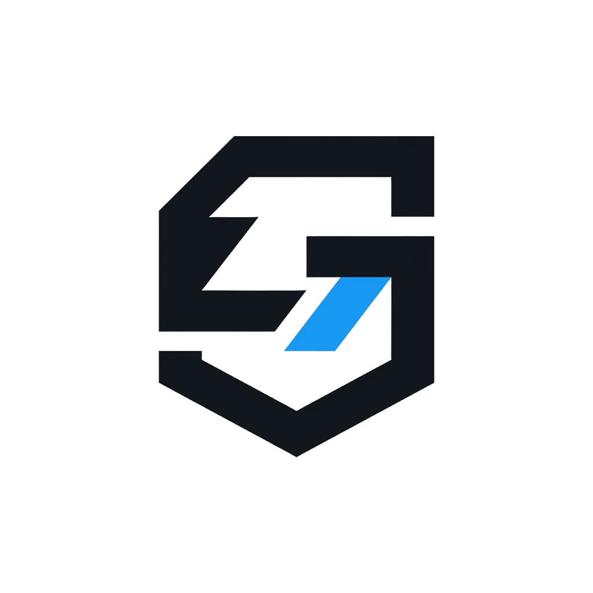

<div align="center">
  
  <p>
    <strong>A modular, from‑scratch compiler for a Rust‑like systems programming language, written in Rust.</strong><br/>
    Implements a complete compilation pipeline: lexing, parsing, name resolution, HIR, MIR, type inference &amp; trait solving, borrow checking, optimizations, and multiple code generation backends (LLVM and a custom bytecode VM). The project is organised as a Cargo workspace with more than 20 crates, designed for clarity, testability, and incremental development.
  </p>
  <p>
    
    
    
    
    
    
    
    
    
    
    
    
  </p>
</div>

---

# Glyim

> [!NOTE]
> Glyim is a research-grade compiler under active development. The pipeline is end-to-end functional for a substantial subset of the language, and the test harness verifies every stage from lexing through MIR interpretation. See [Project Status](#project-status) for what's wired up today versus what's still on the roadmap.

---

## Table of Contents

- [Why Glyim](#why-glyim)
- [Features](#features)
- [Architecture](#architecture)
- [Getting Started](#getting-started)
- [Usage](#usage)
- [Language Tour](#language-tour)
- [The `glyip` Build Tool](#the-glyip-build-tool)
- [Development](#development)
- [Testing](#testing)
- [Project Status](#project-status)
- [Acknowledgements](#acknowledgements)

---

## Why Glyim

Most "toy compiler" projects stop at a parser or a tree-walking interpreter. Glyim is built to be a *real* compiler: it has a full type system with inference and trait solving, an NLL borrow checker, monomorphization, a MIR optimizer, and a production LLVM backend via `inkwell`. Every stage is a self-contained crate with a narrow public API, so each phase can be studied and tested in isolation — and replaced without touching the rest.

The design is heavily inspired by rustc's architecture (arena-allocated IRs, interned types, query-style contexts, trait-based dependency injection), but written from scratch with a strong emphasis on readable code and testability.

---

## Features

### Language

- **Rust-like syntax** with `fn`, `let`, `struct`, `enum`, `match`, `if`/`else`, `while`, `loop`, `for`, closures, `impl` blocks, and traits.
- **Generics** with type parameters, generic bounds (`T: Trait`), and where-clauses.
- **Traits** with default methods, associated types, and static dispatch.
- **Pattern matching** with literals, ranges, or-patterns, slices, structs, tuples, enums, and `if` guards.
- **`async`/`await`** with state-machine desugaring (straight-line and multi-await bodies).
- **Closures** with capture analysis (`ByValue` / `ByRef(Mut)` / `ByRef(Not)`).
- **Macros**: declarative `macro_rules!` with fragment specifiers (`:expr`, `:ty`, `:pat`, `:tt`, …), plus built-in `file!`, `line!`, `column!`, `env!`, `option_env!`, `include!`, `include_str!`, `include_bytes!`, `concat!`, `concat_idents!`, `stringify!`.
- **Procedural macros** through a C-compatible token-stream ABI (`glyim-proc-macro`), with a `dlopen`-based cdylib loader.
- **Ranges**, `Option`/`Result`/`Vec`/`String`/`Box`/`PhantomData`/`UnsafeCell` as compiler-known builtins.

### Compiler

- **Non-lexical lifetime (NLL) borrow checking** with Polonius-style region inference, cross-block liveness analysis, and two-phase borrow support.
- **Move analysis** with partial-move tracking and drop-flag elaboration.
- **Type inference** with unification variables (general / integer / float), occurs-check, and bidirectional checking.
- **Trait solving** via a fulfillment context with obligation queues, HRTB support (`for<'a>`), and auto-trait computation (`Send`/`Sync`/`Unpin`).
- **Monomorphization** with polymorphization (unused generic params → canonical placeholder) and codegen-unit partitioning.
- **MIR optimizations**: constant propagation, dead code elimination, CFG simplification, unreachable block elimination, slice desugaring, and drop elaboration.
- **Layout computation** with ABI-aware argument passing (`sret`, `byval`, `Ignore`, `Direct`, `Split`).
- **VTable generation** for trait objects.
- **MIR interpreter** used for `const fn` evaluation and test execution.
- **Incremental compilation** via SHA-256 fingerprinting of sources and build configuration.

### Code Generation

- **LLVM backend** (`glyim-codegen-llvm`) using `inkwell`/LLVM 22 — produces native object files with real ABI lowering, debug info, exception handling (Itanium + SEH), and Link-Time Optimization (`fat` / `thin`).
- **Bytecode backend** (`glyim-codegen`) — a compact stack-machine bytecode used for testing and embedded execution, verified by the `glyim-bytecode-vm` crate.

### Tooling

- **`glyim` CLI** — compile with `--emit=obj|exec|mir|llvm-ir|asm|cdylib`, choose a backend, set opt-level, target triple, LTO strategy, and codegen units.
- **`glyip` build tool** — Cargo-like project manager with `new`, `build`, `test`, and `run`; dependency resolution with SemVer 2.0 matching, path deps, git deps (branch/tag/rev), lockfiles, and a registry client.
- **Language Server** (`glyim-lsp`) — diagnostics, goto definition, hover, completion, folding, formatting, rename, workspace symbols, code actions (add missing match arms, generate impl, remove unused imports), and auto-import.
- **Test harness** (`glyim-test`) — compile-pass / compile-fail / UI / run-pass / run-fail modes with inline annotations (`//~ ERROR`, `//~| …`), snapshot testing (CST, def-map, MIR), mocking utilities for every compiler phase, and property-based type generation.

---

## Architecture

The compiler is split into small, single-responsibility crates. Each phase consumes the previous phase's IR and exposes a minimal trait-based interface so tests can substitute mocks.

| Crate | Description |
|-------|-------------|
| `glyim-core` | Foundation types: index vectors, definition IDs, interner, paths, ABI constants. |
| `glyim-span` | Source locations (file, byte index, span), hygiene contexts, multispan diagnostics. |
| `glyim-diag` | Diagnostic types, error codes, `DiagSink`, `miette` integration. |
| `glyim-vfs` | Virtual file system with in-memory file content tracking. |
| `glyim-syntax` | CST definition (Rowan-based), `SyntaxKind` enum, AST node helpers. |
| `glyim-frontend` | Lexer + parser (merged), produces `SyntaxNode`. |
| `glyim-def-map` | Module graph, item scopes, name resolution. |
| `glyim-meta` | Macro expansion: `macro_rules!` declarative macros and built-in macros. |
| `glyim-proc-macro` | C-compatible proc-macro ABI, registry, and `dlopen` loader. |
| `glyim-hir` | High-level IR (untyped), lowering from CST. |
| `glyim-type` | Type interning (`TyCtx`), type kinds, substitutions, regions, predicates, auto-traits, object safety, layout hints, printing. |
| `glyim-solve` | `InferenceTable`, unification, trait solver, fulfillment context, HRTB. |
| `glyim-typeck` | Type checker: HIR → THIR with inference and trait resolution. |
| `glyim-const-eval` | Constant expression evaluator over HIR. |
| `glyim-mir` | Mid-level IR (CFG), place types, statement/terminator kinds. |
| `glyim-lower` | THIR → MIR lowering + monomorphization + CGU partitioning + polymorphization. |
| `glyim-borrowck` | Borrow checker (NLL, two-phase borrows, move analysis). |
| `glyim-opt` | MIR optimisation passes. |
| `glyim-mir-interp` | Interpreter for MIR (used in tests and const-eval). |
| `glyim-layout` | Type layout computation (size, alignment, ABI, vtables). |
| `glyim-codegen` | Abstract code generation backend trait + bytecode backend. |
| `glyim-codegen-llvm` | LLVM backend (via `inkwell`) with full ABI handling and LTO. |
| `glyim-bytecode-vm` | Switch-dispatch VM executing the bytecode backend's output. |
| `glyim-runtime` | Runtime FFI: alloc, dealloc, drop glue, panic, fs/net/thread/time/process. |
| `glyim-db` | Compilation database: interners, VFS, type context, trait context. |
| `glyim-pipeline` | End-to-end compilation driver (lex → parse → def-map → HIR → typeck → lower → borrowck → opt → codegen). |
| `glyim-cli` | Command-line interface (`clap`) and linker driver. |
| `glyim-lsp` | Language Server Protocol implementation. |
| `glyim-test` | Testing framework: discovery, execution, snapshots, mocks, property testing. |
| `glyim-lang-core` | Core library source (`.g` files): `Option`, `Result`, `iter`, `slice`, `str`, `cell`, `mem`, `ptr`, `ops`, `cmp`, `marker`, `panic`, `hint`, `convert`, `default`, `future`. |
| `glyim-lang-alloc` | Alloc library source: `Box`, `Vec`, `String`, `Rc`, `RawVec`. |
| `glyim-lang-std` | Standard library source: `io`, `fs`, `net`, `thread`, `sync`, `env`, `time`, `process`, `task`. |
| `glyip` | Package manager / build tool. |

### Compilation Pipeline

```
source.g
   │
   ▼
┌──────────────┐   ┌──────────────┐   ┌──────────────┐
│   Lexer      │──▶│   Parser     │──▶│   CST        │  (glyim-frontend, glyim-syntax)
└──────────────┘   └──────────────┘   └──────────────┘
                                             │
                                             ▼
┌──────────────┐   ┌──────────────┐   ┌──────────────┐
│  Macro       │◀──│   Def-Map    │◀──│   HIR        │  (glyim-meta, glyim-def-map, glyim-hir)
│  Expansion   │   │  (name res.) │   │  (untyped)   │
└──────────────┘   └──────────────┘   └──────────────┘
                                             │
                                             ▼
┌──────────────┐   ┌──────────────┐   ┌──────────────┐
│  Trait       │◀──│   Typeck     │──▶│   THIR       │  (glyim-solve, glyim-typeck)
│  Solving     │   │  (inference) │   │  (typed)     │
└──────────────┘   └──────────────┘   └──────────────┘
                                             │
                                             ▼
┌──────────────┐   ┌──────────────┐   ┌──────────────┐
│  Borrowck    │◀──│  Lowering    │──▶│   MIR        │  (glyim-lower, glyim-borrowck, glyim-mir)
│  (NLL)       │   │ (monomorph.) │   │  (CFG)       │
└──────────────┘   └──────────────┘   └──────────────┘
                                             │
                                             ▼
┌──────────────┐   ┌──────────────┐   ┌──────────────┐
│  LLVM IR     │◀──│  Optimizer   │──▶│  Bytecode    │  (glyim-opt, glyim-codegen-llvm, glyim-codegen)
│  → .o / exe  │   │  (MIR passes)│   │  → .gbc      │
└──────────────┘   └──────────────┘   └──────────────┘
                                             │
                                             ▼
                                       ┌──────────────┐
                                       │  Interpreter │  (glyim-mir-interp)
                                       └──────────────┘
```

---

## Getting Started

### Prerequisites

- **Rust** — latest stable, 2024 edition (Rust 1.94+ recommended).
- **LLVM 22** — required only for the LLVM backend. Set `LLVM_SYS_220_PREFIX` to your LLVM installation prefix before building.
- **`watchexec`** — optional, for the `justfile` recipes.

> [!TIP]
> If you don't have LLVM 22 installed, build with `--no-default-features` (or simply skip the `glyim-codegen-llvm` crate) and use the bytecode backend — the full pipeline still works end-to-end through MIR interpretation and the bytecode VM.

### Building

```bash
git clone https://github.com/elcoosp/glyim-v2
cd glyim
cargo build --release
```

The compiler driver is then available at `target/release/glyim`.

### Quick Start

```bash
# Create a new project
cargo run -p glyip -- new hello
cd hello

# Build it
cargo run -p glyip -- build

# Run it
cargo run -p glyip -- run
```

---

## Usage

### The `glyim` Compiler Driver

```bash
# Compile a source file to an object file using the LLVM backend (default)
glyim input.g -o output.o

# Emit LLVM IR instead of an object file
glyim input.g --emit llvm-ir

# Emit MIR (useful for debugging lowering)
glyim input.g --emit mir

# Emit assembly
glyim input.g --emit asm

# Use the bytecode backend
glyim input.g --backend bytecode --emit obj

# Compile to a runnable executable
glyim input.g --emit exec -o hello

# Compile to a cdylib (used for proc-macro crates)
glyim proc_macro_dep.g --emit cdylib

# Optimise at level 2 with fat LTO
glyim input.g -O2 --lto fat

# Cross-compile to AArch64 Linux
glyim input.g --target aarch64-unknown-linux-gnu

# Emit diagnostics as JSON (for editors / LSP)
glyim input.g --error-format json
```

### Command-Line Flags

| Flag | Description |
|------|-------------|
| `--emit <KIND>` | `obj` (default), `exec`, `mir`, `llvm-ir`, `asm`, `cdylib` |
| `--backend <NAME>` | `llvm` (default) or `bytecode` |
| `-O, --opt-level <N>` | Optimisation level 0–3 |
| `--target <TRIPLE>` | Target triple (default: `x86_64-unknown-linux-gnu`) |
| `--linker <PATH>` | Override the system linker |
| `--link-flags <FLAGS>` | Extra flags passed to the linker |
| `--lto <KIND>` | `off` (default), `fat`, `thin` |
| `--codegen-units <N>` | Number of CGUs (default: available parallelism, capped at 16) |
| `--proc-macro-deps <LIST>` | Comma-separated proc-macro dependency source files |
| `--error-format <FMT>` | `human` (default) or `json` |

> [!IMPORTANT]
> `--lto=thin` requires the LLVM backend and the `llvm-lto2` tool from the same LLVM distribution `glyim-codegen-llvm` was built against. Requesting `thin` with `--backend bytecode` is an explicit error rather than a silent no-op.

### The `glyip` Build Tool

`glyip` is Cargo's counterpart for Glyim projects. It reads a `Glyip.toml` manifest, resolves dependencies (path, registry, and git), maintains a `Glyip.lock` lockfile, and drives the compiler.

```bash
glyip new my_project              # Scaffold a new binary project
glyip new my_lib --lib            # Scaffold a new library project

glyip build                       # Build the project (incremental)
glyip build --release -O2         # Release build with LTO fat
glyip build --backend llvm        # Force the LLVM backend

glyip test                        # Run all tests
glyip test --filter parser        # Run only tests matching "parser"
glyip test --compiled             # Compile each test to a native exe and run it

glyip run -- --flag value         # Build and run with program arguments
```

### Manifest (`Glyip.toml`)

```toml
[package]
name = "my_project"
version = "0.1.0"
edition = "2024"

[dependencies]
serde = "1.0"
local_util = { path = "../local_util" }
my_crate = { git = "https://github.com/example/my_crate", tag = "v0.3.0" }

[dev-dependencies]
test_helpers = { path = "../test_helpers" }
```

> [!TIP]
> The resolver performs real SemVer 2.0 matching (caret, tilde, wildcard, and comparison operators), detects dependency cycles, and reports version conflicts with the full set of requesters that disagree.

---

## Language Tour

```glyim
// Structs, enums, generics, traits.
struct Point<T> {
    x: T,
    y: T,
}

enum Shape {
    Circle(f64),
    Rectangle(f64, f64),
    Point,
}

trait Area {
    fn area(&self) -> f64;
}

impl Area for Shape {
    fn area(&self) -> f64 {
        match self {
            Shape::Circle(r) => 3.14159 * r * r,
            Shape::Rectangle(w, h) => w * h,
            Shape::Point => 0.0,
        }
    }
}

// Pattern matching, ranges, guards.
fn classify(n: i32) -> &str {
    match n {
        0 => "zero",
        1 | 2 => "small",
        x if x < 0 => "negative",
        _ => "large",
    }
}

// Closures and iterators.
fn sum_of_squares(values: &[i32]) -> i32 {
    values.iter().map(|x| *x * *x).sum()
}

// Async / await.
async fn fetch_twice() -> i32 {
    let a = fetch_one().await;
    let b = fetch_one().await;
    a + b
}
```

> [!NOTE]
> The full grammar and standard library are still evolving. The `glyim-lang-core`, `glyim-lang-alloc`, and `glyim-lang-std` crates contain the current standard library source (written in Glyim) and serve as the compiler's own bootstrapping corpus.

---

## Development

### Workspace Layout

All crates live under `crates/`. The workspace root `Cargo.toml` defines shared dependencies and members. The standard library lives under `glyim-lang-core/lib/`, `glyim-lang-alloc/lib/`, and `glyim-lang-std/lib/` as `.g` source files.

### Adding a New Crate

1. Create the directory under `crates/<name>`.
2. Add a `Cargo.toml` with `[package]` and `[dependencies]`.
3. Register the crate in the workspace `members` list.
4. If its public API is used by other crates, add its path to `[workspace.dependencies]`.

### Design Conventions

- **Context traits** — every phase defines a narrow trait (`LowerCtx`, `BorrowckCtx`, `TypeLookup`, `TraitSolver`) that the pipeline implements. This decouples core logic from the database and lets unit tests substitute mocks.
- **Testing mocks** — `glyim-test` provides `MockLowerCtx`, `MockBorrowckCtx`, `MockSolver`, `MockCodegen`, and `TestDbBuilder`.
- **Arena-allocated IRs** — `IndexVec<I, T>` gives every IR node a typed, cheaply-copyable ID. Interning (`TyCtx`) makes type handles stable across phases.
- **Diagnostics** — every phase returns `Vec<GlyimDiagnostic>`, which the driver renders with `miette` (human) or serialises to JSON.

### Running a Subset of Tests

```bash
# Run the whole suite
cargo test

# Run only the glyim-test harness
cargo test -p glyim-test

# Filter tests by path substring
cargo test -p glyim-test -- --filter parser

# Verbose output
GLYIM_TEST_SHOW_OUTPUT=1 cargo test -p glyim-test
```

---

## Testing

Glyim's test harness (`glyim-test`) is a first-class part of the project. It discovers `.g` files under `tests/` and runs them in one of five modes, selected by an inline header or the containing directory name:

| Mode | Meaning |
|------|---------|
| `compile-pass` | The source must compile without errors. |
| `compile-fail` | The source must produce specific errors, checked against inline annotations. |
| `ui` | The full compiler output (CST, def-map, typeck, diagnostics) must match an `.expected` snapshot. |
| `run-pass` | The compiled program must exit successfully and match its expected stdout/stderr. |
| `run-fail` | The compiled program must fail with a specific exit code and output. |

### Inline Annotations

```glyim
fn main() {
    let x: i32 = "hello";
    //~^ ERROR mismatched types
    //~| expected i32, found str
}
```

- `//~ ERROR <pattern>` — the annotated line must produce an error whose message contains `<pattern>`.
- `//~| ERROR <pattern>` — a continuation of the previous annotation (used for multi-line diagnostic blocks).
- `//~^`, `//~^^`, … — point at earlier lines.
- `//~~` — fuzzy matching (allow the diagnostic to land within ±1 line).
- `//~? ERROR …` — the diagnostic is optional; the test still passes if it is absent.

### Snapshot Testing

Snapshot tests for the CST, def-map, and MIR are written with `insta`:

```rust
snapshot_cst("my_syntax_case", source);
snapshot_mir("my_mir_case", &ctx, &body);
```

Update snapshots with:

```bash
GLYIM_BLESS=1 cargo test -p glyim-test
# or, for interactive review
cargo insta review
```

### Property-Based Testing

`glyim-test`'s `property` module generates random types (with and without inference variables) and checks invariants such as "unification of a type with itself succeeds" and "unification of two distinct types fails".

---

## Project Status

### Working end-to-end

- Lexing, parsing, CST, error recovery.
- Module graph, name resolution, `use` imports, visibility checks.
- Declarative and built-in macro expansion.
- HIR lowering, including `async fn` / `.await` desugaring.
- Type inference, unification, auto-trait computation, trait solving with HRTB.
- THIR → MIR lowering, monomorphization, polymorphization.
- NLL borrow checking with two-phase borrows and move analysis.
- MIR optimisation passes (const prop, DCE, CFG simplify, unreachable elimination, slice desugar, drop elaboration).
- LLVM codegen for scalar and aggregate types, with real ABI lowering.
- Bytecode codegen and the bytecode VM.
- MIR interpreter used for `const fn` evaluation and `run-*` tests.
- LSP with diagnostics, hover, completion, goto-definition, references, rename, folding, formatting, code actions, and workspace symbols.
- `glyip` build tool: project scaffolding, incremental builds, dependency resolution (path / registry / git), lockfiles, and compiled test execution.

### Tracked gaps

The compiler's development is tracked against an internal de-stubbing plan. Notable open items include:

- Full cross-frame unwinding in the MIR interpreter (currently single-frame cleanup is supported).
- Multi-await and loop-await async state machines are implemented but not yet runtime-verified on all hosts (the Linux CI job exercises them).
- Some builtin methods on `Vec`/`String`/`Result`/`Option` lower to synthetic `FnDefId`s whose bodies the LLVM backend must intrinsic-lower; unimplemented ones produce an explicit compiler error rather than wrong code.
- `--lto=thin` requires `llvm-lto2` from the matching LLVM distribution.
- Procedural macros are supported via the C-ABI bridge, but the two-stage host compile is still being wired into the default `glyim-cli` flow.

> [!WARNING]
> Glyim is not yet self-hosting. The standard library is written in Glyim and consumed by the compiler as a test corpus, but the compiler itself is Rust.

---

## Acknowledgements

Glyim stands on the shoulders of excellent open-source projects:

- [Rowan](https://github.com/rust-analyzer/rowan) — lossless syntax trees.
- [Inkwell](https://github.com/TheDan64/inkwell) — safe LLVM bindings.
- [Miette](https://github.com/zkat/miette) — beautiful diagnostics.
- [Insta](https://insta.rs/) — snapshot testing.
- [Lasso](https://github.com/Kixiron/lasso) — string interning.
- The Rust compiler team, whose architecture and documentation were a constant source of design inspiration.

---

<p align="center">
  <em>Glyim is a work in progress. Contributions, bug reports, and design discussions are welcome.</em>
</p>
