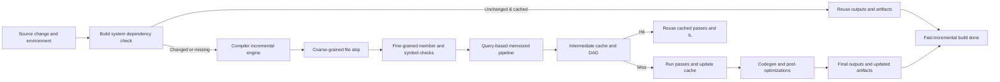

Here’s a concise, research‑style overview of where “state of the art” stands for compiler optimizations targeting incremental compilation, plus concrete techniques and systems you can dig into.

---

## 0. Big picture

Modern incremental compilation is no longer just “only recompile changed files.” The frontier includes:

- Fine‑grained, program‑wide dependency tracking and memoization (Rust, Roslyn, etc.).
- Stateful compilers that cache intermediate results across builds and skip “dormant” passes on changed files (CGO 2024 Clang work).【turn2find0】
- ABI‑ and name‑based change propagation to limit recompilation to truly affected members/classes (Kotlin, Scala/Zinc).【turn20fetch0】【turn11search3】
- Demand‑driven, query‑based designs that unify caching, incrementality, and parallelism (Rust, programmatic build systems).【turn6find3】【turn13fetch0】
- Build‑system–level content‑addressed caching and remote memoization (Pluto, Bazel, Gradle).【turn12fetch0】【turn14fetch0】

---

## 1. Conceptual pipeline

This diagram shows how modern systems combine build‑system and compiler‑level optimizations for incrementality:

---

## 2. Core optimization categories

### 2.1 Fine‑grained dependency tracking & memoization

Instead of treating files as the unit of recompilation, modern systems track dependencies at the level of:

- Definitions and uses of names (members, types, functions).
- Individual compiler queries (type_of, optimized_mir, etc.).

Key ideas:

- Rust: “query‑based” demand‑driven compiler where each query is memoized. A dependency graph is recorded between queries; a “red–green” marking algorithm decides which cached results are still valid across builds, re‑using the rest.【turn6find3】
- Programmatic incremental build systems (PIBS): build steps are modeled as tasks with dynamic file and task dependencies; a context records dependencies during execution and re‑executes tasks only when their inputs change, caching results otherwise.【turn13fetch0】
- Pluto: build system with dynamic dependencies and *fine‑grained file dependencies* (generalized timestamps/requirements). It maintains a build summary to achieve provably sound and optimal minimal rebuilding.【turn12fetch0】

These techniques are foundational: they enable other optimizations (caching, pass skipping) by precisely knowing what depends on what.

---

### 2.2 Stateful compilers & pass‑level reuse

A recent research direction is to make compilers themselves *stateful*, so that for changed files they don’t re‑run all passes from scratch.

- CGO 2024 – “Enabling Fine‑Grained Incremental Builds by Making Compiler Stateful” (Clang): introduces a stateful Clang that retains “dormant information” from previous runs and uses profiling history to bypass dormant passes on modified files, yielding average 6.72% end‑to‑end build speedups on real‑world C++ projects.【turn2find0】
- The approach explicitly targets the asymmetry where build systems are stateful but compilers are usually stateless; the compiler now keeps cross‑build state to avoid redundant work inside changed files.【turn2find0】

This is a clear step toward pass‑level incrementality and is one of the clearest “state of the art” results in compilers for incremental builds.

---

### 2.3 IL/IR‑level and backend caching

Beyond front‑end and dependency tracking, systems cache intermediate representations:

- Rust: rustc’s query system can cache and reuse high‑level IR (e.g., MIR) across builds when dependencies are unchanged; the on‑disk cache includes the dependency graph and fingerprints of query keys.【turn6find3】
- WebAssembly (Cranelift/Wasmtime): Cranelift has an “incremental compilation cache” that serializes compilation results keyed over functions/CLIR, including target features and flags, to reuse machine‑code generation across incremental runs.【turn17find0】

This is crucial for heavy backends and codegen where work is expensive and inputs change slowly.

---

### 2.4 Name‑based invalidation & ABI‑awareness

To limit unnecessary recompilation, many systems reason at the granularity of *names* and *ABIs*:

- Scala/Zinc (sbt): “name hashing” invalidates only dependents that actually use changed names, preventing cascading recompilations across the whole codebase.【turn11search3】
- Kotlin (Gradle plugin):
  - Fine‑grained classpath snapshots (members) allow recompilation only of classes depending on modified members.
  - Coarse‑grained snapshots (class ABI hashes) are used for stable libraries; ABI changes trigger broader recompilation but avoid recompiling everything.【turn20fetch0】
  - Cross‑module incremental compilation uses classpath snapshots and Gradle artifact transformations to compute and cache ABI, enabling better compilation avoidance and Gradle build cache compatibility.【turn9fetch0】

These techniques effectively optimize the *invalidation policy*: only things whose semantics could have changed are rebuilt.

---

### 2.5 Build‑system memoization & remote caching

Optimizing the compiler in isolation is not enough; the build system is the scheduler that decides what to recompile.

- Pluto: sound and optimal incremental build system with fine‑grained dependencies and dynamic dependencies; interleaves dependency analysis and builder execution to ensure minimal rebuilds.【turn12fetch0】
- Shake: Haskell‑based build system with precise dependencies, minimal rebuilds, and parallelism; widely used for large Haskell codebases.【turn0search11】
- Bazel (remote caching): content‑addressed caching of build actions; an action’s inputs, outputs, command line, and environment are hashed and cached in a remote content‑addressable store (CAS), so even across CI machines the same compiler invocations are not repeated.【turn14fetch0】
- Gradle build/cache & configuration cache: Kotlin (and other JVM) builds benefit from build‑caching of tasks and configuration‑caching to avoid re‑configuring and re‑running unchanged compilation tasks.【turn20fetch0】

These systems treat the compiler as a memoizable function and provide large speedups by sharing results across users, branches, and CI jobs.

---

### 2.6 Persistent processes, daemons, and “live” IDE integration

Keeping compilers alive across invocations avoids cold‑start overhead and enables richer caching:

- Kotlin daemon: runs alongside Gradle and can be kept warm to avoid repeated startup costs; JVM tuning and daemon reuse are documented as important for incremental performance.【turn20fetch0】
- Roslyn (.NET): incremental generators use a high‑level pipeline where fine‑grained steps are cached and reused across incremental builds in Visual Studio, explicitly aiming to scale to very large projects.【turn15fetch0】
- TypeScript: `incremental` option and `.tsbuildinfo` files save project graph information on disk to speed up subsequent builds in project‑references mode.【turn22find0】

---

## 3. Representative systems & techniques

| Domain / System | Core incremental optimizations | Key references |
|-----------------|--------------------------------|----------------|
| Rust (rustc) | Query‑based demand‑driven compiler; memoized queries; dependency graph; red–green marking; on‑disk cache of fingerprints & results. | rustc incremental compilation docs.【turn6find3】 |
| Clang (stateful compiler) | Stateful compiler across builds; retains dormant pass info; bypasses unchanged passes on modified files. | CGO 2024 “Enabling Fine‑Grained Incremental Builds by Making Compiler Stateful.”【turn2find0】 |
| Kotlin (Gradle plugin) | File‑level change tracking; fine‑grained vs coarse‑grained classpath snapshots; ABI hashing; cross‑module incremental compilation via artifact transforms & Gradle build cache. | Kotlin docs; JetBrains blog on new approach.【turn20fetch0】【turn9fetch0】 |
| Scala (sbt/Zinc) | Name hashing to limit invalidation to dependents that use changed names; class‑based name hashing improvements. | sbt/Zinc name hashing description & presentations.【turn11search3】【turn11search4】 |
| TypeScript | `incremental` + `.tsbuildinfo` to persist program graph; project‑references builds reuse prior state. | TypeScript docs.【turn22find0】 |
| .NET / Roslyn | Incremental generators with fine‑grained pipeline and caching between steps. | Roslyn incremental generators docs.【turn15fetch0】 |
| WebAssembly (Cranelift/Wasmtime) | Incremental compilation cache keyed over functions/CLIR; serializable compilation results; configuration‑aware cache keys. | Cranelift ICC issue & implementation references.【turn17find0】 |
| Build systems | Pluto (fine‑grained deps, dynamic deps, sound & optimal rebuilding); Shake (minimal rebuilds, parallelism); Bazel (remote CAS & action cache); Gradle (build & configuration caches). | Pluto OOPSLA paper; Shake ICFP paper; Bazel remote caching docs.【turn12fetch0】【turn0search11】【turn14fetch0】 |
| Programmatic incremental build systems | Tasks with dynamic file & task dependencies; memoized execution; reusable incremental context. | PIBS tutorial (dynamic dependencies, caching).【turn13fetch0】 |

---

## 4. Practical takeaways for tool/ML‑compiler engineers

If you’re designing a compiler or toolchain and want modern incrementality, the current “best practice bundle” looks roughly like this:

- Use a **demand‑driven, query‑like IR** with:
  - Fine‑grained keys (per definition/function/module).
  - Memoization and explicit dependency recording.
  - Fingerprint‑based caching that can be persisted and reloaded (Rust‑style).【turn6find3】
- Implement **fine‑grained dependency tracking**:
  - At the level of names, members, and ABIs, not just files (Scala/Kotlin style).【turn11search3】【turn20fetch0】
- Make the compiler **stateful across invocations**:
  - Keep persistent caches of intermediate results (IR, analysis) and reuse them when inputs are unchanged (CGO 2024 stateful Clang).【turn2find0】
- Design the backend for **IL‑level caching**:
  - Cache codegen results per function/IR unit; include target features and flags in cache keys (Cranelift ICC).【turn17find0】
- Integrate with a **proper build system**:
  - Use content‑addressed caching and remote execution where possible (Bazel).【turn14fetch0】
  - Support dynamic dependencies and fine‑grained file requirements (Pluto, PIBS).【turn12fetch0】【turn13fetch0】
- For IDE scenarios, keep a **long‑running process or daemon** and cache aggressively:
  - Reuse data structures across IDE keystrokes (Roslyn generators, TypeScript `.tsbuildinfo`, Kotlin daemon).【turn15fetch0】【turn22find0】【turn20fetch0】

---

If you tell me what kind of compiler you’re working on (e.g., ML, DSL, data‑flow, WebAssembly), I can map these general techniques into a concrete architecture and recommend which subset to prioritize first.
To brainstorm truly innovative features in incremental compilation, we must look past the current state of the art (query memoization, ABI hashing, remote CAS) and ask: *What are the fundamental, unsolved bottlenecks?* 

The current bottlenecks are:
1. **The Branch-Switching Tax:** Switching Git branches almost always invalidates the incremental cache, forcing a full rebuild.
2. **Syntactic vs. Semantic Churn:** Renaming a local variable changes the AST, forcing downstream fingerprint mismatches even though the semantics didn't change.
3. **The "Pass Barrier":** We cache IR, but we rarely cache *optimization decisions* (e.g., "is this function worth inlining?"). If an input changes, we rerun the whole optimization pipeline.
4. **Hot-Path Latency:** For REPLs and IDEs, even sub-second incremental compilation is too slow; we need millisecond latency.

Here are deep, innovative features designed to solve these unsolved problems, pushing incremental compilation into its next era.

---

### 1. The "Merkle Compiler": Branch-Agnostic IR Caching
**The Gap:** Current systems (Bazel, Gradle, Rust) tie their incremental state to a specific linear history (a specific commit or file state). If you checkout a different branch, the cache is blown away. 
**The Innovation:** Store the compiler's Intermediate Representation (IR) and analysis results in a **Content-Addressable Merkle DAG**, completely detached from Git branches.
*   **Mechanism:** Every AST node, type resolution, and optimized IR block is hashed based *only* on its content and dependencies. A "build state" is merely a pointer to the root of a Merkle tree.
*   **Branch Switching as O(1):** When you `git checkout feature-branch`, the compiler doesn't clear the cache. It simply looks up the new root hash. Unchanged files across branches share the exact same Merkle nodes in memory and on disk.
*   **Incremental Merging:** If you merge two branches, the compiler can perform a "3-way merge" at the IR level, reusing shared subtrees of analysis from both branches without re-evaluating them.
*   **Use Case:** A developer switches between a `main` branch and a refactoring branch 50 times a day. With a Merkle Compiler, the *first* build on each branch takes time, but every subsequent switch back is instantaneous.

### 2. Alpha-Equivalence Short-Circuiting (Semantic Diffing)
**The Gap:** Fingerprinting is syntactic. If you add a comment, change whitespace, or rename a local variable `x` to `y`, the AST hash changes, invalidating all downstream caches.
**The Innovation:** Introduce a **Semantic Normalization Pass** before fingerprinting. 
*   **Mechanism:** Before hashing an AST for the incremental cache, the compiler runs an ultra-fast alpha-renaming pass (renaming all local variables to `_v1, _v2`, stripping comments, normalizing associative operations like `a + b` to `b + a`).
*   **The Gain:** If a developer refactors purely local names or reformats code, the "semantic hash" remains identical. The compiler skips type-checking, borrow-checking, and optimization for that file entirely.
*   **Use Case:** Running an auto-formatter (like `rustfmt` or `prettier`) on a massive codebase currently triggers massive unnecessary recompilations. With semantic diffing, an auto-format results in **zero** incremental recompilation work.

### 3. Speculative Pre-Compilation (Predictive Caching)
**The Gap:** Incremental compilation is purely *reactive*—it waits for a file to be saved, then computes.
**The Innovation:** Make the compiler *proactive* using local edit-history heuristics or a lightweight ML model.
*   **Mechanism:** The compiler observes developer behavior: "When the user edits `function_A()`, there is an 85% probability they will edit `function_B()` within the next 5 minutes." When `A` is saved and incrementally compiled, the compiler speculatively compiles `B` (and its dependents) in a background thread using a cloned snapshot of the compiler state.
*   **The Gain:** If the prediction is correct, when the user saves `B`, the result is served from RAM instantly (0ms latency). If wrong, the speculative state is dropped with zero cost (since it was isolated).
*   **Use Case:** IDE integration for massive C++ or Rust codebases where even "incremental" takes 5–10 seconds. The UI feels completely stateless and instantaneous.

### 4. Optimization Invariant Caching (Decoupling Analysis from Optimization)
**The Gap:** We cache the IR *before* optimization (e.g., MIR in Rust). If a dependency changes, we regenerate the IR and rerun the entire optimization pipeline (inlining, loop unrolling, DCE), which is the most expensive part of compilation.
**The Innovation:** Cache the *properties* of the code, not just the code itself. 
*   **Mechanism:** During optimization, the compiler generates an **Optimization Invariant Certificate**—a compact data structure stating: "Function X has no side effects, is pure, has a cyclomatic complexity of 4, and inlines perfectly into Y." 
*   **The Gain:** If `Function X` changes syntactically but its *Invariant Certificate* hashes to the same value, the compiler skips the optimization passes for `X` and all its downstream dependents. It just links the previously optimized machine code.
*   **Use Case:** Changing an internal implementation detail of a math function without changing its signature or purity. The compiler realizes the optimization invariants haven't changed and skips LLVM/CodeGen entirely for the whole module.

### 5. Continuous Event-Sourced Compilation (For REPLs & Notebooks)
**The Gap:** REPLs (like Jupyter, Clojure, Swift) usually compile whole cells. If a cell defines a class, and you redefine it, all downstream cells must be re-executed and recompiled.
**The Innovation:** Treat the compiler as an **Event-Sourced Database**.
*   **Mechanism:** Instead of compiling "files" or "cells," the compiler ingests a stream of *patches* (AST diffs). The compiler's internal type environment and IR are implemented as CRDTs (Conflict-free Replicated Data Types) or append-only logs. 
*   **The Gain:** When a user changes a type definition in Cell 1, the compiler doesn't reparse Cell 1. It applies the diff to its internal type state, calculates the *delta* of the type environment, and propogates only the exact micro-updates needed to Cell 2 and Cell 3's IR.
*   **Use Case:** Sub-millisecond hot-reloading in game engines or data science notebooks. You change a column type in a DataFrame definition, and the compiler incrementally patches the downstream queries without recompiling them from scratch.

### 6. Fractal Cache Granularity (Adaptive Zooming)
**The Gap:** Caching at the function level generates too much bookkeeping overhead for small files. Caching at the module level rebuilds too much for large files.
**The Innovation:** The compiler dynamically adjusts its caching granularity based on edit velocity and file size.
*   **Mechanism:** A background monitor tracks how often specific AST regions are invalidated. 
    *   If a file is large but only one function is edited repeatedly (hot-spot), the compiler "zooms in," splitting the file's incremental cache into per-function buckets.
    *   If a file is small or undergoing massive refactors (high churn), the compiler "zooms out," invalidating the whole file's cache to avoid the overhead of tracking thousands of micro-dependencies.
*   **Use Case:** A developer is doing heavy refactoring using AI assistants (like Copilot) that rewrite whole files at once. The compiler detects the high churn, temporarily disabling fine-grained tracking to ensure the massive diffs are processed at maximum throughput, then re-enables fine-grained tracking once the developer returns to manual typing.

### 7. Self-Healing Provenance Graphs (Solving Cache Corruption)
**The Gap:** Incremental caches inevitably get corrupted over time (the classic "clean build fixed it" bug). Current systems just detect when a hash mismatches and force a rebuild, but they don't know *why* the cache went bad.
**The Innovation:** Attach cryptographic provenance to every cached artifact.
*   **Mechanism:** Every cached IR node stores not just its hash, but a proof of *how* it was derived (e.g., "I was produced by Pass X, using inputs Y and Z, at compiler version V"). A background daemon periodically runs a lightweight "garbage collector" that verifies the DAG of proofs.
*   **The Gain:** Instead of a silent cache miss, the compiler can provide a deterministic error message: *"Incremental cache corrupted: Cached node for `std::vec::push` relied on a specific memory layout assumption that was changed by an OS update. Automatically purging subtree."*
*   **Use Case:** Enterprise CI/CD pipelines where mysterious "cache poisoning" wastes hundreds of hours of developer time. The cache becomes mathematically verifiable and self-repairing.

---

### The Ultimate Synthesis: The "Quantum" Compiler
If you combine these ideas, you get a fundamentally different kind of compiler:
It doesn't parse text; it ingests **semantic diffs**. It doesn't store files; it maintains a **Merkle IR tree**. It doesn't wait for saves; it **speculatively compiles** predicted futures. It doesn't rerun optimizations; it checks **invariant certificates**. 

This shifts the compiler from being a *batch processor of text* to a *live, stateful database of code semantics*.
