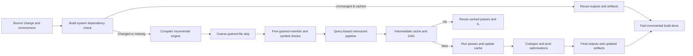

Here’s a concise, research‑style overview of where “state of the art” stands for compiler optimizations targeting incremental compilation, plus concrete techniques and systems you can dig into.

---

## 0. Big picture

Modern incremental compilation is no longer just “only recompile changed files.” The frontier includes:

- Fine‑grained, program‑wide dependency tracking and memoization (Rust, Roslyn, etc.).
- Stateful compilers that cache intermediate results across builds and skip “dormant” passes on changed files (CGO 2024 Clang work).【turn2find0】
- ABI‑ and name‑based change propagation to limit recompilation to truly affected members/classes (Kotlin, Scala/Zinc).【turn20fetch0】【turn11search3】
- Demand‑driven, query‑based designs that unify caching, incrementality, and parallelism (Rust, programmatic build systems).【turn6find3】【turn13fetch0】
- Build‑system–level content‑addressed caching and remote memoization (Pluto, Bazel, Gradle).【turn12fetch0】【turn14fetch0】

---

## 1. Conceptual pipeline

This diagram shows how modern systems combine build‑system and compiler‑level optimizations for incrementality:



---

## 2. Core optimization categories

### 2.1 Fine‑grained dependency tracking & memoization

Instead of treating files as the unit of recompilation, modern systems track dependencies at the level of:

- Definitions and uses of names (members, types, functions).
- Individual compiler queries (type_of, optimized_mir, etc.).

Key ideas:

- Rust: “query‑based” demand‑driven compiler where each query is memoized. A dependency graph is recorded between queries; a “red–green” marking algorithm decides which cached results are still valid across builds, re‑using the rest.【turn6find3】
- Programmatic incremental build systems (PIBS): build steps are modeled as tasks with dynamic file and task dependencies; a context records dependencies during execution and re‑executes tasks only when their inputs change, caching results otherwise.【turn13fetch0】
- Pluto: build system with dynamic dependencies and *fine‑grained file dependencies* (generalized timestamps/requirements). It maintains a build summary to achieve provably sound and optimal minimal rebuilding.【turn12fetch0】

These techniques are foundational: they enable other optimizations (caching, pass skipping) by precisely knowing what depends on what.

---

### 2.2 Stateful compilers & pass‑level reuse

A recent research direction is to make compilers themselves *stateful*, so that for changed files they don’t re‑run all passes from scratch.

- CGO 2024 – “Enabling Fine‑Grained Incremental Builds by Making Compiler Stateful” (Clang): introduces a stateful Clang that retains “dormant information” from previous runs and uses profiling history to bypass dormant passes on modified files, yielding average 6.72% end‑to‑end build speedups on real‑world C++ projects.【turn2find0】
- The approach explicitly targets the asymmetry where build systems are stateful but compilers are usually stateless; the compiler now keeps cross‑build state to avoid redundant work inside changed files.【turn2find0】

This is a clear step toward pass‑level incrementality and is one of the clearest “state of the art” results in compilers for incremental builds.

---

### 2.3 IL/IR‑level and backend caching

Beyond front‑end and dependency tracking, systems cache intermediate representations:

- Rust: rustc’s query system can cache and reuse high‑level IR (e.g., MIR) across builds when dependencies are unchanged; the on‑disk cache includes the dependency graph and fingerprints of query keys.【turn6find3】
- WebAssembly (Cranelift/Wasmtime): Cranelift has an “incremental compilation cache” that serializes compilation results keyed over functions/CLIR, including target features and flags, to reuse machine‑code generation across incremental runs.【turn17find0】

This is crucial for heavy backends and codegen where work is expensive and inputs change slowly.

---

### 2.4 Name‑based invalidation & ABI‑awareness

To limit unnecessary recompilation, many systems reason at the granularity of *names* and *ABIs*:

- Scala/Zinc (sbt): “name hashing” invalidates only dependents that actually use changed names, preventing cascading recompilations across the whole codebase.【turn11search3】
- Kotlin (Gradle plugin):
  - Fine‑grained classpath snapshots (members) allow recompilation only of classes depending on modified members.
  - Coarse‑grained snapshots (class ABI hashes) are used for stable libraries; ABI changes trigger broader recompilation but avoid recompiling everything.【turn20fetch0】
  - Cross‑module incremental compilation uses classpath snapshots and Gradle artifact transformations to compute and cache ABI, enabling better compilation avoidance and Gradle build cache compatibility.【turn9fetch0】

These techniques effectively optimize the *invalidation policy*: only things whose semantics could have changed are rebuilt.

---

### 2.5 Build‑system memoization & remote caching

Optimizing the compiler in isolation is not enough; the build system is the scheduler that decides what to recompile.

- Pluto: sound and optimal incremental build system with fine‑grained dependencies and dynamic dependencies; interleaves dependency analysis and builder execution to ensure minimal rebuilds.【turn12fetch0】
- Shake: Haskell‑based build system with precise dependencies, minimal rebuilds, and parallelism; widely used for large Haskell codebases.【turn0search11】
- Bazel (remote caching): content‑addressed caching of build actions; an action’s inputs, outputs, command line, and environment are hashed and cached in a remote content‑addressable store (CAS), so even across CI machines the same compiler invocations are not repeated.【turn14fetch0】
- Gradle build/cache & configuration cache: Kotlin (and other JVM) builds benefit from build‑caching of tasks and configuration‑caching to avoid re‑configuring and re‑running unchanged compilation tasks.【turn20fetch0】

These systems treat the compiler as a memoizable function and provide large speedups by sharing results across users, branches, and CI jobs.

---

### 2.6 Persistent processes, daemons, and “live” IDE integration

Keeping compilers alive across invocations avoids cold‑start overhead and enables richer caching:

- Kotlin daemon: runs alongside Gradle and can be kept warm to avoid repeated startup costs; JVM tuning and daemon reuse are documented as important for incremental performance.【turn20fetch0】
- Roslyn (.NET): incremental generators use a high‑level pipeline where fine‑grained steps are cached and reused across incremental builds in Visual Studio, explicitly aiming to scale to very large projects.【turn15fetch0】
- TypeScript: `incremental` option and `.tsbuildinfo` files save project graph information on disk to speed up subsequent builds in project‑references mode.【turn22find0】

---

## 3. Representative systems & techniques

| Domain / System | Core incremental optimizations | Key references |
|-----------------|--------------------------------|----------------|
| Rust (rustc) | Query‑based demand‑driven compiler; memoized queries; dependency graph; red–green marking; on‑disk cache of fingerprints & results. | rustc incremental compilation docs.【turn6find3】 |
| Clang (stateful compiler) | Stateful compiler across builds; retains dormant pass info; bypasses unchanged passes on modified files. | CGO 2024 “Enabling Fine‑Grained Incremental Builds by Making Compiler Stateful.”【turn2find0】 |
| Kotlin (Gradle plugin) | File‑level change tracking; fine‑grained vs coarse‑grained classpath snapshots; ABI hashing; cross‑module incremental compilation via artifact transforms & Gradle build cache. | Kotlin docs; JetBrains blog on new approach.【turn20fetch0】【turn9fetch0】 |
| Scala (sbt/Zinc) | Name hashing to limit invalidation to dependents that use changed names; class‑based name hashing improvements. | sbt/Zinc name hashing description & presentations.【turn11search3】【turn11search4】 |
| TypeScript | `incremental` + `.tsbuildinfo` to persist program graph; project‑references builds reuse prior state. | TypeScript docs.【turn22find0】 |
| .NET / Roslyn | Incremental generators with fine‑grained pipeline and caching between steps. | Roslyn incremental generators docs.【turn15fetch0】 |
| WebAssembly (Cranelift/Wasmtime) | Incremental compilation cache keyed over functions/CLIR; serializable compilation results; configuration‑aware cache keys. | Cranelift ICC issue & implementation references.【turn17find0】 |
| Build systems | Pluto (fine‑grained deps, dynamic deps, sound & optimal rebuilding); Shake (minimal rebuilds, parallelism); Bazel (remote CAS & action cache); Gradle (build & configuration caches). | Pluto OOPSLA paper; Shake ICFP paper; Bazel remote caching docs.【turn12fetch0】【turn0search11】【turn14fetch0】 |
| Programmatic incremental build systems | Tasks with dynamic file & task dependencies; memoized execution; reusable incremental context. | PIBS tutorial (dynamic dependencies, caching).【turn13fetch0】 |

---

## 4. Practical takeaways for tool/ML‑compiler engineers

If you’re designing a compiler or toolchain and want modern incrementality, the current “best practice bundle” looks roughly like this:

- Use a **demand‑driven, query‑like IR** with:
  - Fine‑grained keys (per definition/function/module).
  - Memoization and explicit dependency recording.
  - Fingerprint‑based caching that can be persisted and reloaded (Rust‑style).【turn6find3】
- Implement **fine‑grained dependency tracking**:
  - At the level of names, members, and ABIs, not just files (Scala/Kotlin style).【turn11search3】【turn20fetch0】
- Make the compiler **stateful across invocations**:
  - Keep persistent caches of intermediate results (IR, analysis) and reuse them when inputs are unchanged (CGO 2024 stateful Clang).【turn2find0】
- Design the backend for **IL‑level caching**:
  - Cache codegen results per function/IR unit; include target features and flags in cache keys (Cranelift ICC).【turn17find0】
- Integrate with a **proper build system**:
  - Use content‑addressed caching and remote execution where possible (Bazel).【turn14fetch0】
  - Support dynamic dependencies and fine‑grained file requirements (Pluto, PIBS).【turn12fetch0】【turn13fetch0】
- For IDE scenarios, keep a **long‑running process or daemon** and cache aggressively:
  - Reuse data structures across IDE keystrokes (Roslyn generators, TypeScript `.tsbuildinfo`, Kotlin daemon).【turn15fetch0】【turn22find0】【turn20fetch0】

---

If you tell me what kind of compiler you’re working on (e.g., ML, DSL, data‑flow, WebAssembly), I can map these general techniques into a concrete architecture and recommend which subset to prioritize first.
To brainstorm truly innovative features in incremental compilation, we must look past the current state of the art (query memoization, ABI hashing, remote CAS) and ask: *What are the fundamental, unsolved bottlenecks?* 

The current bottlenecks are:
1. **The Branch-Switching Tax:** Switching Git branches almost always invalidates the incremental cache, forcing a full rebuild.
2. **Syntactic vs. Semantic Churn:** Renaming a local variable changes the AST, forcing downstream fingerprint mismatches even though the semantics didn't change.
3. **The "Pass Barrier":** We cache IR, but we rarely cache *optimization decisions* (e.g., "is this function worth inlining?"). If an input changes, we rerun the whole optimization pipeline.
4. **Hot-Path Latency:** For REPLs and IDEs, even sub-second incremental compilation is too slow; we need millisecond latency.

Here are deep, innovative features designed to solve these unsolved problems, pushing incremental compilation into its next era.

---

### 1. The "Merkle Compiler": Branch-Agnostic IR Caching
**The Gap:** Current systems (Bazel, Gradle, Rust) tie their incremental state to a specific linear history (a specific commit or file state). If you checkout a different branch, the cache is blown away. 
**The Innovation:** Store the compiler's Intermediate Representation (IR) and analysis results in a **Content-Addressable Merkle DAG**, completely detached from Git branches.
*   **Mechanism:** Every AST node, type resolution, and optimized IR block is hashed based *only* on its content and dependencies. A "build state" is merely a pointer to the root of a Merkle tree.
*   **Branch Switching as O(1):** When you `git checkout feature-branch`, the compiler doesn't clear the cache. It simply looks up the new root hash. Unchanged files across branches share the exact same Merkle nodes in memory and on disk.
*   **Incremental Merging:** If you merge two branches, the compiler can perform a "3-way merge" at the IR level, reusing shared subtrees of analysis from both branches without re-evaluating them.
*   **Use Case:** A developer switches between a `main` branch and a refactoring branch 50 times a day. With a Merkle Compiler, the *first* build on each branch takes time, but every subsequent switch back is instantaneous.

### 2. Alpha-Equivalence Short-Circuiting (Semantic Diffing)
**The Gap:** Fingerprinting is syntactic. If you add a comment, change whitespace, or rename a local variable `x` to `y`, the AST hash changes, invalidating all downstream caches.
**The Innovation:** Introduce a **Semantic Normalization Pass** before fingerprinting. 
*   **Mechanism:** Before hashing an AST for the incremental cache, the compiler runs an ultra-fast alpha-renaming pass (renaming all local variables to `_v1, _v2`, stripping comments, normalizing associative operations like `a + b` to `b + a`).
*   **The Gain:** If a developer refactors purely local names or reformats code, the "semantic hash" remains identical. The compiler skips type-checking, borrow-checking, and optimization for that file entirely.
*   **Use Case:** Running an auto-formatter (like `rustfmt` or `prettier`) on a massive codebase currently triggers massive unnecessary recompilations. With semantic diffing, an auto-format results in **zero** incremental recompilation work.

### 3. Speculative Pre-Compilation (Predictive Caching)
**The Gap:** Incremental compilation is purely *reactive*—it waits for a file to be saved, then computes.
**The Innovation:** Make the compiler *proactive* using local edit-history heuristics or a lightweight ML model.
*   **Mechanism:** The compiler observes developer behavior: "When the user edits `function_A()`, there is an 85% probability they will edit `function_B()` within the next 5 minutes." When `A` is saved and incrementally compiled, the compiler speculatively compiles `B` (and its dependents) in a background thread using a cloned snapshot of the compiler state.
*   **The Gain:** If the prediction is correct, when the user saves `B`, the result is served from RAM instantly (0ms latency). If wrong, the speculative state is dropped with zero cost (since it was isolated).
*   **Use Case:** IDE integration for massive C++ or Rust codebases where even "incremental" takes 5–10 seconds. The UI feels completely stateless and instantaneous.

### 4. Optimization Invariant Caching (Decoupling Analysis from Optimization)
**The Gap:** We cache the IR *before* optimization (e.g., MIR in Rust). If a dependency changes, we regenerate the IR and rerun the entire optimization pipeline (inlining, loop unrolling, DCE), which is the most expensive part of compilation.
**The Innovation:** Cache the *properties* of the code, not just the code itself. 
*   **Mechanism:** During optimization, the compiler generates an **Optimization Invariant Certificate**—a compact data structure stating: "Function X has no side effects, is pure, has a cyclomatic complexity of 4, and inlines perfectly into Y." 
*   **The Gain:** If `Function X` changes syntactically but its *Invariant Certificate* hashes to the same value, the compiler skips the optimization passes for `X` and all its downstream dependents. It just links the previously optimized machine code.
*   **Use Case:** Changing an internal implementation detail of a math function without changing its signature or purity. The compiler realizes the optimization invariants haven't changed and skips LLVM/CodeGen entirely for the whole module.

### 5. Continuous Event-Sourced Compilation (For REPLs & Notebooks)
**The Gap:** REPLs (like Jupyter, Clojure, Swift) usually compile whole cells. If a cell defines a class, and you redefine it, all downstream cells must be re-executed and recompiled.
**The Innovation:** Treat the compiler as an **Event-Sourced Database**.
*   **Mechanism:** Instead of compiling "files" or "cells," the compiler ingests a stream of *patches* (AST diffs). The compiler's internal type environment and IR are implemented as CRDTs (Conflict-free Replicated Data Types) or append-only logs. 
*   **The Gain:** When a user changes a type definition in Cell 1, the compiler doesn't reparse Cell 1. It applies the diff to its internal type state, calculates the *delta* of the type environment, and propogates only the exact micro-updates needed to Cell 2 and Cell 3's IR.
*   **Use Case:** Sub-millisecond hot-reloading in game engines or data science notebooks. You change a column type in a DataFrame definition, and the compiler incrementally patches the downstream queries without recompiling them from scratch.

### 6. Fractal Cache Granularity (Adaptive Zooming)
**The Gap:** Caching at the function level generates too much bookkeeping overhead for small files. Caching at the module level rebuilds too much for large files.
**The Innovation:** The compiler dynamically adjusts its caching granularity based on edit velocity and file size.
*   **Mechanism:** A background monitor tracks how often specific AST regions are invalidated. 
    *   If a file is large but only one function is edited repeatedly (hot-spot), the compiler "zooms in," splitting the file's incremental cache into per-function buckets.
    *   If a file is small or undergoing massive refactors (high churn), the compiler "zooms out," invalidating the whole file's cache to avoid the overhead of tracking thousands of micro-dependencies.
*   **Use Case:** A developer is doing heavy refactoring using AI assistants (like Copilot) that rewrite whole files at once. The compiler detects the high churn, temporarily disabling fine-grained tracking to ensure the massive diffs are processed at maximum throughput, then re-enables fine-grained tracking once the developer returns to manual typing.

### 7. Self-Healing Provenance Graphs (Solving Cache Corruption)
**The Gap:** Incremental caches inevitably get corrupted over time (the classic "clean build fixed it" bug). Current systems just detect when a hash mismatches and force a rebuild, but they don't know *why* the cache went bad.
**The Innovation:** Attach cryptographic provenance to every cached artifact.
*   **Mechanism:** Every cached IR node stores not just its hash, but a proof of *how* it was derived (e.g., "I was produced by Pass X, using inputs Y and Z, at compiler version V"). A background daemon periodically runs a lightweight "garbage collector" that verifies the DAG of proofs.
*   **The Gain:** Instead of a silent cache miss, the compiler can provide a deterministic error message: *"Incremental cache corrupted: Cached node for `std::vec::push` relied on a specific memory layout assumption that was changed by an OS update. Automatically purging subtree."*
*   **Use Case:** Enterprise CI/CD pipelines where mysterious "cache poisoning" wastes hundreds of hours of developer time. The cache becomes mathematically verifiable and self-repairing.

---

### The Ultimate Synthesis: The "Quantum" Compiler
If you combine these ideas, you get a fundamentally different kind of compiler:
It doesn't parse text; it ingests **semantic diffs**. It doesn't store files; it maintains a **Merkle IR tree**. It doesn't wait for saves; it **speculatively compiles** predicted futures. It doesn't rerun optimizations; it checks **invariant certificates**. 

This shifts the compiler from being a *batch processor of text* to a *live, stateful database of code semantics*.
Building a JIT-compiled language with a file watcher using LLVM/Inkwell puts you in a fantastic position. You don't have to wait for object files, linker invocations, or process startup. Your entire bottleneck is **LLVM optimization time and IR reconstruction**.

To achieve a "sub-100ms feels-like-magic" file watcher, you have to stop treating the JIT like a traditional compiler and start treating it like a **live, in-memory database of machine code**. 

Here are highly innovative, LLVM/Inkwell-specific architectures to make your JIT watcher absurdly fast.

---

### 1. The "Lego-Block" Micro-Module Architecture (Bypassing Monolithic LLVM)
**The Problem:** A standard JIT dumps everything into one massive `inkwell::Module`. If you change *one* function, LLVM's `PassManager` often re-analyzes and re-optimizes half the module due to inline cascades and global analysis.
**The Innovation:** Never use a single module. Partition your code into **Micro-Modules** (e.g., one `Module` per struct impl block, or per file).
*   **How it works:** You have a "Core" module (pre-optimized, never touched) and dozens of "User" micro-modules. 
*   **The Inkwell implementation:** When a file changes, you *only* destroy the `inkwell::Module` corresponding to that file. You rebuild the IR for that file, run the `PassManager` *only* on that tiny module, and add it to the `JITDylib`.
*   **The Catch (Cross-Module Calls):** If `Module A` calls `Module B`, you can't use standard LLVM linking. You must use **LLVM OrcV2 Lazy Reexports** (available in Inkwell). This creates an indirect jump table. `Module A` compiles instantly because it doesn't need to know the absolute address of `Module B` until runtime.
*   **Result:** Changing a 50-line file only takes the time to optimize 50 lines of IR, regardless of whether your project is 10,000 lines.

### 2. Double-Buffered JIT Dylibs (Zero-Downtime Swapping)
**The Problem:** While LLVM is optimizing the changed code in the background, your main execution thread is blocked, causing the file watcher to "freeze" for a few hundred milliseconds.
**The Innovation:** Use two `inkwell::orc::JITDylib`s: **Active** and **Staging**.
*   **How it works:** 
    1. Program is running, executing out of `Dylib A`.
    2. File watcher triggers. You spin up a background thread, compile the changed IR, and load it into `Dylib B` (Staging).
    3. Once `Dylib B` is fully compiled and ready, you flip a global `AtomicPtr` or function pointer table to point to the functions in `Dylib B`.
    4. The next execution frame uses `Dylib B`. `Dylib A` is discarded (or kept as a backup to flip back if the new code crashes).
*   **The Inkwell implementation:** Inkwell exposes `ExecutionSession` and `JITDylib`. You define your symbols with absolute relocations. Swapping is literally just updating a Rust `Arc<AtomicPtr<...>>>`. 
*   **Result:** UI/CLI never drops a frame. The compile happens entirely asynchronously.

### 3. Speculative Tier-0 Interpreter (Sub-Millisecond Feedback)
**The Problem:** Even with Micro-Modules, LLVM `-O2` takes ~50-100ms per module. If the user is holding down a key or using an AI auto-formatter that saves every 2 seconds, the JIT falls behind.
**The Innovation:** Don't send the code to LLVM immediately. Send it to a **Bytecode VM**.
*   **How it works:** Your frontend (Parser -> AST) translates to a custom, extremely fast bytecode. You interpret this bytecode. It runs in ~1ms. 
*   **The Inkwell integration:** You run a background thread that looks at the "dirty" functions. If a function is executed more than 100 times *or* the file hasn't been saved for 500ms, *then* you invoke Inkwell to convert that specific function to LLVM IR, run the `PassManager`, and JIT it. Replace the bytecode function pointer with the LLVM JIT pointer.
*   **Result:** Instant feedback while typing, automatically upgrading to native LLVM speed when idle.

### 4. Stateful Hot-Patching (Don't Restart `main()`)
**The Problem:** Most JIT watchers (like `cargo run` with `watchexec`) literally restart the entire program. You lose your application state (open windows, loaded data, game state) on every compile.
**The Innovation:** **Live Code Patching.**
*   **How it works:** Your runtime maintains a Global Function Table (vtable). 
    ```rust
    static mut FUNCTIONS: [fn(); 1000] = [noop; 1000];
    ```
    When the user calls `my_function()`, they actually call `FUNCTIONS[42]()`.
*   **The Inkwell implementation:** When the file watcher triggers, Inkwell recompiles `my_function`. You query the new `JITTargetAddress` from the `JITDylib` and atomically swap `FUNCTIONS[42] = new_address`. 
*   **Result:** The user changes a calculation, hits save, and the *running* program instantly uses the new calculation without restarting. Variables in memory are preserved. This is how Lisp and Erlang machines work, applied to an LLVM/Rust JIT.

### 5. AST-Diffing to IR-Diffing (The "Stitcher")
**The Problem:** If you change one line in a 500-line function, you rebuild the entire 500-line function's LLVM IR using `inkwell::Builder`.
**The Innovation:** **Incremental IR Construction.**
*   **How it works:** Keep the `inkwell::values::FunctionValue` and its `BasicBlock`s alive in memory. When the file changes, run a textual/AST diff (like Myers diff). 
*   **The Inkwell implementation:** 
    * If a line was *added* at line 42: Position the `Builder` at the end of the `BasicBlock` corresponding to line 41, and append the new IR instructions. 
    * If a line was *deleted*: You can't easily delete from LLVM IR. Instead, replace the deleted instruction with an `undef` or a constant, or mark the block for reconstruction.
    * This is advanced and requires careful SSA handling, but for simple expressions or sequential scripts, it avoids tearing down and rebuilding the `FunctionValue`.
*   **Result:** Modifying a long script feels like editing a text file, because you are only "appending" or "patching" the JIT, not recompiling it.

### 6. Pre-Optimized Bitcode "Foundation" (Dependency Caching)
**The Problem:** If you import a standard library or heavy dependency, JIT compiling it from scratch every time you restart the watcher is incredibly slow.
**The Innovation:** **On-Disk Pre-Optimized Modules.**
*   **How it works:** The *very first time* your watcher starts, it compiles your standard library / dependencies with `-O3`, and serializes the resulting LLVM IR to an in-memory byte buffer (using `Module::write_bitcode_to_path` or a custom memory buffer).
*   **The Inkwell implementation:** On subsequent watcher reloads, skip the parsing and optimization entirely. Load the pre-optimized bitcode directly into memory via `inkwell::memory_buffer::MemoryBuffer::create_from_memory`, and add it to the `JITDylib` using `IRLayer::add`.
*   **Result:** 50MB of standard library loads into the JIT in ~5 milliseconds, bypassing the optimizer completely.

---

### The Ultimate "God-Mode" Architecture Blueprint

If you want to build the absolute state-of-the-art LLVM file watcher, combine these into a single pipeline:

1. **Boot Phase (< 100ms):** Load standard library from Pre-Optimized Bitcode into `JITDylib::Core`.
2. **Execution Phase (Infinite Loop):** Run your main event loop, executing out of `JITDylib::Active`.
3. **File Watcher Triggered:**
   * **0ms:** AST Diff determines what changed.
   * **1ms:** Changed function is pushed to the **Tier-0 Interpreter**. The program doesn't skip a beat.
   * **50ms (Background):** Rust thread spawns. Rebuilds only the changed Micro-Module using Inkwell. 
   * **100ms (Background):** Inkwell `PassManager` optimizes only that Micro-Module.
   * **150ms (Background):** New module is loaded into `JITDylib::Staging`.
   * **151ms:** **Atomic Swap.** The Global Function Table pointer flips from `Active` to `Staging`. The main thread is now executing native, optimized LLVM code.
   * **152ms:** `Staging` becomes `Active`. Old `Active` is marked for GC.

By leveraging Inkwell's access to the raw OrcV2 APIs (Lazy Reexports, JITDylibs, Custom Layers), you can build a JIT that doesn't just "re-run" fast, but *mutates the running program's machine code in-flight*.
You already JIT, so your AOT path should basically be: “make release builds feel as incremental and cache‑friendly as CI or IDE builds.”

Below are concrete, innovative feature ideas for the AOT side, specifically assuming LLVM/Inkwell.

---

## 0. Mental model for an AOT‑first incremental pipeline

Think of the AOT pipeline as a graph with three big layers:

- Your frontend IR (AST/typed IR).
- LLVM IR modules (and bitcode).
- Machine code + linking (LTO/ThinLTO).

State‑of‑the‑art tooling already does:

- ThinLTO + per‑object caching (summaries + backends; incremental via cache directory)【turn3fetch0】.
- Rust‑style per‑query dependency graphs + “red/green” reuse of cached work【turn8find0】.
- Xcode/Swift LLVM CAS with sub‑function granularity keys and remote gRPC caches【turn6fetch0】.

Your opportunity: push this further *inside* your own frontend and IR, and make LLVM do less by doing smarter work upstream.

---

## 1. Summary‑Driven ThinLTO for your language (not just C/C++)

LLVM’s ThinLTO is explicitly designed to be scalable and incremental by using per‑module summaries and a combined index; linkers can cache backend results to speed up incremental builds【turn1fetch0】【turn3fetch0】.

Innovative twist for your language:

- **Your own “language summary” layer**:
  - Emit, per module, a **typed summary** (exported names, their signatures, inlining heuristics, purity flags, ABI shape).
  - During “thin link”, merge these summaries first, before invoking LLVM’s ThinLTO.
- **Guided importing**:
  - Use your summary to decide which functions to aggressively import across modules *before* LLVM’s ThinLTO backend.
  - Do this based on your high‑level info (e.g., “this function is called from N hot loops and is pure”).

Why this is innovative:

- You’re treating your language’s IR as first‑class citizens in the LTO planning phase, not just dumping LLVM bitcode.
- You can avoid re‑running large parts of LLVM’s backend by keeping stable summaries across builds and only reimporting where your summaries changed.
- It pairs beautifully with LLVM’s ThinLTO caching: unchanged summaries → same backend cache keys → cache hits【turn3fetch0】.

---

## 2. Sub‑function granular CAS behind Inkwell (like Xcode 26, but for your language)

Xcode 26 introduced LLVM CAS‑based compilation caching with cache keys at **sub‑function granularity** and support for remote gRPC caches【turn6fetch0】.

You can do something similar with Inkwell:

- **Custom caching layer on top of Inkwell’s Module**:
  - After your frontend emits an LLVM `Module`, before heavy optimization, you hash:
    - The LLVM IR string or bitcode.
    - Your own “summary metadata” (type info, inlining hints).
    - Target triple + feature flags + optimization level.
  - Use that as a key into a **local CAS** (flat files, sqlite, or custom object store).
  - On hit, just load the pre‑optimized module or even the pre‑codegened object directly into the JIT/AOT pipeline.
- **Remote CAS for team/CI**:
  - Expose a simple gRPC/HTTP service that stores/retrieves entries keyed by that hash.
  - In CI or on a team, the first machine to build a function combo populates the cache; everyone else gets cache hits for the heavy backend work.

Why this is innovative:

- You’re reusing LLVM’s strength, but at a granularity tuned to your language (e.g., per crate, per module, per generic instantiation).
- You can make your AOT releases share cache with your JIT runs (if the optimization level and target match), so “slow release builds” on your dev machine get faster over time.

---

## 3. Frontend‑level dependency DAG + red/green reuse (Rust‑style, but portable)

Rust’s incremental engine builds a dependency graph of *queries* and uses a red/green marking algorithm to decide which cached results can be reused【turn8find0】.

You can adapt this directly for your AOT path:

- Define a set of **queries**:
  - `parse(file)`
  - `type_check(module)`
  - `monomorphize(generic_instance_id)`
  - `lower_to_llvm(module)`
  - `optimize_llvm(module)`
  - `codegen(module)`
- Between builds:
  - Serialize the **dependency graph** and fingerprints of each query’s inputs (e.g., source hash + flags + upstream summaries).
  - On the next build, compute fingerprints of the new inputs; try to mark nodes “green” if their fingerprint is unchanged and dependencies are green【turn8find0】.
- For LLVM‑heavy work:
  - Mark `lower_to_llvm` and `optimize_llvm` as expensive; make sure their inputs include:
    - The typed IR of the module.
    - Imported summaries from other modules.
    - The “ThinLTO plan” (which functions to import).

Why this is innovative:

- You avoid re‑emitting LLVM IR and rerunning LLVM passes for unchanged parts of your code, even when they sit in big modules.
- You can even share this dependency graph across JIT and AOT (JIT can use it for hot reload; AOT can use it for release rebuilds).

---

## 4. “Hot module” specialization: AOT cache tuned for generics

Most languages with generics suffer from “instantiation churn” in AOT builds. Innovative idea: treat **generic instantiations as separate cache nodes** in your dependency graph.

How:

- For each generic function/type, assign a **stable instantiation key** based on:
  - The generic definition’s fingerprint.
  - The fingerprints of the type arguments (or their summaries).
- Keep a global cache:
  - `mono_ir(gen_def_id, args_hash) -> LLVM Module/Bitcode`.
- During AOT builds:
  - When a generic definition changes, invalidate only the instantiations that actually used it; others stay cached.
  - When you add a new instantiation, if the definition and type args are unchanged, you can sometimes reuse the existing LLVM IR.

Why this is innovative:

- You’re doing “per instantiation” caching at the frontend IR level, not just per file.
- This pairs extremely well with a CAS (from idea 2): the CAS key for an instantiation is just the hash of definition + args + target.

---

## 5. ThinLTO‑aware build graph with “function import sets”

ThinLTO works by building a combined summary index and then parallelizing backends, using caching to make incremental builds fast【turn1fetch0】【turn3fetch0】.

You can be smarter about *what* changes:

- Maintain a persistent **“ThinLTO plan”** across builds:
  - Which functions are imported into which modules.
  - Which modules are in the same “linked cluster” for inlining decisions.
- When only a non‑exported function changes:
  - If its callers are all in the same module and the import set didn’t change, you can often skip re‑linking large parts of the product; just re‑run the backend for that module.

Implementation with Inkwell:

- After the “thin link” step (summary index built), serialize:
  - The import decisions.
  - The module partitioning for backend threads.
- On incremental builds:
  - Reuse previous import decisions unless the summaries changed.
  - Only re‑run backends for modules where:
    - The bitcode changed, or
    - New functions were imported into them.

Why this is innovative:

- You’re turning “link time” into a cacheable, incremental step instead of a monolithic barrier.
- For large apps, you can drastically reduce the amount of re‑linking and re‑codegen even when low‑level functions change.

---

## 6. Target‑triples as first‑class cache dimensions (multi‑target AOT)

AOT usually means “build per target”. You can innovate by making **cross‑target builds** almost free:

- Structure your cache keys as:
  - `(frontend_ir_hash, target_triple, features, opt_level)`.
- When a user builds for `x86_64` then later for `aarch64`:
  - Reuse all frontend and summary work; only re‑run LLVM codegen for the new triple.
- For embedded/OS‑dev:
  - Allow the same IR to be cached and codegened for many targets (bare metal, different OS ABIs, etc.).

Why this is innovative:

- Most compilers treat cross‑target builds as separate universes; you treat them as “different projections of the same IR”.
- This is especially powerful if your language is used for portable libraries or game engines.

---

## 7. “Safe partial LTO” with risk profiles per module

In real projects, people often disable LTO because it makes builds too slow. Innovative idea:

- Let the user annotate **“LTO risk profile”** per module:
  - `hot` – fully participate in LTO, inlining, etc.
  - `cold` – only import; do not export internal details.
  - `sealed` – never participate in cross‑module inlining.
- Use this to:
  - Run aggressive LTO only over the “hot” modules; keep “cold”/“sealed” modules as pre‑compiled bitcode you can reuse across many builds.

This isn’t in mainstream tools; it’s a novel way to make LTO feel incremental by **shrinking the LTO universe**.

---

## 8. Debug‑info / symbol layering for faster debug builds

Often the slowness in AOT “debug builds” is debug info generation. Innovative idea:

- Separate **“symbol layers”**:
  - Core types and publicly exported symbols (always full debug info).
  - Private implementation details (less debug info; compress or strip in CI).
- Cache these layers independently:
  - When you change a private function, you only invalidate its symbol layer; the public interface stays cached.

Why this is innovative:

- You align caching with what developers actually need in the debugger most of the time, reducing rebuilds without losing usability.

---

## 9. “Branch‑aware” release caches (Git‑aware but content‑defined)

Even though AOT is for “release”, developers often build releases on multiple branches. You can avoid redundant work:

- Use a **content‑defined cache** keyed by:
  - Your frontend IR.
  - Dependency summaries.
  - Target + options (see idea 6).
- Don’t key it on branch name; key it on content.
- If two branches share a large library, they share the cached backend outputs.

This is conceptually similar to LLVM CAS / Xcode 26’s approach【turn6fetch0】, but you can push it further by:

- Exposing a `--cache-branch-agnostic` flag to explicitly say “reuse release artifacts across branches when IR matches”.

---

## 10. “Speculative AOT precompilation” from dev/JIT to release

Since you default to JIT, you can do something very innovative:

- While the user is running JIT builds, the compiler can:
  - Collect **instantiation profiles** (which generics are hot).
  - Pre‑compute **AOT‑friendly summaries** for hot modules in the background.
- When the user runs `release`:
  - Feed these profiles/summaries into the AOT pipeline:
    - Prioritize those instantiations for caching and LTO.
    - Prepopulate the ThinLTO backend cache for the hot modules.

Why this is innovative:

- The JIT dev loop literally warms up the AOT release cache.
- This is unique to tools that have both JIT and AOT.

---

## How this maps concretely to your stack

- **Inkwell side:**
  - Build an `AotCache` abstraction that:
    - Accepts `(Module, Summaries, Target, Flags)` and returns a cached object or optimized bitcode.
    - Internally uses a CAS and optional remote gRPC service (idea 2).
  - Integrate with ThinLTO: on the AOT path, run `clang -flto=thin` style flow but with your own summaries and cached import sets (idea 5).

- **Your frontend side:**
  - Implement a query engine (idea 3) to track dependencies and fingerprints of:
    - Source files
    - Module boundaries
    - Generic instantiations
  - Expose “instantiation keys” to the cache so you can deduplicate work across modules and targets (idea 4, 6).

- **Dev UX:**
  - Show a small “AOT cache hit/miss” indicator during releases.
  - Provide a `--clean-aot-cache` and `--warm-aot-cache-from-jit` flag to tie JIT dev sessions to release builds.

If you tell me what your current AOT pipeline looks like (how you invoke LLVM, whether you already use ThinLTO, how you package the final binary), I can sketch a minimal implementation plan for 2–3 of these features that will give you the biggest “incremental AOT” wins.
