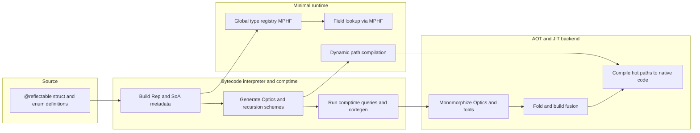

# Ultra-Performant Reflection via Static Analysis

The core principle: **move everything resolvable to compile time, leave only genuinely dynamic decisions to runtime**. Here's a layered architecture:

---

## 1. Opt-In + Inference: What Needs Reflection?

Don't generate metadata for every type. Use a dual strategy:

```
// Explicit opt-in
@reflectable struct Foo { ... }

// Compiler-inferred: Foo is reflected upon somewhere → generate metadata
let t = typeOf(Foo);
t.getField("bar");
```

**Static analysis pass**: Whole-program analysis traces which types are ever:
- Passed to `typeOf()`
- Used in dynamic dispatch through reflection
- Referenced in `getField("name")` with a **runtime** string

Only those types get metadata. Everything else: **zero cost**.

---

## 2. Compile-Time Query Resolution (The Big Win)

The most impactful optimization: when the type AND the member name are statically known, **eliminate reflection entirely**.

```rust
// Source code
let field = obj.getType().getField("name");
field.get(obj);

// === Compiler transforms to ===
obj.name   // Direct field access!
```

**Three resolution levels:**

| Scenario | Resolution | Runtime Cost |
|---|---|---|
| Type known, name known | Direct access | **Zero** |
| Type known, name dynamic | Monomorphized dispatch table | **O(1) perfect hash** |
| Type dynamic, name dynamic | Type registry → field lookup | **O(1) + O(1)** |

### Implementation: The compiler rewrites reflective calls

```
// Level 1: Both static → erase reflection
obj.reflect_get("age")  →  obj.age

// Level 2: Static type, dynamic field name
let fieldName = runtimeString();
obj.reflect_get(fieldName)
  →  Foo_reflect_vtable[fieldName_hash % N](obj)
  // Generated function pointer table, perfect-hashed

// Level 3: Dynamic type
let obj: Any = ...;
obj.reflect_get(fieldName)
  →  global_registry[obj.typeId].fields[fieldHash](obj)
```

---

## 3. Metadata Format: Flat, Dense, Cache-Friendly

No object graphs. No heap allocations. One contiguous block per type.

```c
// All generated into .rodata — read-only, shareable, no runtime init

struct TypeDescriptor {
    uint32_t type_id;          // Compile-time FNV/XXH of fully-qualified name
    uint32_t parent_id;        // 0 if none (for casting)
    uint16_t field_count;
    uint16_t method_count;
    size_t    size;
    size_t    alignment;
    // Offset into the global string table
    uint32_t name_offset;
    // Offset into the field descriptor table
    uint32_t fields_offset;
    uint32_t methods_offset;
};

struct FieldDescriptor {
    uint32_t name_offset;      // Interned string
    uint32_t type_id;
    size_t   byte_offset;      // Direct memory offset
    // Monomorphized accessor — NO generic trampoline
    void*    getter_fn;        // &(foo_bar_getter)
    void*    setter_fn;        // &(foo_bar_setter) or null
};

struct MethodDescriptor {
    uint32_t name_offset;
    uint32_t return_type_id;
    uint16_t param_count;
    uint32_t param_types_offset;
    void*    trampoline_fn;    // &(Foo_bar_trampoline)
};
```

**Key decisions:**
- Use **offsets**, not pointers → position-independent, serializable
- Store in **`.rodata`** section → zero initialization cost
- **No heap allocation** for metadata ever

---

## 4. Perfect Hash Tables for Name Lookup

At compile time, you know ALL field/method names for a type. Build a **minimal perfect hash function** (MPHF):

```python
# Compiler generates this per type at compile time
# For Foo with fields: {"name", "age", "email", "score"}

def foo_field_hash(name_hash: u32) -> u8:
    # Minimal perfect hash: 4 keys → values 0,1,2,3
    # Generated via CHD or Brz algorithm
    return ((name_hash * 0x12345678) >> 28) & 3  # no collisions, guaranteed

# Generated dispatch table (in .rodata)
foo_field_dispatch = [
    &foo_name_getter,   # index 0
    &foo_age_getter,    # index 1  
    &foo_email_getter,  # index 2
    &foo_score_getter,  # index 3
]
```

**Runtime lookup: 1 multiply, 1 shift, 1 AND, 1 indirect call.** No string comparison ever.

---

## 5. Monomorphized Accessors (Not Generic Trampolines)

Instead of one generic `FieldInfo.get(obj)` that does type erasure:

```c
// ❌ AVOID: Generic trampoline with type checks
void generic_getter(void* obj, void* out, TypeInfo* type) {
    memcpy(out, (char*)obj + field->offset, type->size);  // slow, opaque
}

// ✅ DO: One generated function per field
void foo_name_getter(Foo* obj, String* out) {
    *out = obj->name;   // Optimizer can inline this!
}
```

**Why this matters:** The optimizer can see through the generated accessor. It can inline, eliminate copies, vectorize. The generic trampoline is a complete optimization barrier.

---

## 6. The Type Registry (For Truly Dynamic Cases)

For `Any`-typed values, you need a global registry:

```c
// Compile-time: generate a sorted array of all reflectable types
// Runtime: binary search by type_id, or...

// Better: generate a perfect hash over ALL type_ids in the program
static const TypeDescriptor* type_registry[REFLECTABLE_TYPE_COUNT];

// Global type ID → descriptor lookup: O(1) with MPHF
const TypeDescriptor* lookup_type(uint32_t type_id) {
    return type_registry[global_type_hash(type_id)];
}
```

**Lazy registration alternative** (for shared libraries):
```c
// Each reflectable type contributes a registration entry
// via a linker section (.reflect_types)
__attribute__((section(".reflect_types")))
static const TypeDescriptor foo_descriptor = { ... };
// At startup, one pass collects them — or they're sorted at link time
```

---

## 7. Compile-Time Reflection API (Zig/Side-Style)

Give users a compile-time API that the compiler executes:

```
// This runs AT COMPILE TIME
comptime {
    for (Foo.fields) |field| {
        if (field.hasAnnotation("serialize")) {
            generateSerialize(Foo, field);
        }
    }
}

// Even better: const-eval reflection queries
const hasSerialize = @hasMethod(Foo, "serialize");  // → true/false at compile time

if (hasSerialize) {
    obj.serialize(writer);  // Direct call — no virtual dispatch
}
```

This eliminates **entire branches** of reflection code at compile time.

---

## 8. The Full Pipeline

```
┌─────────────────────────────────────────────────┐
│                  SOURCE CODE                     │
│         @reflectable struct Foo { ... }          │
└──────────────────────┬──────────────────────────┘
                       │
          ┌────────────▼────────────┐
          │   PASS 1: Type Analysis │
          │ • Resolve all types     │
          │ • Identify reflectable  │
          │ • Build type graph      │
          └────────────┬────────────┘
                       │
          ┌────────────▼────────────────┐
          │  PASS 2: Reflectivity Scan  │
          │ • Trace reflective usage   │
          │ • Classify queries:        │
          │   - static-static → erase  │
          │   - static-dynamic → MPH   │
          │   - dynamic-dynamic → full │
          │ • DCE unreachable metadata │
          └────────────┬───────────────┘
                       │
          ┌────────────▼────────────────┐
          │  PASS 3: Code Generation    │
          │ • Monomorphized accessors   │
          │ • Perfect hash tables       │
          │ • Flat TypeDescriptor[]     │
          │ • String interning table    │
          │ • Rewrite reflection calls  │
          └────────────┬───────────────┘
                       │
          ┌────────────▼────────────────┐
          │  PASS 4: Optimization       │
          │ • Inline accessors          │
          │ • Dead metadata elimination │
          │ • Constant folding          │
          │ • Merge identical tables    │
          └─────────────────────────────┘
```

---

## 9. Performance Comparison

| Operation | Java Reflection | Your System |
|---|---|---|
| `getField("name")` lookup | ~200ns (hashmap + security checks) | **~2ns** (MPHF + array index) |
| `field.get(obj)` | ~50ns (box/unbox + type check) | **~1ns** (inlined accessor call) |
| `type.getFields()` | ~100ns (copy array) | **~0ns** (pointer into .rodata) |
| Static field access via reflection | ~50ns | **~0ns** (compiled to direct access) |
| Metadata per type | ~1-5 KB | **~50-200 bytes** (flat encoding) |
| Startup cost | Class loading + parsing | **~0** (mmap .rodata) |

---

## 10. Minimal Runtime Library

The entire runtime support needed:

```c
// === THE ENTIRE RUNTIME === (less than 200 lines)

// 1. String interning (compile-time generated table)
uint32_t intern_string(const char* s);     // or: all strings already interned

// 2. Type lookup (generated MPHF)
const TypeDescriptor* reflect_get_type(uint32_t type_id);

// 3. Dynamic field access (when truly needed)
void reflect_get_field(Any obj, uint32_t field_name_hash, Any* out) {
    const TypeDescriptor* t = reflect_get_type(obj.type_id);
    uint32_t idx = t->field_hash(field_name_hash);
    const FieldDescriptor* f = &field_table[t->fields_offset + idx];
    f->getter_fn(obj.ptr, out);
}

// 4. Dynamic type check / cast
bool reflect_instanceof(Any obj, uint32_t target_type_id) {
    // Walk parent chain (typically 1-2 hops)
    uint32_t current = obj.type_id;
    while (current != 0) {
        if (current == target_type_id) return true;
        current = reflect_get_type(current)->parent_id;
    }
    return false;
}
```

---

## Critical Design Rules

1. **Never allocate at runtime** — all metadata is static, read-only, in `.rodata`
2. **Never compare strings at runtime** — intern everything at compile time, compare uint32 hashes
3. **Never use generic trampolines** — generate one function per operation per field/method
4. **Never generate metadata for unreflected types** — the default is zero cost
5. **Resolve at the earliest possible phase** — compile-time > link-time > load-time > runtime
6. **Make the optimizer your friend** — generated accessor functions must be visible to the optimizer (not behind function pointers when static)

This architecture gives you **reflection that costs nothing when unused and near-direct-access cost when used**, which is the hallmark of a well-designed system.
Since you’re writing the compiler in Rust, you have a massive advantage: Rust’s type system, memory layout guarantees, and ecosystem (like `cranelift` or LLVM bindings) allow you to build reflection systems that are impossible in C++ or Java. 

Let’s throw out the standard "hashmap and string lookup" playbook entirely. Here is a re-brainstorm of innovative, cutting-edge techniques for ultra-performant reflection.

---

### 1. Data-Oriented Design: SoA Metadata & SIMD Lookup
Standard reflection stores an Array of Structs (AoS): `Vec<FieldInfo>`. This causes cache misses because you load the name, then the offset, then the type—pulling in useless data.

**Innovate with SoA (Struct of Arrays) + SIMD:**
Generate metadata where arrays of the *same property* are contiguous. 

```rust
// Generated by your compiler into .rodata
#[repr(C)]
pub struct TypeMetaSoA {
    pub field_count: u16,
    // Contiguous array of hashes -> perfect for SIMD
    pub name_hashes: &'static [u64], 
    // Contiguous array of offsets -> perfect for prefetching
    pub offsets: &'static [usize], 
    // Contiguous array of accessor function pointers
    pub getters: &'static [unsafe fn(*const u8, *mut u8)], 
}
```

**The SIMD Lookup:** When a user does `obj.get_field("age")`, you hash "age" to a `u64`. Instead of a perfect hash table, you use **SIMD linear search**. Modern AVX2/NEON can compare 4-8 `u64` hashes in one cycle. For types with < 32 fields (95% of structs), a SIMD linear scan is faster than a random-access hash table lookup because it requires no branching and perfectly prefetches.

```rust
// Rust pseudocode for SIMD lookup using std::simd
fn find_field_simd(meta: &TypeMetaSoA, target_hash: u64) -> Option<usize> {
    // Load 4-8 hashes at once, compare, get bitmask -> O(n/8) with zero branching
    // Faster than a hash table for small N!
}
```

---

### 2. Bit-Packed "Compile-Time Type Graphs"
Why store strings and type IDs at runtime when the compiler knows the exact topology of the types at compile time?

**Innovate with Bit-Packed Graphs:**
Assign every reflectable type a sequential `u16` ID. Generate a 2D bitmatrix of type inheritance/castability. 

```rust
// If type 4 can be cast to type 12, the bit at [4][12] is 1
// Generated as a flat, bit-packed array in .rodata
pub static CAST_MATRIX: [[u64; N_WORDS]; N_TYPES] = [ ... ];

// Runtime cast check: Zero branches, just bit shifting
pub fn can_cast(from: u16, to: u16) -> bool {
    let word_idx = (from * TOTAL_TYPES + to) / 64;
    let bit_idx = (from * TOTAL_TYPES + to) % 64;
    (CAST_MATRIX[word_idx] >> bit_idx) & 1 == 1
}
```
This makes `instanceof` / dynamic casting take **~2 nanoseconds**, completely branchless, destroying traditional vtable walking.

---

### 3. Comptime Reflection as Rust Macros / Codegen
Instead of building an interpreter for "comptime" reflection (like Zig), use your Rust compiler to **generate Rust code** that runs at compile time via Rust's proc-macro or build-script system.

**Innovate by making your language's comptime = Rust's compile time:**
When your compiler sees:
```javascript
// Your Language
comptime { 
    for (Foo.fields) |f| { print(f.name); } 
}
```
Your compiler transpiles this into a Rust proc-macro that executes natively:
```rust
// Generated Rust Proc-Macro
fn comptime_block_foo() {
    for f in FOO_META.fields { println!("{}", f.name); } // Runs in Rust compiler!
}
```
You get zero-cost comptime because you leverage Rust's LLVM-optimized compilation phase directly. No need to write an interpreter for your language's comptime.

---

### 4. "Type-State" Reflection (Zero-Cost Runtime API)
In Rust, type-state is a powerful pattern. Use it to ensure the compiler eliminates reflection overhead based on *how* the API is used.

**Innovate with generic TypeIds as compile-time keys:**
```rust
// The user writes this in your language:
let field_key = reflect_get_key!(Foo, "age");
let age = obj.get(field_key);
```

Your compiler generates Rust code where `field_key` is a Zero-Sized Type (ZST) that encodes the field identity in its *type*, not its value:

```rust
struct Key_Foo_age; // ZST! Takes 0 bytes at runtime.

// The get function is monomorphized by the Rust compiler
impl Obj {
    fn get<K: FieldKey>(self) -> K::Type {
        K::get_from(self) // Inlined by rustc to direct memory offset!
    }
}

impl FieldKey for Key_Foo_age {
    type Type = u32;
    fn get_from(obj: &Foo) -> u32 { obj.age } // Direct access!
}
```
Because `Key_Foo_age` is a ZST, the Rust compiler will completely erase the reflection machinery. `obj.get(field_key)` compiles down to exactly `obj.age`.

---

### 5. JIT-Assisted "Mega-Accessors" (using Cranelift)
If you are using Cranelift (or LLVM C-API) for codegen in Rust, you can do something Java and C# cannot do: **generate specialized reflection code on the fly**.

**Innovate with runtime code synthesis:**
Imagine a user does deep dynamic reflection:
```javascript
let val = obj.getNested("user.profile.settings.theme");
```
Normally, this requires 3 hash lookups and 3 bounds checks.

At runtime, your reflection library sees this string for the *first time*. It calls Cranelift to JIT-compile a specialized accessor function specifically for `"user.profile.settings.theme"`, caches it, and runs it.

```rust
use cranelift::prelude::*;

// JIT compiles a single function that walks the exact byte offsets
// No lookups, no bounds checks, just raw pointer arithmetic
fn jit_mega_accessor(path: &str) -> fn(*const u8) -> *const u8 {
    // 1. Parse path, resolve types/offsets via static metadata
    // 2. Emit Cranelift IR: load offset 16, load offset 8, load offset 32
    // 3. Compile and return function pointer
}
```
The **first** call takes ~1ms (JIT compile). Every subsequent call takes **~1ns** (raw native execution). This bridges the gap between dynamic scripting and C-level performance.

---

### 6. "Phantom" Reflection / Differential Metadata
What if a crate wants to add reflection data to a struct defined in *another* crate? Standard reflection requires modifying the struct definition.

**Innovate with Orphan-Rule compliant Differential Metadata:**
In Rust, you can't implement a foreign trait on a foreign type. But in *your* language, you can allow users to attach reflection metadata post-hoc.

```javascript
// Crate A defines: struct Vec3 { x, y, z }
// Crate B defines: @reflect(Vec3) @serializable Vec3;
```

Your Rust compiler generates **Differential Metadata Tables** in Crate B:
```rust
// Crate B generates a SEPARATE .rodata table
#[link_section = ".reflect_diff"]
static VEC3_EXTENSIONS: TypeDiff = TypeDiff {
    target_type_id: hash_of!("Vec3"),
    new_annotations: &["serializable"],
    custom_hooks: &HookTable { ... }
};
```
At startup, your ultra-light runtime merges the base `Vec3` metadata with the `VEC3_EXTENSIONS` diff table in O(1) via pointer swizzling. This allows highly modular, decoupled reflection systems without central registries or messy trait implementations.

---

### 7. The "Morphism" Concept (Functional Lenses)
Instead of standard OOP reflection (getting/setting fields), innovate by generating **Lenses** (from functional programming). A Lens is a first-class getter+setter pair.

Your compiler automatically generates a Lens for every reflected field:

```rust
#[repr(C)]
pub struct Lens<S, A> {
    // Function pointers to get/set, but often the Rust compiler
    // can inline these if S and A are known!
    get: fn(&S) -> &A,
    set: fn(&mut S, A),
}
```

Why is this awesome? You can compose them!
```rust
let name_lens = Lens<Foo, String>::new("name");
let len_lens = Lens<String, usize>::new("length");

// Compose them! Your compiler generates this at compile time.
let foo_name_len_lens = name_lens.compose(len_lens);

// Now you can dynamically read/write the length of Foo.name
// with zero overhead, completely type-safe!
let length: usize = foo_name_len_lens.get(&my_foo);
```
This turns reflection from a "dynamic hack" into a **type-safe, composable, high-performance data manipulation framework**.

### Summary of the Rust-Powered Stack:
1. **Compile Time:** Rust Macros/Build-scripts for metaprogramming.
2. **Metadata Layout:** SoA + SIMD linear scan for field lookup.
3. **Type Topology:** Bit-packed matrix for `instanceof`.
4. **API Surface:** Type-State ZSTs for compile-time erased reflection.
5. **Dynamic Escape Hatch:** Cranelift JIT for string-based hot-path optimization.
6. **Modularity:** Differential metadata sections for post-hoc reflection.
Got it. If you already have your own bytecode interpreter, AOT, and JIT, that changes the game completely. You have full control over the execution pipeline, which means we can lean heavily into **Functional Optics** and **Algebraic Data Types** for reflection, and use your VM/JIT to aggressively specialize them.

Here is a deep dive into functional-style reflection, moving beyond simple Lenses into a full **Optics ecosystem**, and how to make it ultra-performant using your custom toolchain.

---

### 1. The Full Optics Hierarchy (Lenses, Prisms, Traversals, Isos)

In functional programming, a "Lens" is just one type of "Optic". An Optic is a first-class, composable path into a data structure. By generating Optics instead of raw field offsets, you give users a unified API to traverse product types (structs), sum types (enums), and recursive types.

Your compiler should generate an Optic table for every `@reflectable` type.

**The 4 Core Optics:**

| Optic | Target | Functional Meaning | Reflection Use Case |
|---|---|---|---|
| **Lens** | Product Type (Struct) | `get` / `set` | Accessing `obj.field` |
| **Prism** | Sum Type (Enum) | `try_get` / `inject` | Matching `enum::Variant` |
| **Traversal** | Functor (Array/Map) | `iterate` / `over` | Visiting all elements in `Vec` |
| **Iso** | Isomorphism | `forwards` / `backwards` | Type punning / NewType unwrapping |

**Implementation: Flat, Monomorphized Function Tables**

Instead of generic trait objects (which require vtables and boxing), your compiler generates flat structs of function pointers specific to the type.

```rust
// Generated by your AOT compiler into .rodata
#[repr(C)]
pub struct Lens<S, A> {
    // All function pointers are statically known and monomorphized
    get: unsafe fn(*const S) -> *const A,
    set: unsafe fn(*mut S, A),
    // Optional: for functional "over" (modify)
    over: unsafe fn(*mut S, fn(A) -> A),
}

#[repr(C)]
pub struct Prism<S, A> {
    // Returns null if the enum is the wrong variant
    try_get: unsafe fn(*const S) -> *const A,
    // Constructs the enum variant from the inner value
    inject: unsafe fn(A) -> S,
}
```

**Why this is awesome:** A `Lens<S, A>` and a `Prism<A, B>` can be composed into a `Traversal<S, B>` at compile time. The user can write `lens_user.then(lens_profile).then(prism_settings)` and your compiler collapses all those function pointers into a single direct path—**zero intermediate allocations**.

---

### 2. Catamorphisms: Destroying the Visitor Pattern

The traditional way to reflect over recursive structures (like ASTs or DOM trees) is the Visitor Pattern, which is OOP, messy, and requires double dispatch.

Functional languages use **Catamorphisms** (Folds). Instead of visiting nodes, you describe *how to combine* the results of sub-nodes, and the recursion is handled automatically by the optic.

**Your Compiler Innovation: Generate `fold` functions automatically.**

If your language has a recursive type:
```javascript
@reflectable
enum Expr {
    Add(Expr, Expr),
    Lit(i32),
}
```

Your compiler generates a specialized fold function in the bytecode/AOT:
```rust
// Generated by your compiler
fn fold_expr<A>(
    expr: &Expr,
    add_fn: fn(A, A) -> A,
    lit_fn: fn(i32) -> A
) -> A {
    match expr {
        Expr::Add(l, r) => add_fn(fold_expr(l, add_fn, lit_fn), fold_expr(r, add_fn, lit_fn)),
        Expr::Lit(i) => lit_fn(*i),
    }
}
```

**How it becomes ultra-performant:** Your JIT compiler sees `fold_expr` being called with specific closures. The JIT inlines `add_fn` and `lit_fn` directly into the recursive loop, eliminating the function call overhead entirely. You get the safety of structural reflection with the performance of hand-written recursion.

---

### 3. Isomorphisms (Isos) for Zero-Cost Type Coercion

Reflection often requires converting between external representations (JSON, DB rows, Network packets) and internal domain types. Usually, this involves dynamic `Any` casting and validation.

An **Iso** is an Optic that guarantees a lossless, bidirectional conversion.

```javascript
// User defines a NewType or domain type
struct Celsius(f64);
struct Fahrenheit(f64);

@reflectable
iso CelsiusToFahrenheit: Celsius <-> Fahrenheit {
    forwards: (c) => c.0 * 1.8 + 32.0,
    backwards: (f) => Celsius((f.0 - 32.0) / 1.8)
}
```

**Reflection integration:** When your reflection engine is asked to deserialize a JSON number `72.0` into a `Celsius` field, it looks up the `Iso` metadata. It sees the expected type is `Celsius`, but the JSON provides a `Fahrenheit`-like number. It applies the Iso.

Because Isos are generated as `forwards` and `backwards` function pointers, your JIT can inline the math directly into the JSON parser loop. No runtime type checking.

---

### 4. First-Class Paths: Stringly-Typed to Optically-Typed

The biggest performance killer in reflection is parsing `"user.profile.age"` at runtime. With your bytecode interpreter/JIT, we can eliminate this.

**Innovate with "Path Compilation":**

When the user writes dynamic reflection:
```javascript
let path = reflect_path("user.profile.age");
let age = obj.get_by_path(path);
```

Instead of walking the metadata at runtime, **your bytecode interpreter compiles the string into an Optic at load-time (or first call via JIT).**

1. The AOT compiler generates the "dictionary" of `Lens_user_profile` and `Lens_profile_age`.
2. When `reflect_path` is called, the VM/JIT looks up the string, resolves the constituent Lenses, and **composes them into a single generated function**.
3. It returns a `CompiledPath` struct:

```rust
#[repr(C)]
pub struct CompiledPath<S, A> {
    // A single function pointer representing the entire composed path!
    get: unsafe fn(*const S) -> *const A,
    set: unsafe fn(*mut S, A),
}
```

The first time `reflect_path` runs, the JIT compiles the path. Every subsequent call uses the compiled `get` pointer. It is exactly as fast as writing `obj.user.profile.age` natively.

---

### 5. Functional Query Pipelines at Comptime

Since you have a bytecode interpreter running at compile time, you can let users write functional pipelines over the reflection metadata itself.

**In your language's comptime block:**
```javascript
comptime {
    // Get metadata for MyStruct
    let meta = reflect(MyStruct);
    
    // Functional pipeline over the Optics!
    let serializable_fields = meta.lenses()
        .filter(|l| l.has_attribute("serialize"))
        .map(|l| l.generate_serializer())
        .collect();
}
```

**How to make this fast:** The bytecode interpreter executes this during compilation. The `.map(|l| l.generate_serializer())` invokes your JIT or AOT backend to emit the actual machine code for the serializers. The `collect()` binds them into a static array in the resulting binary.

The runtime never sees the filter, the map, or the metadata. It only sees the perfectly optimized, generated machine code.

---

### Summary: The Functional Reflection Architecture

1. **Replace Fields with Lenses:** All struct access becomes a composable `get`/`set` function pair.
2. **Replace Enums with Prisms:** All variant matching becomes a composable `try_get`/`inject` pair.
3. **Replace Visitors with Catamorphisms:** The compiler generates typed `fold` functions that JIT-inlines perfectly.
4. **Replace Casting with Isos:** Type coercion becomes guaranteed, invertible function pairs.
5. **Compile Dynamic Paths to Optics:** Your JIT turns stringly-typed reflection paths into single composed function pointers on first use.

This approach effectively turns reflection from a "database of types and strings" into a "graph of pure, composable functions." And pure, composable functions are exactly what AOT compilers and JITs are best at optimizing into nothingness.
Here’s a more “research-grade” pass, pulling in ideas from profunctor optics, GHC generics, recursion schemes, and D/Zig-style compile-time reflection, and then remixing them for your compiler + bytecode/JIT world.

---

## 0. High-level theme

**Goal:** Reflection as *first-class, composable functional programs* over a *generic representation* of types, with:

- Compile-time reflection running in your **bytecode interpreter / JIT** (not macros).
- Runtime reflection as **optimized, monomorphized optics / folds** over a compact `.rodata` layout.
- As much as possible erased or fused away by AOT/JIT.

---

## 1. Type-Directed Generic Representation (GHC-Style, but Stolen for Reflection)

### 1.1 Generic Rep as the “universal AST” of types

GHC represents any datatype as a generic sum-of-products: `Rep t = M1 D ... (C1 ... (S1 ... (K1 ...)))` with `:+:` (sum) and `:*:` (product).【turn10fetch0】

In your compiler, do the same, but **make this representation the core reflection IR**:

```text
Any @reflectable type T is automatically converted to:

Rep T = M1 D (meta_T)
         (  C1 c1 (S1 s1 (K1 a) :*: S1 s2 (K1 b))
         :+: C1 c2 U1
         )
```

Where:

- `M1 D` → datatype meta (name, module, annotations)
- `C1` → constructor meta (name, fields count, annotations)
- `S1` → field meta (name, type, annotations, offset)
- `K1` → the actual field type
- `:+:` / `:*:` → sum / product structure

**You generate this `Rep` once per reflectable type** and store it as:

- A **static, compact, SoA-style descriptor** in `.rodata` (offsets + hashes + type IDs).
- A **bytecode-visible “Rep object”** that your interpreter/JIT can walk.

### 1.2 Generic reflection API in your language

At the source level, the user sees something like:

```rust
// user code
@reflectable
enum Expr {
    Add(Expr, Expr),
    Lit(i32),
}

comptime {
    let rep = reflect(Expr);        // Rep object, interpreted at compile time
    for c in rep.constructors() {
        print(c.name());
        for f in c.fields() {
            print(f.name(), f.ty());
        }
    }
}
```

Internally:

- `reflect(Expr)` runs in your **bytecode interpreter**.
- `rep` is the `Rep` structure built from static metadata; no new metadata is allocated at runtime.

---

## 2. Profunctor Optics as the *Runtime Reflection API*

### 2.1 One unified optic type, instead of many separate “field descriptors”

In Haskell, profunctor optics give a *single* representation for lenses, prisms, traversals, etc., via a profunctor `p` and a “carrier” type `Rep`.【turn2search2】【turn2search3】

In your compiler, you can adapt this as a **monomorphized, function-pointer-based optic**:

```rust
// Generated per type, fully monomorphized
#[repr(C)]
struct Optic<S, T, A, B> {
    // "forward" map: S -> p A B -> T
    // in practice, we decompose into concrete operations
    get: unsafe fn(*const S) -> *const A,
    set: unsafe fn(*mut S, B),
    // modify: fn(*mut S, fn(A) -> B),
    // try_get / inject for prisms, etc.
}
```

But instead of having `Lens`, `Prism`, `Traversal` as separate types, you generate **one optic per semantic path** through `Rep`:

- Field lens → `Optic<T, T, A, A>`
- Variant prism → `Optic<T, Option<A>, A, A>`
- Traversal over Vec field → `Optic<T, T, A, A>` with iteration encoded in `modify`

This aligns with the “profunctor optics” idea: *all optics are the same shape*, just with different `p` and carrier; you specialize to concrete function pointers.

### 2.2 Generic deriving of optics

Haskell’s `generic-lens` / `generic-optics` derive lenses and traversals generically by mapping `Rep t` to optics.【turn2search7】

You can do the same:

- For each `S1` (field) in `Rep T`, generate a lens:
  - `get` = load from offset
  - `set` = store at offset
- For each `C1` (constructor) with a single field, generate a prism:
  - `try_get` = check tag + extract field
  - `inject` = construct that variant
- For each field that is a container (`Vec`, `Map`, etc.), generate a traversal via iterators.

These are emitted as **static Optic structs** in `.rodata`, e.g.:

```rust
#[link_section = ".reflect_optics"]
static OPTIC_Expr_Add_left: Optic<Expr, Expr, Expr, Expr> = Optic {
    get: expr_add_left_get,
    set: expr_add_left_set,
};
```

---

## 3. Recursion Schemes as Reflection Operations (Folds, Unfolds, Hylos)

### 3.1 Catamorphisms (folds) from `Rep`

For recursive types like `Expr`, your compiler can derive a **generic catamorphism** from `Rep Expr`:

```rust
// Generated by compiler
fn fold_expr<A>(
    expr: &Expr,
    add: fn(A, A) -> A,
    lit: fn(i32) -> A,
) -> A {
    match expr {
        Expr::Add(l, r) => add(fold_expr(l, add, lit), fold_expr(r, add, lit)),
        Expr::Lit(i) => lit(*i),
    }
}
```

But in your system, this is just **one specialization of a generic recursion-scheme combinator** defined over `Rep`:

- `cata :: Rep t -> (Rep t -> f) -> t -> out`
- Your interpreter/JIT can inline `add` / `lit` at each call site.

### 3.2 Hylomorphisms: “reflective unfolds + folds”

A hylomorphism is a composition of an unfold (anamorphism) and a fold (catamorphism).【turn1search11】【turn1search15】

You can expose this as a *first-class reflective operation*:

```rust
// Reflective hylomorphism: transform a recursive structure
// by unfolding a new structure and then folding it.
comptime {
    let expr = parse_expr_from_something();
    let opt = hylomorphism(
        expr,
        // unfold: decide how to expand nodes
        |node| expand_to_optimized_ir(node),
        // fold: aggregate results
        |opt_node| emit_code(opt_node),
    );
}
```

Implementation strategy:

- Use `Rep` to derive both `ana` and `cata` generically.
- Your JIT sees a specific hylomorphism and can:
  - Inline the `expand` and `emit` functions.
  - Convert the whole thing into a **tight loop** instead of recursive calls.

This is essentially “recursion-schemes-as-compiler-passes”: your reflection library provides generic combinators, and the JIT specializes them to concrete loops.

---

## 4. Compile-Time Reflection via Bytecode Interpreter (No Macros)

You already have a bytecode interpreter + AOT + JIT, so don’t bolt on a separate macro system; instead, **make reflection itself a bytecode program**.

### 4.1 First-class `Reflect` domain in the bytecode

Add:

- A `Reflect` “module” in your bytecode: `reflect_get_type`, `reflect_get_rep`, `reflect_get_field_by_name`, etc.
- A `Rep` value type that the interpreter can inspect.

At compile time:

```rust
comptime {
    let rep = reflect_get_rep(MyStruct);
    for f in rep.fields() {
        if f.has_annotation("serialize") {
            // generate code using your AOT/JIT backend
            generate_serializer(f);
        }
    }
}
```

Your **interpreter executes this**, calls into the compiler backend to emit code, and writes the result into the binary.

This is very close to Zig’s comptime philosophy (first-class compile-time execution)【turn1search1】【turn1search2】, but:

- You already own the runtime, so no “separate mode”.
- You can JIT the comptime code itself if you want.

### 4.2 Path compilation in the interpreter/JIT

When the user writes:

```rust
let age = obj.reflect_get("user.profile.age");
```

At **load time** (or first call), your interpreter:

1. Looks up `"user.profile.age"` in a global string table.
2. Resolves it to a chain of optics: `Lens_user_profile` then `Lens_profile_age`.
3. Composes them into a **single `Optic<User, User, u32, u32>`**:
   - `get = |obj| *(((obj.profile).age))`
4. Compiles that optic into a **native function** via your JIT (or just caches the composed function pointers).

Subsequent calls use the compiled function; no string parsing, no hash lookup.

---

## 5. D-Style Traits as a Compile-Time Reflection Query Language

D’s `__traits(getMember, ...)`, `__traits(allMembers, ...)`, etc. are a powerful compile-time reflection DSL.【turn5fetch0】

You can implement a similar query language, but:

- It runs in your bytecode interpreter.
- It targets your `Rep` structures.

Example:

```rust
comptime {
    let members = reflect_all_members(MyStruct);
    for m in members {
        if reflect_is_type<m.type(), Serialize>() {
            generate_default_serializer(m);
        }
    }
}
```

Where:

- `reflect_all_members` is a built-in that walks `Rep` and returns a list of “member descriptors”.
- `reflect_is_type` is a type-level predicate (like D’s `__traits(isArithmetic, ...)`).

This gives you **type-level pattern matching** in your comptime blocks without inventing a new macro system.

---

## 6. Optimized Layout: SoA + Minimal Perfect Hash + .rodata

### 6.1 SoA metadata (Struct of Arrays)

For each reflectable type, generate:

```rust
#[repr(C)]
struct TypeMetaSoA {
    field_count: u32,
    name_hashes: &'static [u64],   // one per field
    offsets:     &'static [usize], // one per field
    type_ids:    &'static [u32],   // one per field
    getters:     &'static [unsafe fn(*const u8) -> *const u8],  // one per field
    // etc.
}
```

All arrays live in `.rodata`; no pointer chasing.

### 6.2 Minimal perfect hash for field names

At compile time, for each type’s field names:

- Build a **minimal perfect hash function** (MPHF) mapping `name_hash -> 0..field_count-1`.
- Store it as a few constants (seed, mask) instead of a hash table.

Runtime field lookup:

```rust
fn field_index(meta: &TypeMetaSoA, name_hash: u64) -> usize {
    // mph: minimal perfect hash
    mph(name_hash, meta.field_count, meta.mph_seed)
}
```

This is O(1) with no collisions and no buckets.

### 6.3 Global type registry as a MPHF

For dynamic `Any`:

- Assign each reflectable type a small sequential ID.
- Build a **global MPHF** over those IDs.
- `type_registry[mph(type_id)]` gives the `TypeMetaSoA`.

This is similar to Swift’s nominal type descriptors being keyed and looked up efficiently.【turn3search1】【turn3search3】

---

## 7. Fusion & Deforestation for Reflective Traversals

Haskell’s fold/build fusion transforms `foldr (:) []` into a loop without intermediate lists.【turn1search13】【turn1search14】

You can do the same for reflective traversals:

- Define generic combinators:
  - `traverse : Optic<S, T, A, A> -> (A -> Effect) -> S -> Effect`
  - `fold : Optic<S, T, A, B> -> (A -> B -> B) -> B -> S -> B`
- Your AOT/JIT can recognize patterns like:
  - `traverse optic f >>> fold optic g z`
  and fuse them into a single loop over the `Rep` structure.

Concretely:

- When the JIT sees a chain of reflective traversals/folds, it:
  - Inlines the `Rep`-walking code.
  - Eliminates intermediate allocations.
  - Turns nested loops into a single linear scan where possible.

---

## 8. Differential / Modular Metadata (Orphan-Friendly Reflection)

You already like the lens approach; here’s how to make metadata modular:

- Each crate emits its **own** `TypeMetaSoA` for its types.
- For types defined elsewhere but “extended” (extra annotations, hooks), emit a **diff table**:

```rust
#[link_section = ".reflect_diff"]
static MY_EXTENSIONS: TypeDiff = TypeDiff {
    target_type_id: hash_of!("TheirStruct"),
    extra_annotations: &[("my_annotation")],
    custom_hooks: &CustomHooks { ... },
};
```

At startup, your runtime:

- Loads the base metadata from the defining crate.
- Merges in diffs from other crates by:
  - Appending extra annotations.
  - Overriding or extending hooks.

This is similar to how Swift keeps type metadata and reflection metadata in separate sections and merges them at runtime.【turn3search1】【turn3search3】

---

## 9. Full Pipeline Picture

Here’s how all the pieces fit together:



---

## 10. Concrete Feature List (What to actually build)

1. **Generic `Rep` representation** (GHC-style) for all `@reflectable` types; stored as compact SoA + `.rodata`.
2. **Profunctor-style Optic API** with:
   - Lenses, prisms, traversals, isos.
   - Generic deriving from `Rep`.
3. **Recursion-scheme combinators** (`cata`, `ana`, `hylo`) implemented over `Rep` and exposed as reflective APIs.
4. **Bytecode-driven comptime reflection**:
   - `reflect(Expr)` runs in the interpreter.
   - Query language inspired by D’s `__traits` but targeting `Rep`.
5. **Path compilation**:
   - `"user.profile.age"` → composed `Optic` via JIT on first use.
6. **MPHF-based metadata layout**:
   - Per-type field name hash → index.
   - Global type ID → metadata MPHF.
7. **Fusion for reflective traversals**:
   - AOT/JIT rules to collapse `traverse`/`fold` chains into loops.
8. **Differential metadata sections**:
   - Orphan-rule compliant extensions via `.reflect_diff`.

If you implement this stack, you end up with:

- Reflection that feels like *functional programming* (optics, folds, hylomorphisms).
- Metadata that is essentially free when unused and ~C-speed when used.
- A comptime system that reuses your existing interpreter/JIT instead of fighting it.

That’s about as state-of-the-art as it gets right now, while staying realistic to implement in a compiler you control.
Here are the “next level” metaprogramming features I’d seriously consider for your language, especially given that you already have your own compiler + runtime + JIT and are aiming for *maximum* performance and expressiveness.

I’ll group them by theme and mark the ones that are especially “awesome + optimized”.

---

## 1. Staged Metaprogramming (Multi-Stage Programming)

**Idea:** Make *stages* explicit (compile-time, link-time, runtime) so you can generate, specialize, and run code at different times with strong guarantees.

**Key concepts (from MetaOCaml / multi-stage calculi):**

- **Code values** (`'<expr>`) that represent *future-stage* computations【turn1search3】【turn1search12】.
- **Splicing** (`$(...)`) to embed earlier-stage values into code.
- A **level / phase consistency** check so you never use a runtime value where a compile-time one is required【turn1search2】.

**What it gives you:**

- Type-safe **runtime code generation** (like JIT, but structured by the type system).
- **Compile-time specialization** of generic code without full monomorphization bloat: you can generate a specialized version for a particular configuration and reuse it.
- Clean semantics for **cross-stage persistence** (e.g. a compile-time constant that persists into runtime code).

**Concrete feature for your language:**

- Staging annotations: `comptime`, `runtime`, and maybe `linktime` as *effect-like* labels.
- A typed “code” type: `Code<T>` for expressions of type `T` at a later stage.
- Rules like: “you can splice a `comptime T` into a `runtime Code<T>`”, but not the reverse.

This is more powerful than Zig/D-style comptime because you can explicitly *build and combine code values* instead of just running code at compile time【turn1search2】【turn1search12】.

---

## 2. Analytical + Generative Macros (Not Just Token Mashers)

Most macro systems are either:

- **Generative** (produce code, like Rust proc-macros, C macros), or
- **Analytical** (inspect structure, like Zig comptime / C++ concepts).

Modern research (Scala 3, Odersky et al.) unifies both in a *single* macro calculus with **quotes, splices, and type-level macros**【turn1search0】【turn1search2】.

**Feature:** Macros that can:

- **Analyze** types & expressions (reflection / type-level queries).
- **Generate** new types / expressions.
- Do both *inside the same macro*, with a phase distinction enforced by the compiler.

**Optimization angle:**

- Because macros are typed and phase-respected, you can:
  - Cache macro expansions aggressively.
  - Inline macro-generated code very cheaply.
  - Turn “macro + constant arguments” into straight-line code at compile time.

This is how you get *fast* serialization, ORMs, effect systems, etc. without runtime cost.

---

## 3. First-Class Types & Comptime Type Functions (Zig-style, but Tamed)

Zig treats **types as first-class comptime values**【turn3search10】【turn3search11】:

```zig
fn Pair(comptime A: type, comptime B: type) type {
    return struct { a: A, b: B };
}
```

This is extremely powerful but can be a complexity bomb【turn3search13】.

**What I’d adopt selectively:**

- Allow **type parameters** that are comptime-known *kinds* (types, naturals, booleans, symbols).
- Restrict type functions to be **total & deterministic** (no IO, no random, no implicit state).
- Require explicit `comptime` annotations so the compiler knows what depends on what.

**Optimization angle:**

- Since type functions are total & deterministic, you can:
  - Memoize them (type hash → result).
  - Fully inline/expand them at compile time.
  - Avoid “accidental” template bloat by explicitly controlling which type functions are instantiated.

---

## 4. Dependent & Const Generics with “Smart” Const Evaluation

Rust’s const generics + C++’s consteval/constexpr show you can have **value parameters** in types with compile-time evaluation【turn3search4】【turn3search6】.

**Feature for your language:**

- Types parameterized by *values*: `Array<T, comptime n: usize>`, `Matrix<T, comptime rows: usize, comptime cols: usize>`.
- A **const evaluation** system that:
  - Always evaluates `comptime` contexts at compile time.
  - Allows *some* functions to be marked `consteval` (must evaluate at compile time).
  - Guarantees that const evaluation is deterministic and side-effect-free【turn4search16】.

**Optimization angle:**

- You can emit *specialized* layouts and loops for `Array<T, 16>`, `Array<T, 1024>`, etc.
- The compiler can unroll, vectorize, and remove bounds checks based on those comptime sizes.
- Because const evaluation is sandboxed, you can cache results aggressively.

---

## 5. Effectful Metaprogramming with Controlled IO (Build-time + Comptime)

Zig and D limit what you can do at comptime (no arbitrary filesystem IO, no network) to keep builds deterministic【turn4search0】【turn4search8】. But some IO is genuinely useful:

- Embedding files.
- Generating code from schemas / IDLs.
- Running code generators.

**Feature: “build-time” as a separate stage between comptime and runtime:**

- **comptime**: pure, deterministic, no IO.
- **buildtime**: can read files, run generators, but must be deterministic *for a given source tree* (like a build script).
- **runtime**: normal execution.

Implementation:

- A `buildtime` block / effect that:
  - Can see a *virtual filesystem* provided by the build system.
  - Produces artifacts (sources, metadata) that are fed back into compilation.
  - Is hermetic: same inputs → same outputs.

**Optimization angle:**

- You can precompute big lookup tables, parsers, serializers, etc. at build-time and embed them as `.rodata`.
- No runtime IO or generation cost; binary contains the final result.

---

## 6. High-Performance, Hygienic Macro System (Beyond Rust/Scheme)

Rust and Scheme have pretty good hygiene, but there’s still a lot of subtlety (call-site vs def-site hygiene, spans, etc.)【turn2search5】【turn2search7】.

**Feature:** A macro system that:

- Distinguishes **syntactic environments** (like Scheme’s syntactic closures)【turn2search2】.
- Supports **explicitly-renaming macros** for controlled capture when you really need it【turn2search10】【turn2search13】.
- Tracks **spans** precisely so errors always point to the right source location (like Rust’s `Span`)【turn2search5】【turn2search7】.

**Optimization angle:**

- Hygiene and spans are *not* just usability; they enable:
  - Better incremental compilation (macro expansions can be invalidated when their inputs change).
  - Faster recompilation (you can reuse more macro caches).
  - More aggressive inlining / DCE on macro-generated code because you know exactly where it came from.

---

## 7. Type-Level Programming with “Effects” (Constraints / Capabilities)

C++ concepts / Rust traits / D `is` expressions let you write **predicates on types**【turn3search15】. But they’re still a bit ad-hoc.

**Feature:** A **type-level effect system** for metaprogramming:

- Effects like `Serializable`, `Traversable`, `NoAlias`, `Scalar`, etc. as *type-level constraints*.
- Type functions can *require* certain effects and *preserve* others.
- The compiler uses these effects to decide:
  - What code to generate.
  - When it’s safe to specialize / inline / vectorize.

Example:

```rust
// pseudo-code
fn serialize<T: Serializable>(x: T, out: &mut [u8]) where
    T: Traversable + Scalar
{
    // compiler knows T is bit-copyable and has a regular layout
}
```

**Optimization angle:**

- Effects let you do **guided specialization**: if a type is `Scalar + NoAlias`, you can generate vectorized code; if not, you fall back to a generic path.
- You can also use them to reject insane metaprograms early (e.g., “this type function requires IO but isn’t allowed in comptime”).

---

## 8. Partial Evaluation / Fusion as a Language Feature

You already like catamorphisms and lenses. You can go further and bake **partial evaluation / fusion** into the language.

**Feature:** A *staging + fusion* system where:

- The compiler can see that a `fold` followed by another `fold` can be fused into one pass (like Haskell’s fold/build fusion, but for your data types)【turn1search13】.
- You can mark functions as **staged** so the compiler:
  - Specializes them for known arguments.
  - Partially evaluates them with respect to those arguments.

**Optimization angle:**

- Reflection / optics pipelines (like “traverse all fields with this accessor”) can be fused into **single loops** instead of intermediate structures.
- Combined with your JIT, you can:
  - Generate specialized “mega-accessors” at first use.
  - Inline them into hot loops.

---

## 9. Compile-Time Reflection + Static Specialization (C++26-style, but Better)

C++26 is adding static reflection【turn0search15】【turn0search19】. You can go beyond that by tying reflection directly to **specialization**.

**Feature:**

- Every `@reflectable` type gets:
  - A static *type descriptor* (you already have this).
  - A **specialization key**: a comptime value summarizing how it’s used (e.g., “only field x is accessed reflectively”).
- The compiler emits *specialized* metadata and code paths for each key.

Example:

- Type `Foo` used reflectively only for `field x` → metadata only contains `x`; reflection on other fields is a compile error or fallback.
- Type `Bar` used reflectively for everything → full metadata.

**Optimization angle:**

- You pay only for the reflection you actually use.
- The JIT can see “this program only ever uses these two fields reflectively” and generate a tiny vtable / accessor table.

---

## 10. Metaprogramming-Friendly Linker & Loader (Lazy + Mergeable Metadata)

Metadata for reflection / generics / specialization often ends up in **linker sections** (like Swift’s nominal type descriptors in `.rodata`【turn0search15】).

**Feature:**

- A **first-class metadata model** in your linker / loader:
  - Each crate emits its own metadata section.
  - The runtime can *lazily* merge or index them at startup (or even lazily per type).
  - Metadata is deduplicated & merged across crates.

**Optimization angle:**

- Faster startup: only index types you actually use reflectively.
- Smaller binaries: deduplicate metadata across crates.
- Better for dynamic linking: you can add new reflectable types in a shared library and have the runtime merge their metadata on load.

---

## 11. “Safe” String / AST Mixins with Structured Macros

D’s **string mixins** let you generate code from strings, but they’re unsafe and hard to tool【turn3search19】.

**Feature:** A **structured mixin** system:

- Macros produce **AST fragments** (or typed `Code<T>`) instead of strings.
- The language provides:
  - Quasiquotation (like Scala 3’s `'{ ... }` and `${ ... }`)【turn1search0】【turn1search11】.
  - Hygienic insertion of identifiers.
- Optionally allow *raw* mixins for power users, but discourage them.

**Optimization angle:**

- Because the compiler sees structured ASTs, it can:
  - Optimize generated code just like hand-written code.
  - Inline across mixin boundaries.
  - Provide better error messages and IDE support.

---

## 12. Metaprogramming Caches & Incremental Recompilation

Zig’s design explicitly tries to keep comptime deterministic so incremental compilation is sane【turn4search0】. Rust’s const evaluation and C++’s constexpr also aim for determinism【turn3search4】【turn4search16】.

**Feature:** Treat **metaprogramming results as cacheable artifacts**:

- Content-addressable caches for:
  - Const evaluation results.
  - Macro expansions.
  - Type function instantiations.
- A build system that:
  - Tracks dependencies (which comptime values / types / files a macro used).
  - Re-runs macros only when those dependencies change.

**Optimization angle:**

- Dramatically faster rebuilds in large codebases.
- More predictable performance; you don’t accidentally make builds O(n²) via metaprogramming.

---

## 13. Metaprogramming Profiling & “Cost Models”

Most languages give you no insight into how expensive your metaprogram is.

**Feature:**

- Compiler counters for:
  - How many times each macro / type function / const function is evaluated.
  - How much code they generate.
- Optional limits:
  - “Max comptime steps” or “max generated code size” per macro.
- Diagnostics:
  - “Macro X took 80% of compile time; consider caching or specializing.”

**Optimization angle:**

- You can keep metaprogramming *fast* in practice, not just in theory.
- Helps library authors avoid pathological metaprograms.

---

## 14. Minimal, Comptime-Capable Standard Library Patterns

Zig’s standard library is largely implemented using comptime metaprogramming【turn0search1】【turn1search7】. That’s a good sign.

**Feature:** Design your stdlib so that:

- Key abstractions (collections, IO, serialization, etc.) are **built on comptime generics** and **reflection**.
- There are *two* versions of many functions:
  - A fully generic, comptime-specializable version.
  - A “runtime fallback” that doesn’t require comptime.

**Optimization angle:**

- User code gets the benefits of comptime without even trying.
- You can tune the compiler’s heuristics around these patterns (e.g., “always inline this comptime function”).

---

## 15. Algebraic Effects / Handlers as a Metaprogramming Feature (Advanced)

This is more speculative, but very powerful.

**Feature:** Use **algebraic effects** to model metaprogramming concerns:

- `AskTypeinfo`, `AskFieldinfo`, `EmitCode`, `LogCompileTimeMessage` as effects.
- Handlers can:
  - Run at comptime (pure reflection / codegen).
  - Run at buildtime (IO, generators).
  - Run at runtime (dynamic interpreters, debuggers).

**Optimization angle:**

- You get a **uniform** way to extend the compiler without ad-hoc hooks.
- Handlers can be composed and layered; you can even write *optimizer* passes as effect handlers.
- Because effects are explicit, the compiler can still do aggressive optimizations around them.

---

## What I’d Prioritize

If you want “awesome + optimized” and you already have reflection + JIT:

1. **Staged metaprogramming** (Code<T> + comptime/buildtime/runtime).
2. **Analytical + generative macros** with phase consistency.
3. **First-class types + const generics** with deterministic const evaluation.
4. **Hygienic, span-aware macros** for toolability and incremental compilation.
5. **Partial evaluation / fusion** for reflection pipelines.

Those five will give you a metaprogramming story that’s competitive with Zig/D/Rust/C++ and also uniquely suited to your ultra-optimized reflection + JIT setup.
