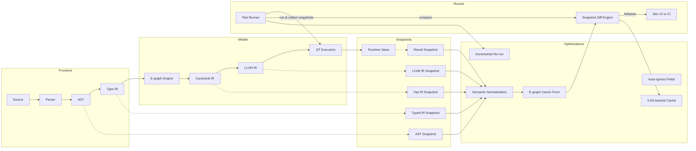

Think of your compiler’s test runner as a “snapshot engine with superpowers”: instead of comparing raw text, you compare stable, typed IR/AST, use the JIT to run snapshots at insane speed, and even snapshot the optimizer’s behavior.

Below are concrete, innovative snapshot-testing features tightly integrated with the pipeline (JIT, OrcV2, e‑graphs, mutants, CAS), plus diagrams.

---

## 0. Snapshot testing, but compiler-native

Traditional snapshot testing: serialize some output to text, store it, diff text next run. Tools like Vitest/Jest support file and inline snapshots and pluggable serializers【turn4fetch0】【turn1search8】.

We’re going to:

- Snapshot **internal compiler artifacts** (AST, typed IR, optimized IR) in stable, canonical forms.
- Leverage **incrementality and the JIT** to make snapshot runs crazy fast.
- Make snapshots **aware of optimizations** (so you’re not triaging noise from cosmetic changes).
- Tie snapshot diffs into **mutation testing** and **CI caching**.

---

## 1. Multi-layer, structure-aware snapshots (not just text)

### Idea

Expose first-class snapshot matchers for each pipeline stage, using stable, structure-aware printers (like AST/IR pretty-printers that are deterministic and useful for snapshots【turn3fetch0】):

- `#snapshot_ast` — canonical AST
- `#snapshot_typed_ir` — typed IR with type annotations normalized
- `#snapshot_opt_ir` — optimized IR (maybe pre- or post-e-graph)
- `#snapshot_llvm_ir` — the LLVM IR you send to Inkwell (with stable names/ids)
- `#snapshot_result` — runtime values (JSON-like), but with type/shape info

You can also do **inline snapshots** (like Vitest’s `toMatchInlineSnapshot`/`toMatchAriaInlineSnapshot`【turn4fetch0】【turn1search4】) for small cases, and file-based snapshots for large IR blobs.

### Why it matters

- You’re comparing **shapes**, not formatting. Renaming a variable or reordering commutative ops won’t flip the snapshot if your printer normalizes.
- Different tools (Jest, Vitest) show that pluggable serializers and custom matchers are already used to make snapshots stable and idiomatic【turn4fetch0】; you’re just applying that inside the compiler.

---

## 2. E-graph-stabilized, “optimization-invariant” snapshots

### Problem

Optimization passes often reorder expressions or apply rewrites that don’t change semantics, but still change the textual IR. That makes snapshot diffs very noisy.

### Idea

Before snapshotting IR, run it through your e-graph engine with a fixed set of canonicalizing rewrites, then extract a canonical representative:

- Example: always normalize `(a + b)` vs `(b + a)` to a chosen order; normalize `x * 1` → `x`; etc.
- Use the same “canonicalization budget” for both reference and current snapshots.
- Only then pretty-print and compare.

This is similar in spirit to using e-graphs to find equivalent expressions and pick a minimal/canonical one【turn2search10】, but applied to **snapshot stability**.

### Result

- Many “pseudo-breaking” changes disappear from diffs. You only see real semantic differences or changes to the selected canonical form.

---

## 3. Instant re-runs via JIT + function-snapshot indexing

### Idea

For many tests, the snapshot is just “the return value of this function for these inputs.” Your runner can:

- For pure functions (known from your effect system), compute and cache `(input, output)` pairs keyed by semantic hashes.
- Keep a **snapshot index** per test:
  - `(test_id, semantic_input_hash) -> canonical_output_hash`
- When the user re-runs:
  - For pure tests, if the input hash matches and the function hasn’t changed (incremental), you can return the cached snapshot in microseconds without even calling into the JIT.

When the function is recompiled (incremental), you invalidate only the entries that depend on its IR fingerprint.

---

## 4. Snapshot-aware, incremental diff execution

When a file changes, you don’t re-run all snapshot tests; you re-run only those whose snapshots could have changed.

### Idea

- For each snapshot test, record a **dependency fingerprint**:
  - Which AST nodes / IR nodes / types / effect annotations it touches.
- When the user saves:
  - Use your incremental red/green system to mark affected tests “dirty”.
  - Skip tests whose dependencies are still green.

This is the same incremental engine we discussed for mutation testing, applied to snapshots.

---

## 5. Dual snapshots: “pre-opt” vs “post-opt”

### Idea

For some tests you want to check both the **source semantics** and that **optimizations didn’t break anything**:

- `pre_opt_snapshot`: snapshot the typed IR before optimizations.
- `post_opt_snapshot`: snapshot the optimized IR after e-graph/LLVM passes.

Your test framework can:

- Assert that `pre_opt` matches the reference (source regression).
- Assert that `post_opt` matches the reference (optimization regression).
- Also support “only post-opt changed” as a non-failure status when the change is explained by a known rewrite family (e.g., strength reduction).

This makes snapshots a tool for monitoring **optimizer stability** over time.

---

## 6. Snapshot-guided mutation testing

### Idea

Use snapshots as the oracle for mutations instead of hand-written assertions:

- Run the baseline test suite and record snapshots for each test.
- For each mutant:
  - Run the same test cases.
  - If any snapshot differs from the reference → mutant is **killed**.
  - If all snapshots match → mutant **potentially equivalent**.

Because you’re reusing the same snapshot comparison machinery, you get:

- Consistent oracles across test runs.
- Easy “why did this fail?” by showing the snapshot diff.

---

## 7. Auto-“ignore” regions and semantic triage via compiler knowledge

One big pain with snapshots is noisy diffs from things like formatting, unique IDs, or irrelevant layout changes. Tools like LLMShot even use LLMs to classify UI snapshot diffs as intentional vs regressions【turn2fetch0】.

### Idea

Use your compiler’s type/IR info to auto-normalize and auto-ignore:

- Strip or normalize:
  - Generated local names, unique IDs, temp names.
  - Debug info, spans, locations.
  - Layout/ordering inside unordered collections (sets, maps).
- Mark fields as `#[snapshot_ignore]` or `#[snapshot_derive(eq_by_hash)]` using attributes.
- Provide a built-in `--explain-diff` mode that:
  - Maps each diff hunk back to:
    - Source span
    - Optimization pass that introduced it
    - Mutant (if active)

This is like LLMShot’s goal of automated triage【turn2fetch0】, but without an LLM: you use the compiler’s own semantics.

---

## 8. Snapshot regression suite for the optimizer itself

### Idea

Use snapshots to regression-test the compiler:

- For representative programs, snapshot the IR after each major pass:
  - After parsing
  - After type inference
  - After e-graph optimization
  - After LLVM optimization
- Treat each of these as a “compiler snapshot test.”

If you change an optimization:

- Run the compiler test suite.
- Diff the per-pass snapshots; you can see exactly which pass changed behavior and how.

This makes your snapshot system a **compiler development tool**, not just a user-level testing tool.

---

## 9. CI: sub-snapshot, CAS-backed caching

Even snapshot diffing can be costly if you recompute and re-serialize huge IRs.

### Idea

Store snapshots in a CAS (like your build cache):

- Key = `(snapshot_kind, stable_ir_hash, normalization_flags)`.
- Value = canonical snapshot text/binary.
- In CI:
  - If the IR hash is unchanged (from the same commit), reuse the snapshot directly from the CAS.
  - Only re-run tests when the IR hash changed.

This is analogous to sub-function compilation caching and CAS-backed build caches used in modern toolchains.

---

## 10. Architecture diagram: Snapshot engine integrated with the compiler

This diagram shows how snapshots flow through your pipeline, and where each optimization sits.



---

## 11. Example test syntax (to make it concrete)

```python
# snapshot the typed IR (before optimizations)
expect(foo(x=1)).to_match_typed_ir_snapshot("foo_typed")

# snapshot the optimized IR (post e-graph)
expect(foo(x=1)).to_match_opt_ir_snapshot("foo_opt")

# snapshot runtime result
expect(foo(x=1)).to_match_result_snapshot("foo_result")
```

And in CI:

```bash
my_lang test --mode=snapshot --ci \
  --snapshot-stages=ast,typed,opt,result \
  --snapshot-cache=cas:grpc://my-cache:9000
```

---

If you tell me what kinds of values you most want to snapshot (AST? IR? runtime objects? visual/terminal output?), I can help you design the exact matcher APIs and canonicalization rules for your language.
