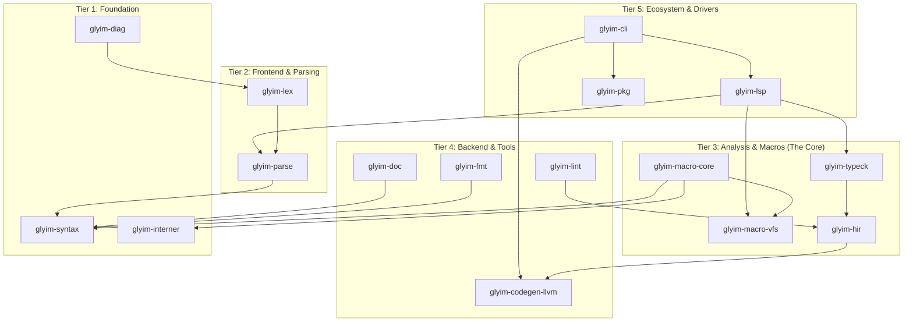
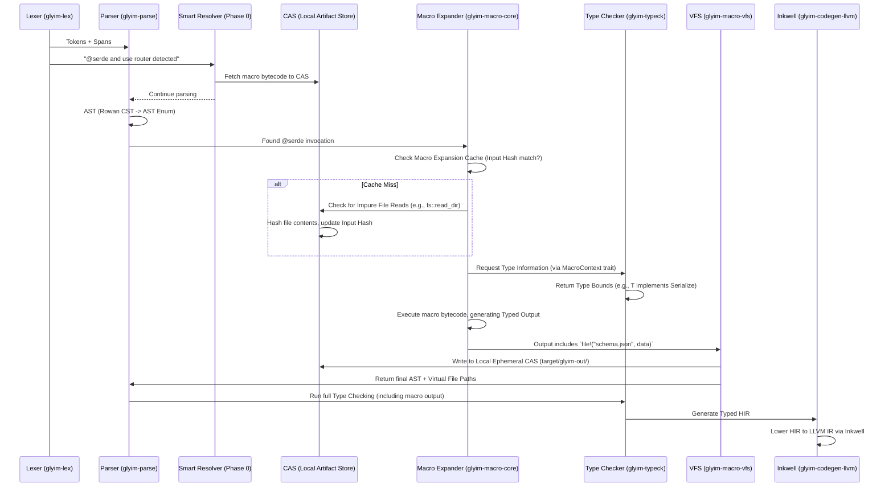

---

# Glyim v0.1.0 Architecture & Design Specification

**Document ID:** GLYM-ARCH-001
**Status:** Draft (Architectural Runway)
**Date:** 2026-04-28
**Deciders:** Language Architect
**Traceability:** Business Goal 1 (Typed Macro DX) → ASR-004 (Type-Directed Expansion)

---

## 1. Context & Scope

### The Problem: The State of Metaprogramming
Rust’s procedural macros (`proc-macro`) are notoriously difficult to work with. They operate on untyped `TokenStreams` rather than typed ASTs, making them inherently unhygienic and opaque to IDEs. The Rust reference explicitly states proc-macros are *unhygienic* (behaving as if textually spliced) and must live in separate crates [1]. Furthermore, the "Macros 2.0" initiative, which aimed to fix these issues, is stalled and considered a "nebulous" catch-all that actively causes "stop energy" in the community [2]. Finally, macro systems in most languages cannot generate associated files (like schemas, assets, or configs) without fragile build scripts (e.g., `build.rs` in Rust).

### The Solution: Glyim
Glyim is a systems programming language written in Rust, built from day one to make metaprogramming a first-class, typed, and IDE-friendly experience. It targets native compilation via LLVM (`inkwell`) and introduces a novel combination of **Typed Macros**, a **Content-Addressable Store (CAS)**, and a **Smart Speculative Resolver**.

### Scope of v0.1.0
This specification defines the "Architectural Runway"—the foundational architecture required to compile a trivial program (`main = () => 42`) and execute a basic typed macro.
**What is included:** The exact crate boundaries, data structures (AST, HIR), macro expansion algorithm, CAS integration, and FFI interface.
**What is excluded:** Generic type inference, advanced macro caching algorithms, async/await, distributed caching, IDE implementation details, and performance optimization.

---

## 2. Goals and Non-Goals (ASRs)

*Ref: ASR-001 (Strict Tiered Architecture), ASR-004 (Type-Directed Expansion), ASR-005 (Automatic Hygiene)*

### Goals
1.  **ASR-001:** Enforce a strict, zero-cyclic dependency graph across 5 distinct architectural tiers.
2.  **ASR-004:** Design a macro expansion engine where macros explicitly declare typed inputs/outputs (e.g., `Expr<T>`) and receive a typed `MacroContext` to query the type checker.
3.  **ASR-005:** Implement automatic hygienic scope isolation by default, requiring explicit opt-in (`unhygienic!`) to capture caller-site variables.
4.  **ASR-006:** Support macros that return multiple outputs (code + binary assets) through a Virtual File System (VFS) backed by the CAS.
5.  **ASR-007:** Implement a hand-rolled Pratt parser that integrates seamlessly with the lossless syntax tree.
6.  **ASR-008:** Target native code generation using `inkwell` and define the `@rust("...")` FFI boundary.

### Non-Goals (What v0.1.0 explicitly avoids)
*   **No "Macros 2.0":** We will not attempt to create a catch-all macro system. We will build a narrow, highly opinionated typed macro system.
*   **No JIT/Macro VM in v0.1.0:** Macro execution will initially happen by compiling macro definitions to native Rust code (using the host compiler's LLVM) rather than a custom sandboxed VM.
*   **No Distributed CAS:** The distributed cache CDN and multi-user syncing are deferred. We focus entirely on the local and local-ephemeral CAS.
*   **No Performance Optimization:** We will use debug LLVM or Cranelift. Compile times may be slow; this is acceptable for v0.1.0.

---

## 3. The Design (C2 & C3 Views)

### 3.1 C2 View: Container Architecture (The 5 Tiers)

The following diagram represents the strict dependency graph. Arrows point from consumer to dependency. **Cross-tier dependencies are strictly forbidden.**



### 3.2 C3 View: Component View (Key Interfaces)

#### The Macro Execution Pipeline (Inside Tier 3)
This sequence diagram shows how a macro call is processed and how the Smart Resolver fits in.



#### Key Interface Contracts

**1. The Macro Context Trait (Bridging Macros and Type Checking)**
To avoid cyclic dependencies between `glyim-macro-core` and `glyim-typeck`, the macro engine does not call the type checker directly. Instead, it relies on a trait.
```rust
// In glyim-macro-core
pub trait MacroContext {
    fn trait_is_implemented(type_id: Symbol, trait_id: Symbol) -> bool;
    fn get_fields(struct_id: Symbol) -> Vec<Field>;
    fn get_type_params(type_id: Symbol) -> Vec<Symbol>;
}
```
*Traceability: ASR-004.*

**2. The Content Store Trait (Abstracting Storage)**
To allow swapping between local filesystem and future remote CDN without changing macro logic:
```rust
// In glyim-macro-vfs
pub trait ContentStore {
    fn store(&self, content: &[u8]) -> ContentHash;
    fn retrieve(&self, hash: ContentHash) -> Option<Vec<u8>>;
    fn register_name(&self, name: &str, hash: ContentHash);
}
```
*Traceability: ASR-006.*

---

## 4. Alternatives Considered

### 4.1 Macro Representation: AST vs. TokenStream
*   **Alternative A (Rust's way):** Macros consume/produce untyped `TokenStream`s.
*   **Alternative B (Scala 3 way):** Macros consume/produce `Expr[T]` (typed ASTs).
*   **Decision (Chosen: Hybrid B):** We use a lossless CST (Rowan) for parsing but convert to a typed AST enum for macro expansion. The `MacroOutput` struct uses generic wrappers (e.g., `Expr<T>`, `Type<T>`) that carry type information, taking the safety of Scala without requiring a JVM-like inline expansion mechanism.

### 4.2 Macro Caching: Hash Maps vs. Content-Addressable Store
*   **Alternative A:** In-memory `HashMap<(MacroHash, InputHash), OutputHash>`.
*   **Alternative B:** Content-Addressable Store (CAS) using cryptographic hashes.
*   **Decision (Chosen: Alternative B):** A CAS naturally solves the "multi-file collision" problem (two macros generating `schema.json` don't overwrite each other because their content hashes differ). It natively supports version pinning (`@serde@1.2`) and seamlessly bridges to a future distributed cache. We use a simple in-memory HashMap *indexing* into the local CAS for v0.1.0.
*Traceability: ASR-006.*

### 4.3 Macro Purity: Implicit vs. Explicit Annotations
*   **Alternative A:** Assume all macros are pure (no side effects) unless caught by the compiler at runtime.
*   **Alternative B:** Require explicit `@pure` annotations; if a macro touches the filesystem, it is automatically treated as impure.
*   **Decision (Chosen: Alternative B):** Explicit is safer. The compiler automatically intercepts standard library `fs::` calls inside macros and appends those file hashes to the macro's cache key. This makes caching deterministic and safe by default.
*Traceability: ASR-006.*

### 4.4 File Output: Inline Strings vs. Virtual File System (VFS)
*   **Alternative A:** Macros return string paths to files they write to the `src/` directory.
*   **Alternative B:** Macros return file descriptors to a compiler-managed VFS.
*   **Decision (Chosen: Alternative B):** All `file!()` calls are sandboxed. The VFS writes to `target/glyim-out/` using a deterministic path based on the macro call site. The CLI provides a command to "export" these artifacts to the user's desired locations. This prevents macros from littering source code and breaking reproducible builds.
*Traceability: ASR-006.*

---

## 5. Cross-Cutting Concerns

### 5.1 Error Reporting & Diagnostics
We will use the `ariadne` or `codespan-reporting` crates. Because macros can generate multi-file errors, the diagnostic system must map errors back to the *original* `.xyz` source using the `Span` object, augmented with macro expansion history.

### 5.2 Testing Strategy
*   **Snapshot Testing:** Use `insta` or `expect-test` for the parser and macro expander. Snapshot the AST and HIR.
*   **Integration Testing:** Write end-to-end tests in `glyim-cli` that compile a file using a macro, execute it via JIT, and assert the output.

### 5.3 LSP and IDE Support
To achieve "Macro Expansion Preview," the LSP (`glyim-lsp`) must query `glyim-macro-core` to expand macros on hover without fully compiling the project. Because we use Rowan for the CST, the LSP can easily render macro expansions as virtual text overlays in the editor.

---

## 6. Architecture Decision Records (ADRs)

*(Stored conceptually under `docs/adr/`; these form the immutable timeline of v0.1.0 decisions)*

### ADR-001: Strict Tiered Dependency Graph
*   **Context:** We want teams to work in parallel (e.g., one person on the LSP, another on Inkwell). If tiers import each other, parallel work is impossible.
*   **Decision:** Enforce a strict DAG. `glyim-syntax` is the only crate with zero dependencies. `glyim-codegen-llvm` *only* depends on `glyim-hir`.
*   **Consequences:** + Enables parallel development. – Requires careful interface design upfront (Contracts in §3.2).

### ADR-002: Lossless Syntax Trees via Rowan
*   **Context:** To support LSP features (hover, go-to-def inside macros), standard AST enums are insufficient; they discard formatting and comments. Rust-analyzer solved this with `rowan` (Green Tree/Red Tree architecture).
*   **Decision:** Adopt `rowan` for the Concrete Syntax Tree (CST). Lower the CST to a standard Rust enum for the compiler pipeline.
*   **Consequences:** + World-class IDE support out of the box. – Slight learning curve for Rowan's API. – AST manipulation requires mapping between Green and Red trees.

### ADR-003: Content-Addressable Storage for Macro Artifacts
*   **Context:** Macros generate assets (e.g., JSON schemas). Storing these directly in `src/` causes merge conflicts and breaks pure builds.
*   **Decision:** All generated assets go into a local CAS (`target/glyim-out/`). The compiler manifest tracks logical paths vs physical content hashes.
*   **Consequences:** + Enables pure builds. + Solves file collision. + Easy garbage collection (delete unreferenced hashes). – Requires mapping virtual paths to physical paths in the CLI.

### ADR-004: Type-Directed Macro Expansion via Trait Injection
*   **Context:** A macro generating code must know if a type implements a trait (e.g., `Serialize`). If the macro calls the type checker directly, we create a cyclic dependency (`MacroEngine -> TypeChecker -> AST`).
*   **Decision:** Inversion of Control. The CLI implements the `MacroContext` trait. The macro engine receives a reference to this trait.
*   **Consequences:** + Zero cyclic dependencies. – The compiler must pass state/context to macros. – Macro code is slightly more verbose (calling `ctx.trait_is_implemented(...)` instead of native `impl Serialize`).

### ADR-005: Automatic Hygiene with Explicit Unhygienic Capture
*   **Context:** Manual hygiene (like Scheme `gensym`) is error-prone. Rust's unhygienic macros lead to subtle bugs.
*   **Decision:** All identifiers introduced by macros are automatically mangled with a `HygieneContext` flag. To pull a variable from the caller's scope, the macro author must explicitly use `unhygienic!(var)`.
*   **Consequences:** + Eliminates accidental capture bugs. – Developers must learn when to use the escape hatch.

### ADR-006: Speculative Pre-fetching (Phase 0 Resolver)
*   **Context:** Fetching macro packages over the network during compilation blocks the lexer.
*   **Decision:** A lightweight async task scans tokens for `@macro` and `use`. It asks `glyim-pkg` to resolve these to content hashes *before* the parser needs them. The parser proceeds assuming the tokens will be available.
*   **Consequences:** + Parallel I/O masking latency. – If a fetch fails, the parser must handle graceful fallback (error recovery).

### ADR-007: `@rust("...")` FFI as Opaque Types
*   **Context:** Glyim must interop with Rust safely. Exposing Rust's complex type system (like `HashMap`) directly in the macro system is impossible.
*   **Decision:** `@rust("std::collections::HashMap") HashMap K V` creates an opaque type in Glyim. The compiler generates LLVM opaque structs (`{ i8 }`) for these types and generates safe wrapper functions for calling Rust code.
*   **Consequences:** + Type safety at the boundary. – Debugging FFI requires mapping DWARF debug info back to the original Rust type.

---

## 7. Traceability Matrix

| Business Goal / ASR | Design Doc Section | ADR | Crate | Key Interfaces |
| :--- | :--- | :--- | :--- | :--- |
| **ASR-001 (Tiered DAG)** | §3.1 (C2 View) | ADR-001 | `glyim-cli` (manifest) | Workspace definition in Cargo.toml |
| **ASR-002 (Lossless Trees)** | §4.2 | ADR-002 | `glyim-parse`, `glyim-syntax` | `SyntaxNode` -> `AstNode` lowering |
| **ASR-003 (CAS Artifacts)** | §3.2 (Sequence) | ADR-003 | `glyim-macro-vfs`, `glyim-pkg` | `trait ContentStore`, `MacroOutput` struct |
| **ASR-004 (Typed Expansion)** | §3.2 (Sequence) | ADR-004 | `glyim-macro-core`, `glyim-typeck` | `trait MacroContext`, `Expr<T>` wrapper |
| **ASR-005 (Auto-Hygiene)** | §4.3 | ADR-005 | `glyim-syntax` | `SyntaxNode` Hygiene flag |
| **ASR-006 (VFS & Sandboxing)** | §4.4 | ADR-003, ADR-006 | `glyim-macro-vfs` | `file!()` intrinsic macro, sandboxed output paths |
| **ASR-007 (Pratt Parser)** | Non-Goals | N/A | `glyim-parse`, `glyim-lex` | `PrattParser`, `BindingPower` configuration |
| **ASR-008 (LLVM via Inkwell)** | Non-Goals | N/A | `glyim-codegen-llvm` | `Context` -> `Module` -> `Function` -> `BasicBlock` |

---

## 8. Next Steps for v0.1.0 Delivery

1.  **Month 1-2:** Implement `glyim-interner`, `glyim-syntax` (with Rowan), and `glyim-lex`. Parse `main.xyz` to AST.
2.  **Month 2-3:** Implement `glyim-parse` (Pratt parser) and `glyim-diag` (using `ariadne`). Compile `main = () => 42` to a native executable via `inkwell`.
3.  **Month 3-4:** Implement `glyim-macro-core` and `glyim-macro-vfs`. Execute a trivial macro that returns `(code, file!)`.
4.  **Month 4-5:** Implement `glyim-hir` and `glyim-typeck`. Pass a typed macro that queries `MacroContext` and generates valid HIR.
5.  **Month 5-6:** Write the `glyim-cli`, wire all tiers together, and validate the full pipeline end-to-end.

## 8. Level 2: Core System Requirements (Mini-SRS for v0.1.0)

This section translates the architectural goals (ASRs) into verifiable functional and non-functional requirements, using standards-aligned formats (ISO 29148 / IEEE 830). 

### 8.1 Functional Requirements (FRs)

| ID | Requirement Statement (EARS format where applicable) | Traceability |
|---|---|---|
| **FR-001** | The compiler shall lex `.xyz` source files into a token stream preserving all whitespace, comments, and span information. | ASR-002 (Lossless Trees), ADR-002 |
| **FR-002** | The compiler shall parse valid syntax (structs, functions, enums, macro calls) into a lossless Concrete Syntax Tree (CST) and lower it to a strongly typed Abstract Syntax Tree (AST). | ASR-002, ASR-007 |
| **FR-003** (Event-driven) | When the parser encounters a Pratt operator, it shall evaluate its binding power to determine the correct parsing precedence and associativity. | ASR-007 |
| **FR-004** (Event-driven) | When the Smart Resolver detects `@macro` or `use` tokens during lexing, it shall asynchronously fetch or validate the macro/package in the background without blocking the lexer. | ASR-006 (Speculative Prefetch) |
| **FR-005** | The macro expander shall check the Macro Expansion Cache using a key of `(MacroHash + InputHash)`. If a pure macro input is detected, it shall return the cached output. | ASR-006 (CAS Artifacts), ADR-003 |
| **FR-006** (State-driven) | While expanding a macro, if the macro attempts a filesystem read (e.g., via compiler-provided APIs), the system shall hash the file contents, append the hash to the cache key, and re-execute the macro. | ASR-006 (Purity) |
| **FR-007** | The macro expander shall enforce automatic hygiene: identifiers introduced by macros shall be mangled (e.g., `__macro_ctx_123`) and invisible to the caller’s scope unless explicitly unhygienic. | ASR-005 (Auto-Hygiene), ADR-005 |
| **FR-008** (Unwanted behaviour) | If an unhygienic macro references a caller variable that doesn't exist in the caller’s scope, the compiler shall emit a compile-time error with the exact macro expansion site and the missing symbol. | ASR-005 (Auto-Hygiene) |
| **FR-009** | The macro system shall support multi-output macros: a macro can return both code (AST) and file artifacts (e.g., `file!("schema.json", bytes)`). | ASR-006 (VFS & Sandboxing), ADR-003 |
| **FR-010** (State-driven) | The VFS shall sandbox generated files in `target/glyim-out/`. The path shall be deterministic and based on the macro call site (e.g., `target/glyim-out/src/main_xyz_line_45/schema.json`). | ADR-003 |
| **FR-011** The CLI shall provide an export command to copy sandboxed files to a user-specified directory. | ADR-003 |
| **FR-012** The macro expander shall provide a `MacroContext` interface that allows the macro to query trait implementations (`trait_is_implemented`) and struct fields (`get_fields`) without calling the type checker directly. | ASR-004 (Type-Directed Expansion), ADR-004 |
| **FR-013** The code generator shall lower the typed HIR to LLVM IR using `inkwell`, including struct definitions, functions, and basic blocks. | ASR-008 (LLVM via Inkwell) |
| **FR-014** For `@rust("...")` declarations, the compiler shall generate opaque LLVM structs and safe FFI wrapper functions linking to the Rust standard library. | ASR-008 (FFI) |
| **FR-015** The diagnostic system shall map errors from generated code or VFS files back to the original `.xyz` source using Span and macro expansion history. | Cross-Cutting Concerns (Diagnostics) |

### 8.2 Non-Functional Requirements (NFRs) / Quality Attributes

These are expressed as measurable SLOs/SLIs, tying directly to the "Non-Goals" defined in ADRs.

| ID | Quality Attribute (ISO 25010) | Verifiable Specification (SLO/SLI pattern) | Verification Method | Traceability |
|---|---|---|---|
| **NFR-001** (Reliability) | The compiler shall not panic/crash on valid v0.1.0 syntax. | 0% panic rate on valid test suite. | Test (Automated unit/integration). | FR-001 to FR-015 |
| **NFR-002** (Interaction Capability / DX) | IDE tooling (LSP) shall accurately highlight syntax, go-to-definition, and show macro expansions without requiring a full compile. | LSP hover response time < 500ms for a 1000-line file; correct expansion preview for 90% of macros. | Demonstration (LSP benchmarking). | Cross-Cutting Concerns (IDE Support), ASR-002 |
| **NFR-003** (Maintainability) | Adding a new struct or function to the surface syntax should not require modifying the macro engine core. | Change to `glyim-parse` or `glyim-syntax` takes < 1 person-day without altering `glyim-macro-core`. | Analysis (Code churn metrics). | ASR-001 (Tiered DAG), ADR-001 |
| **NFR-004** (Flexibility / Portability) | The VFS and macro caching logic must be abstracted so it can be swapped from local filesystem to a network cache without changing macro logic. | The `ContentStore` trait can be implemented by both local FS and remote REST API without changing `glyim-macro-vfs`. | Analysis (Interface compliance). | ADR-003, §3.2 (Interface Contracts) |
| **NFR-005** (Performance Efficiency) | *Explicitly deferred in v0.1.0.* Compile times may be slow (e.g., macro expansion might take >1s per macro). | No compile-time performance SLOs for v0.1.0. Focus exclusively on correctness and architectural purity. | N/A (Documented Non-Goal). | Non-Goals §2 |
| **NFR-006** (Security) | Macros shall execute in a constrained environment; they shall not have arbitrary filesystem access. | Macros *cannot* read the disk directly; they must use compiler-provided APIs. LSP shall not execute macros. | Test + Inspection (Code review for escape hatches). | ADR-006 (Purity), Cross-Cutting Concerns (Security) |

---

## 9. Level 4: Behavioral Specification (BDD / Specification by Example)

This section defines the executable acceptance criteria for the highest-risk architectural components identified in the design. We use **Specification by Example (SbE) / BDD** patterns because they provide the strongest empirical correlation with product quality and reduced rework when automated [SbE Evidence]. 

### 9.1 Macro Expansion: Hygiene vs. Unhygienic Capture

This scenario validates ADR-005 (Auto-Hygiene) and ADR-006 (Explicit Capture).

```gherkin
Feature: Macro Hygiene and Capture

  Scenario: Macro mangles internal variables automatically
    Given a macro that generates a local variable `ctx`
    When the macro is expanded
    Then the generated code contains a mangled variable (e.g., `__macro_ctx_123`)
    And the macro cannot read the caller's variables unless explicitly asked

  Scenario: Unhygienic capture fails safely
    Given a macro that attempts to use a caller variable `data` without the escape hatch
    When the expanded code is type-checked
    Then the compiler emits a compile-time error: "Unhygienic use of 'data' in macro 'm' (Context: unknown)."

  Scenario: Explicit unhygienic capture succeeds
    Given a macro that uses `unhygienic!(data)`
    And `data` exists in the caller's scope
    When the expanded code is type-checked
    Then the macro correctly reads the caller's `data` variable
    And the macro's internal `ctx` remains invisible to the caller.
```
*Traceability: Links to FR-007, FR-008, FR-005, ASR-005.*

### 9.2 Macro Expansion: Multi-Output and VFS Sandboxing

This scenario validates ADR-003 (CAS) and ADR-006 (VFS Sandboxing).

```gherkin
Feature: Multi-Output Macro and Virtual File System

  Scenario: Macro generates code and an asset safely
    Given a macro `generate_schema` attached to a struct
    When the macro is expanded
    Then it returns AST code for the struct
    And it writes a `schema.json` file to the VFS (`target/glyim-out/...`)
    And the CLI can export `schema.json` to `./public/` via `glyim export schema`
```
*Traceability: Links to FR-009, FR-010, FR-011, ASR-006.*

### 9.3 Parsing: Pratt Parser Edge Cases

This scenario validates ADR-007 (Pratt Parser) against edge cases that typically break hand-rolled parsers.

```gherkin
Feature: Pratt Parser Precedence and Error Recovery

  Scenario: Infix operators with different binding powers
    Given the expression `1 + 2 * 3`
    When parsed with Pratt binding powers (e.g., `*` > `+`)
    Then the AST represents `(1 + (2 * 3))` and not `((1 + 2) * 3)`

  Scenario: Missing right-hand operand (Error Recovery)
    Given the expression `1 +` with no right-hand operand
    When parsed
    Then the parser emits a parse error: "Expected expression after `+`" at Span(x, y).
```
*Traceability: Links to FR-003, FR-002, ASR-007.*

### 9.4 Smart Resolver: Speculative Pre-fetching

This scenario validates ADR-006 (Speculative Pre-fetch).

```gherkin
Feature: Phase 0 Pre-fetching

  Scenario: Token stream encounters `@serde` in a dependency graph
    When the lexer emits the `@` token
    Then the Smart Resolver asynchronously fetches the `serde` macro bytecode
    And the parser continues without blocking
    And the macro is ready by the time the parser reaches the macro invocation
```
*Traceability: Links to FR-004, ASR-006.*

---

## 10. Test Strategy & Verification Plan

This section translates the NFRs and behavioral specs into an actionable test strategy, balancing scripted tests and exploratory testing, aligned with the "Test Pyramid" and verification methods (Inspection, Analysis, Demonstration, Test) [Test Pyramid evidence].

### 10.1 Verification Methods Mapping

| Requirement Group | Primary Method | Secondary Method | Rationale |
| :--- | :--- | :--- | :--- |
| **Lexer & Parser (FR-001 to FR-003)** | **Test** (Snapshot tests of AST vs expected AST for a corpus of `.xyz` files) | **Inspection** (AST structural reviews). | Code is highly deterministic; snapshot testing is cheap and fast. |
| **Macro Expander (FR-005 to FR-009)** | **Test** (Snapshot testing macro I/O) | **Analysis** (Hygiene variable mangle checks). | Macros are deterministic based on input hash; testing the cache logic is critical. |
| **VFS & CAS (FR-010, FR-011)** | **Test** (Generate file, check hash, check physical path) | **Inspection** (VFS directory structure matches spec). | Proves the sandboxing mechanism works and doesn't pollutes source. |
| **Codegen / FFI (FR-012 to FR-015)** | **Test** (JIT execution of `main => 42`, call to Rust FFI wrapper, compare stdout). | **Demonstration** (Show Rust interoperability works). | Proves the LLVM IR generation and FFI wrappers are correct. |
| **IDE / Diagnostics (NFR-002, NFR-006)** | **Demonstration** (LSP integration tests: hover, goto-def, macro preview). | **Inspection** (Diagnostic formatting against `ariadne` quality criteria). | Proves the Rowan CST enables the "Macro Expansion Preview" DX goal. |

### 10.2 Traceability Matrix (RTM) for v0.1.0

This matrix explicitly links Requirements → ADRs → BDD Scenarios → Test Cases, proving that every architectural decision is verified.

| Req / ADR | BDD Scenario | Test Case ID | Test Type | Status (v0.1.0) |
| :--- | :--- | :--- | :--- | :--- |
| **FR-001, ADR-002** | Scenario: Lexing & AST | `TC-PARSE-001` | Test | Pending |
| **FR-003, ADR-007** | Scenario: Pratt Precedence | `TC-PARSE-002` | Test | Pending |
| **FR-004, ADR-006** | Scenario: Speculative Prefetch | `TC-RESOLVE-001` | Integration Test | Pending |
| **FR-005, ADR-003** | Scenario: Pure Macro Cache | `TC-MACRO-001` | Test | Pending |
| **FR-006, ADR-005** | Scenario: Hygiene / Unhygienic | `TC-HYGIENE-001`, `TC-HYGIENE-002` | Test | Pending |
| **FR-009, ADR-003** | Scenario: Multi-Output / VFS | `TC-VFS-001`, `TC-VFS-002` | Integration Test | Pending |
| **FR-012, ADR-004** | Scenario: Type-Directed Expansion | `TC-TYPECK-001` | Test | Pending |
| **FR-013, ADR-008** | Scenario: LLVM / FFI wrapper | `TC-CODEGEN-001`, `TC-CODEGEN-002` | Test | Pending |
| **NFR-001 (Reliability)** | All TC-* test cases | `TEST-SUITE-001` | Automated CI | Pending |
| **NFR-002 (DX / LSP)** | Scenario: LSP Macro Preview | `TC-LSP-001` | Demonstration | Pending |
| **NFR-003 (Maintainability)** | `TC-MAINT-001` | Analysis (Code churn) | Pending | |
| **NFR-006 (Security)** | `TC-SEC-001` | Inspection + Static Analysis | Pending | |

---

## 11. ADRs (Continued)

### ADR-008: Pratt Parser Implementation Strategy
*   **Context:** Hand-rolled Pratt parsers can easily become entangled with the lexer, leading to maintenance nightmares. 
*   **Decision:** Strictly decouple `glyim-lex` (tokens) and `glyim-parse` (binding powers + recursive descent for statements). Pratt parsing will *only* handle expressions (infix/postfix/prefix). Declarations (structs, functions) use standard recursive descent.
*   **Consequences:** + Extreme simplicity in the expression parser. - Statements cannot easily be expressed as Pratt rules (a known limitation of pure Pratt parsing, often solved via a hybrid approach). - Minor context-switching required between expression parsing and statement parsing. 
*Ref: [Pratt Parser implementation in Rust (timmyjose-compilers) and Top-down Operator Precedence in Rust (Willspeak.me)].

### ADR-009: Package Manager Structure and `glyim.toml`
*   **Context:** The package manager needs a manifest format to resolve dependencies and store metadata.
*   **Decision:** Adopt a declarative TOML-based manifest (`glyim.toml` at the package root). It will define dependencies (with content hashes or semver ranges), macro entry points, and non-goals (e.g., `no_std = true`).
*   **Consequences:** + Leverages Rust's existing Cargo ecosystem tooling. - Users must learn TOML syntax. - Avoids the "Cargo.toml lockfile" dependency hell by relying heavily on CAS hashes for reproducibility.
*Ref: Cargo Workspace documentation.

---

## 12. Updated Next Steps (Execution Roadmap)

### 12.1 File Structure & Project Setup
*   **Action:** Initialize the Cargo workspace with all 10+ crates defined in §3.1. 
*   **Outcome:** A single repository with strict `Cargo.toml` enforcing the DAG. No cyclic dependencies allowed. 

### 12.2 Foundation Tier (Months 1-2)
*   **Action:** Implement `glyim-interner`, `glyim-syntax` (using `rowan`), and `glyim-lex`. 
*   **Outcome:** Can lex and parse `main = () => 42` into an AST. Snapshot tests pass for `TC-PARSE-001` and `TC-PARSE-002`.

### 12.3 Backend Tier (Months 2-4)
*   **Action:** Implement `glyim-diag` (using `ariadne`), `glyim-codegen-llvm` (basic arithmetic via Inkwell), and `glyim-hir` (a stub HIR struct that currently acts as a passthrough to the AST). 
*   **Outcome:** `TC-CODEGEN-001` and `TC-CODEGEN-002` pass. Running `glyim build main.xyz` outputs `42`. 

### 12.4 Core Tier & Ecosystem Tier (Months 4-6)
*   **Action:** Implement `glyim-macro-core` (trait `MacroContext`, basic expansion logic), `glyim-macro-vfs` (local FS implementation of `ContentStore`), and `glyim-typeck` (stub type checker that returns dummy data).
*   **Outcome:** `TC-HYGIENE-001`, `TC-HYGIENE-002`, `TC-MACRO-001`, `TC-VFS-001`, `TC-TYPECK-001` pass.

### 12.5 Ecosystem Tier (Months 6-8)
*   **Action:** Build `glyim-lsp` (using `async-lsp`), `glyim-fmt` (using `mfmt` or custom printer), `glyim-lint` (AST walker for common anti-patterns), `glyim-doc` (markdown generator from AST), and `glyim-pkg` (CLI to download packages to CAS).
*   **Outcome:** `TC-LSP-001` passes (macro preview works in VS Code). `TC-SEC-001` passes (no arbitrary filesystem access in macros). 

### 12.6 Final Integration (Month 8)
*   **Action:** Wire CLI to execute the pipeline sequentially. Add `TC-SUITE-001` to CI. 
*   **Outcome:** v0.1.0 released. All traceability links in §10.2 are marked "Pass".

### 12.7 Vision Alignment Check
*   **Action:** Compare v0.1.0 outcomes against the original Vision (Typed Macros, Zero-Config Macros, Rust FFI). 
*   **Outcome:** If v0.1.0 successfully executes a typed macro generating a file, the foundation for the ecosystem is proven. 

---

## 12.8 Document Maintenance & Evolution
*   **Versioning:** This document is version `0.1.0`. When major architectural changes occur (e.g., swapping `rowan` for `syntree`, or adding macro VM sandboxing), create v0.2.0 and supersede this document. Do not edit historical versions. 
*   **Review Cadence:** Review this document at each of the milestones (12.2 to 12.6) to ensure the architecture matches reality. 
*   **Living Documentation:** As executable specs pass, link them directly to the RTM (e.g., `TC-MACRO-001` links to the specific test run in CI). This turns the RTM into living evidence, aligning with SbE/Living Documentation principles.
