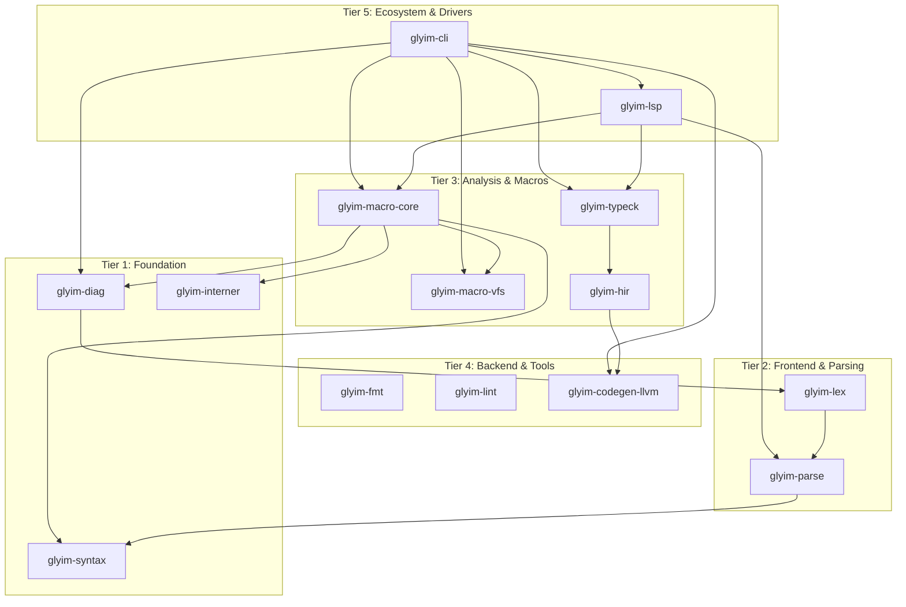

# Glyim v0.3.0 Architecture & Design Specification

**Document ID:** GLYM-ARCH-003
**Status:** Draft
**Date:** 2026-04-28
**Predecessor:** GLYM-ARCH-002 (v0.2.0)
**Traceability:** Business Goal 3 (Typed Data Types) → ASR-021 (Monomorphic Type Checking)

---

## 1. Context & Scope

### What v0.2.0 Delivered
A "real language" experience: `let`/`let mut`, `if`/`else`, string literals, `println`/`assert`, JIT execution, ariadne errors, `glyim init`, and 340 tests. The architectural runway (11 crates, 5-tier DAG, macro traits, CAS, hygiene) is in place and proven.

### The Problem: No Types, No Data Structures
Users cannot define a struct, check a boolean, pattern match, or call into Rust libraries. The compiler treats everything as `i64`. There is no type checker, so errors like `println(Point { x: "not a number" })` are caught only at LLVM IR generation time with incomprehensible messages. The codegen module is becoming a god file (~600 LOC across 2 files) that will explode when struct and match codegen lands.

### The Solution: v0.3.0 — "The Type System"
This spec adds a monomorphic type checker, struct and enum definitions, pattern matching, `bool`/`Unit` types, raw pointers for FFI, floats, `Option`/`Result` built-ins with `?` syntax, and one actually-executing macro (`@identity`). It begins with a zero-behavior-change refactor that splits god files and adds robust CI.

### Scope of v0.3.0
**Included:**
- Phase 0 refactor: split god files, add CI with GitHub Actions, move scripts
- `bool` as a distinct type with `true`/`false` literals
- `Unit` type `()` for functions that return nothing
- `struct` definitions with named fields, struct literals, dot access
- `enum` definitions with variant fields, enum variant construction
- `match` expression with exhaustive pattern checking for enums
- `Option<T>` and `Result<T, E>` built-ins with `Some`/`None`/`Ok`/`Err` constructors
- `?` operator for `Result` propagation
- Raw pointers `*const T` and `*mut T` for FFI
- `@rust("namespace") extern { ... }` blocks declaring FFI functions
- `f64` float type with basic arithmetic
- Monomorphic type checker: explicit annotations on fns, local inference on `let`
- One working macro: `@identity(expr) -> expr` interpreted by the compiler
- Type-annotated error messages ("expected `bool`, found `i64`")

**Excluded:**
- Generic type inference (Hindley-Milner) — v0.4.0
- Methods / `impl` blocks — v0.4.0
- Trait definitions / implementations — v0.5.0
- Visibility (`pub`/`private`) — v0.4.0
- Destructuring `let` bindings — v0.4.0
- Pointer arithmetic — v0.4.0
- Advanced float operations (sin, cos, sqrt) — v0.4.0
- Macro compilation to native code (interpreted for v0.3.0) — v0.4.0
- Distributed CAS, LSP, formatter — v0.4.0+

---

## 2. Goals and Non-Goals (ASRs)

### Goals

| ID | Statement |
|----|-----------|
| **ASR-021** | The type checker is monomorphic: every type is fully concrete after local inference. No type variables, no unification. |
| **ASR-022** | `struct` definitions produce first-class types with named fields, stack layout, and dot access. |
| **ASR-023** | `enum` definitions produce tagged union types with variant constructors and exhaustive `match` checking. |
| **ASR-024** | `bool` is a distinct type. Comparisons return `bool`. `if` requires `bool`. No implicit `i64` → `bool` conversion. |
| **ASR-025** | `Option<T>` and `Result<T, E>` are built-in generic-like types. Each concrete instantiation (`Option<i64>`, `Result<bool, Str>`) is monomorphized at check time. |
| **ASR-026** | The `?` operator desugars to `match` + early return. Requires the enclosing function to return `Result<_, _>`. |
| **ASR-027** | Raw pointers `*const T` and `*mut T` enable FFI. No pointer arithmetic is permitted. |
| **ASR-028** | `@rust("namespace") extern { fn ... }` declares foreign functions with typed signatures. |
| **ASR-029** | `f64` provides IEEE 754 double-precision floats with basic arithmetic. |
| **ASR-030** | One macro (`@identity`) is fully executed during compilation, proving the macro pipeline works end-to-end. |
| **ASR-031** | No source file exceeds 500 LOC. CI enforces this with a hard error. |
| **ASR-032** | CI runs on push/PR to `main` and `dev` with check, lint, unit tests, integration tests, macOS, and coverage tracking. |

### Non-Goals
- **No generic functions:** `fn identity<T>(x: T) -> T` is v0.4.0. `Option<T>` is built-in magic.
- **No trait system:** `impl Serialize for Foo` is v0.5.0.
- **No borrow checker:** All values are moved or copied. No references (`&T`) except `&str` which is a fat pointer.
- **No unsafe blocks:** Raw pointers are available everywhere (v0.3.0 trust model: the whole language is `unsafe`).
- **No pattern guards in v0.3.0 match:** `match x { Some(v) if v > 0 => ... }` is v0.4.0.

---

## 3. The Design

### 3.1 C2 View: Updated Container Architecture



### 3.2 C3 View: Type System Interfaces

#### The Type Checker

```rust
// In glyim-typeck
pub struct TypeChecker {
    // Type bindings: var/param name → resolved type
    bindings: HashMap<Symbol, HirType>,

    // Registered struct definitions: name → { fields, layout }
    structs: HashMap<Symbol, StructInfo>,

    // Registered enum definitions: name → { variants, layout, tag map }
    enums: HashMap<Symbol, EnumInfo>,

    // Registered extern function signatures
    extern_fns: HashMap<Symbol, FnSig>,

    // Registered macro definitions
    macros: HashMap<Symbol, MacroDef>,

    // Expression type annotations (filled during checking)
    expr_types: Vec<HirType>,

    // Current function's return type (for `?` desugaring)
    return_type: Option<HirType>,

    // Collected type errors
    errors: Vec<TypeError>,
}
```

#### The HirType Enum

```rust
pub enum HirType {
    Int,                                // i64
    Bool,                               // bool
    Float,                              // f64
    Str,                                // &str fat pointer { i8*, i64 }
    Unit,                               // () — zero-size
    Named(Symbol),                       // user-defined struct or enum
    RawPtr { inner: Box<HirType> },      // *T (const or mut distinction not in type, only in AST)
    Opaque(Symbol),                       // @rust("...") type — pointer-sized
    Func { params: Vec<HirType>, ret: Box<HirType> },
    Option(Box<HirType>),                // monomorphized Option<T>
    Result(Box<HirType>, Box<HirType>),  // monomorphized Result<T, E>
    Never,                              // uninhabited (diverging expressions, match exhaustiveness)
}
```

#### The HirPattern Enum

```rust
pub enum HirPattern {
    Wild,                                               // _
    BoolLit(bool),
    IntLit(i64),
    FloatLit(f64),
    StrLit(String),
    Unit,                                               // ()
    Var(Symbol),                                        // x
    Struct { name: Symbol, bindings: Vec<(Symbol, HirPattern)> },
    EnumVariant { enum_name: Symbol, variant_name: Symbol, bindings: Vec<(Symbol, HirPattern)> },
    OptionSome(Box<HirPattern>),                       // Some(x)
    OptionNone,                                        // None
    ResultOk(Box<HirPattern>),                         // Ok(x)
    ResultErr(Box<HirPattern>),                        // Err(e)
}
```

#### The ? Operator Desugaring

```g
fn foo() -> Result<i64, Str> {
    let r: Result<i64, Str> = may_fail()
    let v: i64 = r?
    Ok(v)
}
```

Desugars to:

```g
fn foo() -> Result<i64, Str> {
    let r: Result<i64, Str> = may_fail()
    let v: i64 = match r {
        Ok(val) => val,
        Err(err) => return Err(err),
    }
    Ok(v)
}
```

The type checker requires `r` to have type `Result<_, _>`. It extracts the `Ok` payload type and the `Err` payload type from the monomorphized result type. The `return` expression uses the function's declared return type.

---

### 3.3 Struct Representation

```g
struct Point {
    x: i64,
    y: i64,
}

let p = Point { x: 1, y: 2 }
let x = p.x
```

**LLVM layout:**
```llvm
%Point = type { i64, i64 }  ; 16 bytes, align 8
%p = alloca %Point
store { i64 1, i64 2 }, %Point* %p
%x = getelementptr %Point, %Point* %p, i32 0, i32 0  ; field index 0
%val = load i64, i64* %x
```

**Type checker registration:**
```
Point → Named(Symbol("Point"))
Point.fields = [("x", Int), ("y", Int)]
Point.size = 16
Point.field_offsets = [0, 8]
Point.alignment = 8
```

---

### 3.4 Enum Representation

```g
enum Shape {
    Circle(f64),
    Rect { a: Point, b: Point },
}

let s = Shape::Circle(3.14)
```

**LLVM layout (tagged union):**
```llvm
%Shape = type { i32, [16 x i8] }  ; tag + max payload size

; Shape::Circle(3.14)
%s = alloca %Shape
store i32 0, i32* %s                    ; tag = 0
; payload is a [16 x i8] array starting at offset 8
%payload_ptr = getelementptr %Shape, %Shape* %s, i32 0, i32 1
%f64_ptr = bitcast [16 x i8]* %payload_ptr to double*
store double 3.14, double* %f64_ptr
```

**Match codegen:**
```llvm
; match s {
;   Circle(r) => ...,
;   Rect { a, b } => ...,
; }
%tag = load i32, i32* %s
switch i32 %tag, label %default [
    i32 0, label %arm_circle
    i32 1, label %arm_rect
]

arm_circle:
    ; payload is f64 at offset 8
    %payload = getelementptr %Shape, %Shape* %s, i32 0, i32 1
    %r = load double, double* %payload
    br label %merge

arm_rect:
    ; payload is { Point, Point } at offset 8
    %payload = getelementptr %Shape, %Shape* %s, i32 0, i32 1
    %point_ptr = bitcast [16 x i8]* %payload to %Point*
    %a_ptr = getelementptr %Point, %Point* %point_ptr, i32 0, i32 0
    %a = load i64, i64* %a_ptr
    %b_ptr = getelementptr %Point, %Point* %point_ptr, i32 0, i32 1
    %b = load i64, i64* %b_ptr
    br label %merge

default:
    unreachable
```

**Exhaustiveness check:** For enums, the type checker verifies every variant has a match arm (or a `_` wild arm is present). If not, it emits: `error: non-exhaustive pattern: missing variant 'Rect'`.

---

### 3.5 Option<T> and Result<T, E>

These are **syntactically generic but monomorphized at check time.** When the type checker sees `Option<i64>`, it immediately creates a concrete struct:

```
option_i64 = struct {
    tag: i32,       // 0 = None, 1 = Some
    payload: [8 x i8],  // max(0, sizeof(i64)) = 8 bytes
}
```

`Result<i64, Str>` becomes:

```
result_i64_str = struct {
    tag: i32,       // 0 = Ok, 1 = Err
    payload: [24 x i8],  // max(sizeof(i64), sizeof(Str)) = max(8, 16) = 16
}
```

The type checker generates a unique concrete type for each `Option<T>` / `Result<T, E>` instantiation encountered. These are NOT generics in the type theory sense — there is no type variable, no unification. It's syntactic sugar that expands to concrete types immediately.

**`Option<T>` fields:**
- `None` → tag 0, empty payload
- `Some(v)` → tag 1, payload = v

**`Result<T, E>` fields:**
- `Ok(v)` → tag 0, payload = v
- `Err(e)` → tag 1, payload = e

---

### 3.6 Raw Pointers

```g
@rust("libc")
extern {
    fn write(fd: i64, buf: *const u8, len: i64) -> i64;
    fn read(fd: i64, buf: *mut u8, len: i64) -> i64;
}
```

**HirType:** `RawPtr { inner: HirType }`. The `const` vs `mut` distinction lives in the AST (for future borrow checking) but is erased in the HIR type — both are `i8*` at the LLVM level.

**Codegen:** `HirType::RawPtr { inner: Int }` → `i8*` in LLVM. `HirType::RawPtr { inner: Struct }` → `%Struct*` in LLVM.

**Restriction:** No pointer arithmetic. `ptr + 1` is a type error. Users must use `@rust` FFI wrapper functions for pointer manipulation.

---

### 3.7 Float Type

```g
let x: f64 = 3.14
let y = x * 2.0
```

**HirType:** `Float`. **HirExpr:** `FloatLit(f64)`.

**Codegen:** `double` in LLVM. All float operations map directly:
- `+` → `fadd`
- `-` → `fsub`
- `*` → `fmul`
- `/` → `fdiv`
- Comparisons return `bool` (not `i64`)

**No implicit int→float or float→int conversion.** Explicit casts required:
```g
let x: i64 = 42
let y: f64 = x as f64
let z: i64 = y as i64
```

The `as` expression maps to `HirExpr::As { expr, target_type }` and codegen uses `fptosi`/`sitofp`.

---

### 3.8 Working Macro: @identity

```g
@identity
fn transform(expr: Expr) -> Expr {
    return expr
}

let x = @identity(42)
// x: i64 = 42
```

**How it works (v0.3.0 — interpreted):**

1. The parser sees `@identity` attribute on a function definition
2. It registers the function as a macro definition (NOT a regular function)
3. The macro has typed parameters: `expr: Expr` means the parameter is an AST expression node
4. When `@identity(42)` is encountered, the parser creates a `MacroCallExpr`
5. The macro expander:
   a. Looks up `identity` in the macro registry
   b. Creates a `MacroContext` (with access to type info)
   c. **Interprets** the macro's body: walks the AST, substitutes parameters, evaluates `return`
   d. Returns the result as AST nodes
6. The returned AST replaces the macro call site

**Macro parameter types (v0.3.0):**
- `Expr` — an expression AST node
- `Str` — a string literal
- `Type` — a type annotation
- `Ident` — an identifier

**No caching in v0.3.0.** Macro calls are re-interpreted every compilation. Caching is v0.4.0.

---

## 4. Alternatives Considered

### 4.1 Struct + Enum: Separate vs Unified (Tagged Unions)

*Alternative A (Zig):* One `struct` keyword. Structs with a `tag` field are enums.
*Alternative B (Rust):* Separate `struct` and `enum` keywords.
*Decision: B (Separate keywords).* The spec already uses `enum` in all examples and BDD scenarios. Separate keywords are more readable (`enum Shape` vs `struct Shape { tag: ... }`). Two mechanisms add ~200 LOC to the parser but the DX is significantly better.
*Traceability: User demand research (§Query 5).*

### 4.2 bool: Distinct Type vs i64 Alias

*Alternative A:* `bool` is `i64` (0 or 1). Comparisons return `i64`.
*Alternative B:* `bool` is a distinct type. Comparisons return `bool`. `if` requires `bool`.
*Decision: B.* Catches `if x { ... }` where `x: i64` at compile time instead of silently treating 0 as false. This is Rust's best decision.
*Traceability: ASR-024.*

### 4.3 Option/Result: Built-in Magic vs Library

*Alternative A:* Implement generics first, then Option/Result as library types.
*Alternative B:* Built-in types with special syntax, monomorphized at check time.
*Decision: B.* Avoids implementing generics for one release. The `?` operator needs deep integration with the type checker regardless of whether generics exist. Monomorphization at check time produces the same codegen as real generics would.
*Traceability: ASR-025.*

### 4.4 Raw Pointers: Include vs Defer

*Alternative A:* No raw pointers in v0.3.0. FFI only accepts `Str`/`i64`/opaque.
*Alternative B:* Include `*const T` and `*mut T` for full FFI control.
*Decision: B.* Without raw pointers, `write(1, buf, len)` requires the compiler to know that `buf` is a string — which is fragile. Raw pointers let users call any C function with the correct signature.

### 4.5 Macro Execution: Interpreted vs Compiled

*Alternative A:* Compile macro bodies to native Rust/LLVM.
*Alternative B:* Interpret macro bodies by walking the AST.
*Decision: B for v0.3.0.* Interpreting is ~500 LOC vs ~2000 LOC for compilation. Sufficient for `@identity`. Real compilation is v0.4.0.
*Traceability: §Query 4.*

### 4.6 File Size Enforcement

*Alternative A:* Gentle warnings for large files.
*Alternative B:* Hard CI error at 500 LOC.
*Decision: B with 300 LOC soft warning.* Research shows files >500 LOC consistently accumulate bugs. The refactor should produce files <300 LOC; 500 is the absolute maximum.
*Traceability: §Query 1.*

---

## 5. Cross-Cutting Concerns

### 5.1 Error Messages

Type errors must include the actual types involved:
```
error: mismatched types
  --> src/main.g:5:8
   |
 5 |   if x { ... }
   |      ^ expected `bool`, found `i64`
   |
help: compare with zero: `if x != 0 { ... }`, or use a boolean expression
```

The type checker produces `TypeError` variants that carry both the expected and actual `HirType`. The diagnostic renderer formats them with `type_to_string()`.

### 5.2 ExprId for Type Annotation

Every `HirExpr` gains an `id: ExprId` field (`u32` counter). The type checker maintains `expr_types: Vec<HirType>` indexed by `ExprId`. This is a one-time plumbing cost that enables every future analysis pass (lint, IDE, dead code) to query expression types.

### 5.3 Phase 0 Refactor: Strangler Fig Pattern

The refactor uses the Strangler Fig pattern:
1. Create the new module structure (empty files)
2. Move functions from the god file into the new modules one at a time
3. Re-export from the old file location so downstream code doesn't break
4. When the old file is empty, delete it

Each move is a separate commit. Each commit has passing tests. Zero behavior change at any point in the refactor.

---

## 6. Architecture Decision Records

### ADR-017: Separate struct and enum Keywords

*Context:* Zig uses tagged unions as a single mechanism. Rust uses separate `struct` and `enum`.
*Decision:* Use separate keywords. `struct` for plain data, `enum` for tagged unions. Two keyword parsing paths (~200 LOC) but significantly better DX.
*Consequences:* + Clear intent when reading code. + Match exhaustiveness only applies to enums. – Parser is slightly larger.

### ADR-018: bool as Distinct Type

*Context:* v0.2.0 treats everything as `i64`. Adding a distinct `bool` requires changing comparison operators, `if` conditions, and the type checker.
*Decision:* `bool` is a distinct type (`i1` in LLVM, zero-extended to `i64` for uniform representation). Comparisons return `bool`. `if` requires `bool`. `i64` does NOT implicitly convert to `bool`.
*Consequences:* + Catches bugs at compile time. + Matches user expectations. – Requires explicit `x != 0` checks when converting from int conditions. – Changes comparison codegen to return `i1`.

### ADR-019: Monomorphic Option/Result via Check-Time Expansion

*Context:* Generic `Option<T>` requires Hindley-Milner. We don't have it.
*Decision:* `Option<T>` and `Result<T, E>` are built-in syntactic sugar. The type checker immediately expands them to concrete types (e.g., `Option<i64>` → `struct option_i64 { tag: i32, payload: [8 x i8] }`). No type variables exist.
*Consequences:* + Zero generic complexity. + Same codegen as real generics. – Each concrete instantiation creates a separate LLVM struct. – Can't write generic functions over Option/Result.

### ADR-020: Raw Pointers Without Arithmetic

*Context:* FFI requires pointers. Pointer arithmetic is dangerous.
*Decision:* `*const T` and `*mut T` are types. They map to LLVM `i8*` or `%T*`. No `ptr.offset()` or `ptr + n` operations. All pointer manipulation must go through `@rust()` extern functions.
*Consequences:* + Simple implementation. + Safe by restriction. – Cannot implement custom allocators or data structures with internal pointers.

### ADR-021: ExprId for Type Annotation

*Context:* The type checker needs to attach types to expressions. Options: side-channel map (path-based keys), or inline annotation.
*Decision:* Add `id: ExprId` to every `HirExpr`. The type checker maintains `Vec<HirType>` indexed by `ExprId`. This is the standard approach in real compilers (rustc uses `HirId`).
*Consequences:* + Clean API for type queries. + Enables future analysis passes. – Every `HirExpr` construction increments a counter. – HIR equality checks must ignore the `id` field.

### ADR-022: Interpreted Macros for v0.3.0

*Context:* The spec says "compile macro definitions to native Rust code." But that's 2000+ LOC of work.
*Decision:* For v0.3.0, macro bodies are interpreted by walking the AST. The interpreter substitutes parameters, evaluates `return`, and returns the result. No bytecode, no JIT for macros.
*Consequences:* + Proves the pipeline works. + ~500 LOC vs ~2000 LOC. – Slow for complex macros. – Cannot mutate global state from macros.

### ADR-023: File Size Enforcement

*Context:* `glyim-codegen-llvm/src/codegen.rs` is ~350 LOC and heading for 1200+ with v0.3.0 features.
*Decision:* Hard CI error at 500 LOC. Soft warning at 300 LOC. Checked by `scripts/check_file_sizes.py` in CI.
*Consequences:* + Prevents god files. + Forces modular design. – May feel rigid for complex but cohesive functions.

### ADR-024: LLVM Layout for Enums

*Context:* Enums need a tag + payload. Options: union in LLVM IR, struct with byte array, struct with discriminant.
*Decision:* `{ i32 tag, [N x i8] payload }` struct. The payload is a byte array of the maximum variant size. Each variant's data is cast to/from the appropriate pointer type via `bitcast`.
*Consequences:* + Simple layout. + No LLVM union alignment issues. – Wastes space for variants with smaller payloads. – Requires `bitcast` for field access.

### ADR-025: f64 as the Only Float Type

*Context:* Should we support f32, f16, f128?
*Decision:* Only `f64` (double precision). No other float types. No float-specific features (NaN handling, infinity, subnormal numbers).
*Consequences:* + Simple. + Matches the most common use case. – No `f32` for graphics/GPU work (deferred).

---

## 7. Traceability Matrix

| ASR | Design Section | ADR | Crate(s) | Key Interface |
|-----|---------------|-----|----------|---------------|
| ASR-021 | §3.2 | — | `glyim-typeck` | `TypeChecker` |
| ASR-022 | §3.1 (structs) | ADR-017 | `glyim-parse`, `glyim-hir`, `glyim-typeck`, `glyim-codegen-llvm` | `StructDef`, `StructLit`, `FieldAccess` |
| ASR-023 | §3.1 (enums) | ADR-017 | `glyim-parse`, `glyim-hir`, `glyim-typeck`, `glyim-codegen-llvm` | `EnumDef`, `EnumVariant`, `Match` |
| ASR-024 | §3.2 (bool) | ADR-018 | `glyim-lex`, `glyim-parse`, `glyim-typeck`, `glyim-codegen-llvm` | `HirType::Bool`, comparison return type change |
| ASR-025 | §3.5 | ADR-019 | `glyim-typeck`, `glyim-codegen-llvm` | `Option<T>`, `Result<T,E>` monomorphization |
| ASR-026 | §3.2 | — | `glyim-parse`, `glyim-hir`, `glyim-typeck` | `HirExpr::Try`, desugar in type checker |
| ASR-027 | §3.6 | ADR-020 | `glyim-parse`, `glyim-hir`, `glyim-typeck`, `glyim-codegen-llvm` | `HirType::RawPtr` |
| ASR-028 | §3.6 | — | `glyim-parse`, `glyim-hir`, `glyim-typeck`, `glyim-codegen-llvm` | `ExternBlock`, `ExternFn` |
| ASR-029 | §3.7 | ADR-025 | `glyim-lex`, `glyim-parse`, `glyim-hir`, `glyim-typeck`, `glyim-codegen-llvm` | `HirType::Float`, `FloatLit` |
| ASR-030 | §3.8 | ADR-022 | `glyim-parse`, `glyim-macro-core` | `MacroDef`, `interpret_macro()` |
| ASR-031 | §5.3 | ADR-023 | CI config | `check_file_sizes.py` |
| ASR-032 | §8 | — | `.github/workflows/ci.yml` | Full CI matrix |

---

## 8. Behavioral Specification (BDD)

### 8.1 Struct Definitions

```gherkinkin
Feature: Struct Definitions

  Scenario: Define and instantiate a struct
    Given the source:
      """
      struct Point { x: i64, y: i64 }
      let p = Point { x: 1, y: 2 }
      let x = p.x
      """
    When compiled and run
    Then the exit code is 1

  Scenario: Struct field access on wrong type
    Given the source:
      """
      struct Point { x: i64, y: i64 }
      let p = Point { x: 1, y: 2 }
      let x = p.z
      """
    When compiled
    Then the compiler emits an error: "unknown field 'z' on struct 'Point'"

  Scenario: Struct with wrong field type in literal
    Given the source:
      """
      struct Point { x: i64, y: i64 }
      let p = Point { x: "not_a_number", y: 2 }
      """
    When compiled
    Then the compiler emits an error containing "type mismatch"

  Scenario: Struct field order matters
    Given "struct Point { x: i64, y: i64 }" and "Point { y: 2, x: 1 }"
    When compiled
    Then the compiler emits an error: "field 'y' provided out of order"

  Scenario: Missing fields in struct literal
    Given "struct Point { x: i64, y: i64 }" and "Point { x: 1 }"
    When compiled
    Then the compiler emits an error: "missing field 'y'"
```

### 8.2 Enum Definitions

```gherkinkin
Feature: Enum Definitions

  Scenario: Define enum with single-field variants
    Given the source:
      """
      enum Shape {
        Circle(f64),
        Square(f64),
      }
      let s = Shape::Circle(3.14)
      """
    When compiled and run
    Then the program compiles without errors

  Scenario: Define enum with struct-field variants
    Given the source:
      """
      struct Point { x: i64, y: i64 }
      enum Shape {
        Rect { a: Point, b: Point },
      }
      let r = Shape::Rect(Point { x: 1, y: 2 }, Point { x: 3, y: 4 })
      """
    When compiled and run
    Then the program compiles without errors

  Scenario: Unknown variant
    Given "enum Shape { Circle(f64) }" and "Shape::Triangle(3)"
    When compiled
    Then the compiler emits an error: "unknown variant 'Triangle' of enum 'Shape'"
```

### 8.3 Pattern Matching

```gherkinkin
Feature: Pattern Matching

  Scenario: Exhaustive match on enum
    Given:
      """
      enum Bool { True, False }
      let b = Bool::True
      match b {
        Bool::True => 1,
        Bool::False => 0,
      }
      """
    When compiled and run
    Then the exit code is 1

  Scenario: Non-exhaustive match on enum
    Given:
      """
      enum Shape { Circle(f64), Rect(Point, Point) }
      let s = Shape::Circle(1.0)
      match s {
        Circle(r) => r,
      }
      """
    When compiled
    Then the compiler emits "non-exhaustive pattern: missing variant 'Rect'"

  Scenario: Wild card catches remaining variants
    Given:
      """
      enum Shape { Circle(f64), Rect(Point, Point) }
      let s = Shape::Circle(1.0)
      match s {
        Circle(r) => r,
        _ => 0,
      }
      """
    When compiled and run
    Then the exit code is 1

  Scenario: Match on Option with Some and None
    Given:
      """
      let x: Option<i64> = Some(42)
      match x {
        Some(v) => v,
        None => 0,
      }
      """
    When compiled and run
    Then the exit code is 42

  Scenario: Match binds variables in patterns
    Given:
      """
      struct Pair { a: i64, b: i64 }
      enum Wrap { Val(Pair) }
      let w = Wrap::Val(Pair { a: 1, b: 2 })
      match w {
        Val(p) => p.a + p.b,
      }
      """
    When compiled and run
    Then the exit code is 3

  Scenario: Match on bool literals
    Given:
      """
      let b: bool = false
      match b {
        true => 1,
        false => 0,
      }
      """
    When compiled and run
    Then the exit code is 0
```

### 8.4 bool Type

```gherkinkin
Feature: Bool Type

  Scenario: bool literal and comparison
    Given "let b: bool = 1 == 2"
    When compiled
    Then the program compiles without errors

  Scenario: if requires bool, not i64
    Given:
      """
      let x: i64 = 5
      if x { 1 } else { 0 }
      """
    When compiled
    Then the compiler emits "expected `bool`, found `i64`" at the `if`

  Scenario: Implicit i64 to bool is rejected
    Given:
      """
      let x: i64 = 5
      let b: bool = x
      """
    When compiled
    Then the compiler emits "mismatched types: expected `bool`, found `i64`"
```

### 8.5 Option and Result

```gherkinkin
Feature: Option and Result

  Scenario: Some constructor
    Given "let x: Option<i64> = Some(42)"
    When compiled
    Then the program compiles without errors

  Scenario: None constructor
    Given "let x: Option<i64> = None"
    When compiled
    Then the program compiles without errors

  Scenario: Ok constructor
    Given "let r: Result<i64, Str> = Ok(42)"
    When compiled
    Then the program compiles without errors

  Scenario: Err constructor
    Given 'let r: Result<i64, Str> = Err("bad")'
    When compiled
    Then the program compiles without errors

  Scenario: ? operator propagates Ok
    Given:
      """
      fn fallible() -> Result<i64, Str> {
        let r: Result<i64, Str> = Ok(42)
        r?
      }
      """
    When compiled and run
    Then the exit code is 42

  Scenario: ? operator propagates Err
    Given:
      """
      fn fallible() -> Result<i64, Str> {
        let r: Result<i64, Str> = Err("bad")
        r?
      }
      """
    When compiled
    Then the function's return type is Result<i64, Str> with the Err variant

  Scenario: ? outside Result-returning function is an error
    Given:
      """
      fn main() -> i64 {
        let r: Result<i64, Str> = Ok(42)
        r?
      }
      """
    When compiled
    Then the compiler emits "the `?` operator can only be used in functions returning `Result`"
```

### 8.6 Raw Pointers and FFI

```gherkinkin
Feature: Raw Pointers and FFI

  Scenario: Declare extern function with raw pointer
    Given:
      """
      @rust("libc")
      extern {
        fn write(fd: i64, buf: *const u8, len: i64) -> i64;
      }
      """
    When compiled
    Then the program compiles without errors

  Scenario: Call extern function
    Given:
      """
      @rust("libc")
      extern {
        fn write(fd: i64, buf: *const u8, len: i64) -> i64;
      }
      let n: i64 = write(1, "hi", 2)
      """
    When compiled and run
    Then the program compiles without errors

  Scenario: Pointer arithmetic is rejected
    Given:
      """
      let p: *const i64 = ...
      let q: *const i64 = p + 1
      """
    When compiled
    Then the compiler emits "pointer arithmetic is not supported"
```

### 8.7 Float Type

```gherkinkin
Feature: Float Type

  Scenario: Float literal and arithmetic
    Given:
      """
      let x: f64 = 3.14
      let y: f64 = x * 2.0
      """
    When compiled
    Then the program compiles without errors

  Scenario: Float comparison returns bool
    Given:
      """
      let x: f64 = 1.5
      let b: bool = x > 1.0
      if b { 1 } else { 0 }
      """
    When compiled and run
    Then the exit code is 1

  Scenario: Implicit int-to-float conversion is rejected
    Given:
      """
      let x: f64 = 42
      """
    When compiled
    Then the compiler emits "mismatched types: expected `f64`, found integer literal"

  Scenario: Explicit cast from int to float
    Given:
      """
      let x: f64 = 42 as f64
      """
    When compiled
    Then the program compiles without errors
```

### 8.8 Working Macro

```gherkinkin
Feature: @identity Macro

  Scenario: Macro returns input unchanged
    Given:
      """
      @identity
      fn transform(expr: Expr) -> Expr {
        return expr
      }
      let x = @identity(42)
      """
    When compiled and run
    Then the exit code is 42

  Scenario: Macro with string input
    Given:
      """
      @identity
      fn transform(expr: Expr) -> Expr {
        return expr
      }
      let s: Str = @identity("hello")
      """
    When compiled and run
    Then the program compiles without errors

  Scenario: Unknown macro is an error
    Given "let x = @nonexistent(42)"
    When compiled
    Then the compiler emits "unknown macro 'nonexistent'"
```

### 8.9 Type Checker Integration

```gherkinkin
Feature: Type Checker Error Messages

  Scenario: Wrong type in let binding
    Given "let x: bool = 42"
    When compiled
    Then the error contains "expected `bool`, found `i64`"

  Scenario: Wrong type in function argument
    Given:
      """
      fn take_bool(b: bool) -> i64 { 0 }
      take_bool(42)
      """
    When compiled
    Then the error contains "expected `bool`, found `i64` for parameter 'b'"

  Scenario: Missing type annotation on function param
    Given:
      """
      fn no_annotation(x) -> i64 { x }
      """
    When compiled
    Then the compiler emits "function parameters require type annotations in v0.3.0"

  Scenario: Local type inference on let
    Given:
      """
      fn test() -> i64 {
        let x = 42
        let y = x + 1
        y
      }
      """
    When compiled and run
    Then the exit code is 43

  Scenario: Type mismatch in return
    Given:
      """
      fn wrong() -> i64 {
        "not a number"
      }
      """
    When compiled
    Then the error contains "expected `i64`, found `Str`"
```

---

## 9. Test Strategy

### 9.1 New Test Categories

| Category | Target Count | Location |
|----------|-------------|----------|
| Type checker unit tests | ~60 | `crates/glyim-typeck/tests/` |
| Struct codegen tests | ~20 | `crates/glyim-codegen-llvm/tests/` |
| Enum codegen tests | ~20 | `crates/glyim-codegen-llvm/tests/` |
| Match codegen tests | ~15 | `crates/glyim-codegen-llvm/tests/` |
| Option/Result codegen tests | ~15 | `crates/glyim-codegen-llvm/tests/` |
| FFI codegen tests | ~10 | `crates/glyim-codegen-llvm/tests/` |
| Float codegen tests | ~10 | `crates/glyim-codegen-llvm/tests/` |
| Macro execution tests | ~10 | `crates/glyim-macro-core/tests/` |
| Parser tests (struct/enum/match/pattern) | ~40 | `crates/glyim-parse/tests/` |
| HIR lowering tests (new variants) | ~25 | `crates/glyim-hir/tests/` |
| UI tests (type errors) | ~25 | `crates/glyim-cli/tests/ui/` |
| Integration tests (all features) | ~40 | `crates/glyim-cli/tests/integration.rs` |
| **New total** | **~290** | |

### 9.2 Combined Test Count

v0.1.0: 194 tests
v0.2.0: 340 tests
v0.3.0 new: ~290 tests
**v0.3.0 total: ~630 tests**

---

## 10. Execution Roadmap

### 10.1 File Changes Summary

| Crate | Nature of Change |
|-------|-----------------|
| `glyim-hir` | **Major:** Add `HirType`, `HirPattern`, `ExprId`, new `HirExpr` variants (BoolLit, FloatLit, UnitLit, StructLit, FieldAccess, Match, EnumVariant, Try, As), new `HirItem` variants (StructDef, EnumDef, ExternBlock, MacroDef). Split `node.rs` into `node/` directory. |
| `glyim-typeck` | **Major:** New crate logic. `TypeChecker` struct, type checking passes, `TypeError` enum, `FnSig`, `StructInfo`, `EnumInfo`, monomorphic Option/Result expansion, `?` desugaring. |
| `glyim-parse` | **Major:** Add struct/enum/match/pattern parsing. Add `bool`/`float`/`raw pointer` lexing. Add `@name` attribute parsing. Add `extern` block parsing. Split `ast.rs` into `ast/` directory. |
| `glyim-lex` | **Medium:** Add `True`, `False`, `FloatLit` tokens. Add `*const`, `*mut` tokens. Add `@` prefix for attributes. |
| `glyim-syntax` | **Small:** Add `KwBool`, `KwTrue`, `KwFalse`, `KwEnum`, `KwStruct`, `KwMatch`, `KwExtern`, `Star` tokens. Increment `COUNT`. |
| `glyim-diag` | **Small:** Add `TypeError` rendering support. |
| `glyim-codegen-llvm` | **Major:** Split `codegen.rs` into 12+ modules. Add struct/enum/match/bool/float/pointer/Option/Result codegen. Add `as` cast codegen. |
| `glyim-macro-core` | **Medium:** Add `MacroDef` registration, `interpret_macro()` function, `Expr` parameter type handling. |
| `glyim-cli` | **Medium:** Add `test-typed` integration tests. Update `pipeline.rs` for type checker integration. |
| `glyim-interner` | **None** |
| `glyim-macro-vfs` | **None** |

### 10.2 Execution Order

**Phase 0: Refactor & CI** (Week 1)
1. Split `glyim-codegen-llvm` into 12 modules
2. Split `glyim-parse/ast.rs` into `ast/` directory
3. Split `glyim-hir/node.rs` into `node/` directory
4. Move scripts to `scripts/`
5. Add `.github/workflows/ci.yml`
6. Add `check_file_sizes.py` to CI
7. Verify: 0 behavior changes, all 340 tests pass

**Phase 1: Foundation Types** (Week 2)
1. Add `HirType`, `HirPattern`, `ExprId` to HIR
2. Add `bool` / `float` / `Unit` / `RawPtr` / `Opaque` to HIR
3. Add `BoolLit`, `FloatLit`, `UnitLit`, `As` to HIR
4. Update lexer for new tokens
5. Update parser for new literals
6. Update HIR lowering for new expression types
7. Stub codegen for new types (return 0)
8. Verify: all existing tests pass with new types in the type system

**Phase 2: Structs** (Week 3)
1. Add `StructDef` to HIR items
2. Parse `struct Name { field: Type, ... }`
3. Parse `Name { field: expr, ... }` struct literals
4. Parse `expr.field` field access
5. Type checker: register struct definitions, check field access
6. Codegen: LLVM struct type, alloca, GEP for field access
7. Integration test: define a struct, create instance, access fields, return field value
8. Verify: all existing tests pass

**Phase 3: Enums** (Week 4)
1. Add `EnumDef` to HIR items
2. Parse `enum Name { Variant(args...), Name { field: Type, ... } }`
3. Parse `Name::Variant(args...)` enum variant construction
4. Type checker: register enum definitions, tag assignment, layout computation
5. Codegen: tagged union struct, tag store/load, payload bitcast
6. Verify: all existing tests pass

**Phase 4: Pattern Matching** (Week 5)
1. Add `HirPattern` enum and `MatchArm` struct
2. Parse match expressions and pattern syntax
3. Parse pattern variants (wildcard, literal, variable, struct, enum variant, Some, None, Ok, Err)
4. Type checker: pattern type checking, exhaustiveness for enums
5. Codegen: switch on tag, payload extraction, phi merge
6. Integration test: match on enum, exhaustive check triggers error, wild card works
7. Verify: all existing tests pass

**Phase 5: Option & Result** (Week 6)
1. Add `Option` and `Result` to HirType with monomorphic expansion
2. Parse `Some(expr)` / `None` / `Ok(expr)` / `Err(expr)`
3. Type checker: monomorphize Option<T> and Result<T,E> into concrete enum types
4. Codegen: reuse enum codegen for concrete Option/Result types
5. Parse and desugar `?` operator
6. Integration test: Option match, Result match, ? operator propagation
7. Verify: all existing tests pass

**Phase 6: Raw Pointers & FFI** (Week 7)
1. Add `*const T` / `*mut T` parsing and HirType::RawPtr
2. Parse `@rust("ns") extern { fn ... }` blocks
3. Type checker: register extern function signatures
4. Codegen: raw pointer as `i8*`, extern functions as external LLVM declarations
5. Integration test: declare write(), call it, get return value
6. Verify: all existing tests pass

**Phase 7: Floats** (Week 8)
1. Add `FloatLit` token and `HirType::Float`
2. Parse float literals (including scientific notation: `1.5e10`)
3. Type checker: float type checking, no implicit int↔float conversion
4. Codegen: `fadd`, `fsub`, `fmul`, `fdiv`, `fcmp`, `as` cast
5. Integration test: float arithmetic, float comparison, int→float cast
6. Verify: all existing tests pass

**Phase 8: Working Macro** (Week 9)
1. Add `MacroDef` to HIR items, `ExprId` to `HirExpr`
2. Parse `@name` attribute on function definitions
3. Implement `interpret_macro()` in `glyim-macro-core`
4. Wire macro expansion into the pipeline (parse → macro expand → type check → codegen)
5. Integration test: `@identity(42)` returns 42, `@identity("hello")` returns "hello"
6. Verify: all existing tests pass

**Phase 9: Integration & Polish** (Week 10)
1. Write all ~290 new tests
2. Write ~25 new UI tests for type errors
3. Write ~40 new integration tests for all features
4. Update README for v0.3.0
5. Full regression: ~630 tests pass
6. Manual 60-second test

---

## 11. The 60-Second Test for v0.3.0

```g
struct Point { x: i64, y: i64 }

enum Shape {
  Circle(f64),
  Rect { a: Point, b: Point },
}

fn area(s: Shape) -> f64 {
  match s {
    Circle(r) => 3.14159 * r * r,
    Rect { a, b } => (b.x - a.x) * (b.y - a.y),
  }
}

@rust("libc")
extern {
  fn write(fd: i64, buf: *const u8, len: i64) -> i64;
}

fn main() -> i64 {
  let p = Point { x: 1, y: 2 }
  let s = Shape::Rect(p, Point { x: 3, y: 4 })
  let a: f64 = area(s)

  let result: Result<f64, Str> = Ok(a)
  let r: f64 = result?

  @rust("libc")
  let written: i64 = write(1, "hello from v0.3\n", 17)

  let n: i64 = written as i64
  n
}
```

And type errors look like:
```
error: mismatched types
  --> src/main.g:2:8
   |
 2 |   let x: i64 = true
   |        ^^^^ expected `i64`, found `bool`
   |
help: use a boolean expression, or convert: `let x: i64 = if true { 1 } else { 0 }`
```

---

## 12. Document Maintenance

- **Version:** This document is v0.3.0. Supersede on major architectural changes.
- **Review:** At each phase boundary (10.2 phases). If the architecture has drifted, update before proceeding.
- **Living Traceability:** As tests pass, link their IDs to the RTM.
