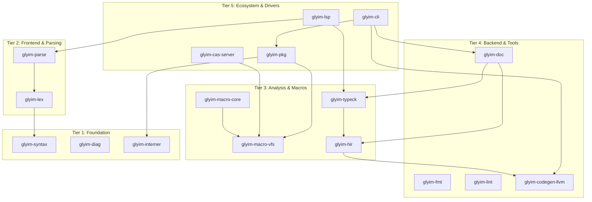

# Glyim v0.5.0 Architecture & Design Specification

## 1. Context & Scope

### What v0.1.0–v0.4.0 Delivered

| Version | Theme | Key Deliverables |
|---------|-------|-----------------|
| **v0.1.0** | Architectural Runway | End-to-end pipeline: `.g` → lex → parse → HIR → LLVM IR → native exe. CAS traits, `MacroContext` trait, hygiene framework. 11 crates, strict DAG. |
| **v0.2.0** | Feels Like a Real Language | `let`/`let mut`, `if`/`else`, string literals, `println`/`assert` builtins, Rowan CST, ariadne diagnostics, JIT execution, `glyim init`, UI test framework. |
| **v0.3.0** | Language Core | Struct types, enum types, generic type parameters, pattern matching, typed macro execution, `@rust()` FFI, REPL, `Option<T>`, `Result<T,E>`, allocator API. |
| **v0.4.0** | Developer Experience | LSP server (`glyim-lsp`), formatter (`glyim-fmt`), macro expansion preview in IDE, `glyim-lint` skeleton, semantic tokens, inlay hints. |

### The Problem: v0.4.0 Is an Island

After v0.4.0, a single developer can write, compile, debug, and iterate on a Glyim program with IDE support. But they cannot:

- **Share code.** There is no package manager. Every project is self-contained. No one can publish a library and have others depend on it.
- **Build real programs.** The standard library is minimal (`Option`, `Result`, basic I/O). There are no collections (`Vec`, `HashMap`, `String`), no iterators, no filesystem API, no networking. Every non-trivial project reimplements these basics.
- **Cache macro work.** The CAS is local-only. Every clean build re-executes every macro. In CI, every pipeline starts from scratch. The architectural differentiator—content-addressable macro caching—is unrealized at scale.
- **Debug effectively.** There is no DWARF debug info. `gdb` and `lldb` cannot set breakpoints, inspect variables, or produce meaningful stack traces. Users resort to `println` debugging.
- **Run tests systematically.** There is no test runner. Projects use ad-hoc `assert()` calls in `main`. CI has no structured way to discover and run tests.
- **Target other platforms.** The compiler only produces binaries for the host architecture. Cross-compilation to ARM, WASM, or Windows requires manual toolchain setup.

Internally, the `glyim-macro-vfs` CAS is ripe for distribution—its `ContentStore` trait was designed for this—but no remote implementation exists. The `glyim-typeck` crate, now fully functional in v0.3.0, is ready to power documentation generation.

### The Solution: v0.5.0 — "Ecosystem & Production Readiness"

**Tagline:** *"Build, share, and cache — at scale."*

This specification adds the minimal feature set so a user can build a multi-package project, depend on community libraries, cache macro work remotely, debug with standard tools, run tests systematically, and cross-compile for production targets.

### Scope of v0.5.0

**Included:**
- Package manager (`glyim-pkg`) with registry, lockfile, and workspace support
- Standard library foundation (`glyim-std`) with collections, strings, iterators, and I/O
- Distributed CAS and remote build cache (Bazel REAPI-compatible)
- DWARF debug information via Inkwell's DIBuilder
- Built-in test runner (`glyim test`)
- Cross-compilation via LLVM target triples and sysroot management
- Documentation generator (`glyim doc`)
- Optimization pipeline (`--release` mode with LTO)

**Excluded:**
- Garbage collection / destructors (v0.6.0)
- Async/await (v0.6.0)
- Trait objects / dynamic dispatch (v0.6.0)
- WASM target (v0.6.0)
- IDE plugin packaging (v0.6.0)
- Incremental compilation (v0.6.0)
- Distributed macro execution (remote *execution*, not just caching) (v0.7.0)

---

## 2. Goals and Non-Goals (ASRs)

### Goals

| ID | Statement |
|----|-----------|
| **ASR-021** | Users can declare, resolve, fetch, and publish package dependencies via `glyim-pkg`. |
| **ASR-022** | The standard library provides `Option<T>`, `Result<T,E>`, `Vec<T>`, `String`, `HashMap<K,V>`, `Iterator<T>`, `Range<T>`, and basic I/O types. |
| **ASR-023** | Macro expansion results cache remotely via a distributed CAS that is wire-compatible with the Bazel Remote Execution API v2. |
| **ASR-024** | Compiled programs carry DWARF debug information usable by `gdb` and `lldb` to set breakpoints, inspect variables, and produce stack traces. |
| **ASR-025** | `glyim test` discovers `#[test]` functions, compiles a test harness, and runs them with structured PASS/FAIL/IGNORED output. |
| **ASR-026** | `glyim build --target <triple>` produces binaries for non-host architectures, including Linux ARM64 and macOS ARM64 from an x86_64 host. |
| **ASR-027** | The package manager's lockfile pins dependencies to content hashes, providing cryptographic reproducibility of builds. |
| **ASR-028** | Macro stack traces map runtime errors in generated code back to the original macro call site. |
| **ASR-029** | `glyim doc` generates HTML documentation from source code and type information, hosted locally or published to a registry. |
| **ASR-030** | `--release` mode applies LLVM optimization passes including Link-Time Optimization (LTO). |

### Non-Goals

| What | Why |
|------|-----|
| **GC / destructors** | Needs careful design (Rust-style drop vs. linear types). Deferred to v0.6.0. |
| **Async/await** | Requires runtime, pinning, and state machine transform. Deferred. |
| **Trait objects / vtables** | Complex codegen. Not blocking for ecosystem. |
| **Full LSP v3.17 compliance** | Incremental improvement over v0.4.0. Not blocking. |
| **WASM target** | Architecturally easy but sysroot/tooling is work. Deferred. |
| **Incremental compilation** | Requires fine-grained caching and dependency tracking. Deferred. |
| **IDE plugins** | Depends on LSP; plugin packaging is v0.6.0. |
| **Compiler plugins (beyond macros)** | Too open-ended. v0.7.0+. |
| **Formal verification** | Research territory. v0.8.0+. |

---

## 3. The Design

### 3.1 C2 View: Container Architecture (Updated for v0.5.0)

The tiered DAG from v0.1.0 is extended with three new crates:



**New crates:**

| Crate | Tier | Depends On | Purpose |
|-------|------|-----------|---------|
| `glyim-pkg` | 5 | `glyim-macro-vfs`, `glyim-interner` | Package manager, dependency resolution, registry client |
| `glyim-cas-server` | 5 | `glyim-macro-vfs` | Remote CAS server (Bazel REAPI compatible) |
| `glyim-doc` | 4 | `glyim-syntax`, `glyim-hir`, `glyim-typeck` | Documentation generator |

### 3.2 Package Manager (`glyim-pkg`)

#### 3.2.1 Manifest Format

`glyim.toml` at the package root:

```toml
[package]
name = "myapp"
version = "0.1.0"
edition = "2024"
authors = ["Jane Doe <jane@example.com>"]
description = "A sample Glyim application"

[dependencies]
serde = "1.2"                     # Semver range
http = { version = "0.3", registry = "https://registry.glyim.dev" }
my-local = { path = "../my-local" }  # Local path dependency

[macros]
derive = "1.0"                     # Macro dependencies (separated for cache key computation)

[target.x86_64-unknown-linux-gnu]
linker = "gcc"

[target.aarch64-unknown-linux-gnu]
linker = "aarch64-linux-gnu-gcc"

[cache]
remote = "https://cache.glyim.dev"
auth = "token:${GLYIM_CACHE_TOKEN}"   # Environment variable expansion
push = true
pull = true

[features]
default = ["json"]
json = ["serde/json"]
```

#### 3.2.2 Lockfile Format

`glyim.lock` — pins every dependency to a content hash:

```toml
# This file is @generated by glyim-pkg.
# Do not edit manually.

[[package]]
name = "serde"
version = "1.2.3"
hash = "sha256:e3b0c44298fc1c149afbf4c8996fb92427ae41e4649b934ca495991b7852b855"
source = "registry+https://registry.glyim.dev"
deps = ["serde-derive"]

[[package]]
name = "serde-derive"
version = "1.2.3"
hash = "sha256:a7ffc6f8bf1ed76651c14756a061d662f580ff4de43b49fa82d80a4b80f8434a"
is-macro = true
source = "registry+https://registry.glyim.dev"
deps = []
```

**Key design: Lockfiles pin to content hashes, not just versions.** This gives cryptographic reproducibility — a unique Glyim advantage over Cargo, npm, and pip. Two different `glyim.lock` files with the same content hashes will produce bit-for-bit identical builds.

#### 3.2.3 Dependency Resolution Algorithm

Glyim uses **minimal version selection** (the same algorithm as Go modules):

1. For each dependency, collect all version constraints from all packages in the dependency graph.
2. Select the *minimum* version that satisfies all constraints.
3. Resolve transitively until the graph is complete.
4. Pin each resolved version to its content hash in the lockfile.

This produces deterministic, reproducible resolution without a SAT solver.

#### 3.2.4 Registry Protocol

The registry is a simple REST API:

```
GET  /api/v1/packages/{name}                          → Package metadata + version list
GET  /api/v1/packages/{name}/{version}                → Package manifest + hash
GET  /api/v1/packages/{name}/{version}/download       → Package archive (.tar.gz)
PUT  /api/v1/packages/{name}/{version}                → Publish (requires auth)
GET  /api/v1/packages/{name}/{version}/docs           → Documentation
```

Package archives are content-addressed: the archive's SHA-256 must match the `hash` field in the lockfile. The registry validates this on upload.

#### 3.2.5 Workspace Support

A workspace root `glyim.toml`:

```toml
[workspace]
members = ["crates/*", "apps/*"]

[workspace.dependencies]
serde = "1.2"    # Shared dependency version
```

Each member has its own `glyim.toml` that can reference workspace dependencies:

```toml
[package]
name = "mylib"
version = "0.1.0"

[dependencies]
serde = { workspace = true }
```

#### 3.2.6 CLI Commands

```
glyim init <name>            # Scaffold a new project
glyim add <pkg>              # Add dependency, update lockfile
glyim add <pkg> --macro      # Add macro dependency
glyim remove <pkg>           # Remove dependency
glyim fetch                  # Download all dependencies to local CAS
glyim publish                # Upload package to registry
glyim outdated               # Check for newer versions
glyim test                   # Run tests
glyim test --all             # Run tests in workspace
glyim test -p <pkg>          # Run tests in specific package
glyim doc                    # Generate documentation
glyim doc --open             # Generate and open in browser
glyim build --release        # Build with optimizations
glyim build --target <triple> # Cross-compile
glyim cache push             # Push artifacts to remote cache
glyim cache pull             # Pull artifacts from remote cache
glyim cache clean            # Remove unused cache entries
```

### 3.3 Standard Library Foundation (`glyim-std`)

#### 3.3.1 Core Types

```glyim
// === Optionality ===
enum Option<T> {
    Some(T),
    None,
}

// === Error Handling ===
enum Result<T, E> {
    Ok(T),
    Err(E),
}

// === Collections ===
struct Vec<T>              // Dynamic array (heap-allocated)
struct String              // Owned UTF-8 string (heap-allocated)
struct HashMap<K, V>       // Hash map (SipHash 1-3, like Rust)

// === Iterators ===
trait Iterator<T> {
    fn next(self) -> Option<T>
}

struct Range<T>            // a..b syntax sugar
struct Iter<T>             // Iterator adapter for Vec<T>

// === I/O ===
struct File                // File handle
struct Stdout              // Standard output writer
struct Stderr              // Standard error writer
struct BufReader           // Buffered reader

// === Error Types ===
struct Error               // Generic error type
fn panic(msg: &str) -> !   // Unrecoverable error (aborts)
fn unwrap<T>(opt: Option<T>) -> T  // Panic on None
```

#### 3.3.2 Heap Allocation

v0.5.0 introduces the `alloc` module. The compiler provides a default system allocator using `malloc`/`free` via libc.

**Compiler-emitted allocator shim:**

```llvm
declare i8* @malloc(i64)
declare void @free(i8*)

define i8* @glyim_alloc(i64 %size) {
entry:
  %ptr = call i8* @malloc(i64 %size)
  %is_null = icmp eq i8* %ptr, null
  br i1 %is_null, label %oom, label %ok

oom:
  call void @abort()
  unreachable

ok:
  ret i8* %ptr
}

define void @glyim_free(i8* %ptr) {
entry:
  call void @free(i8* %ptr)
  ret void
}
```

**`#[no_std]` attribute:** When applied to a package, the compiler does not automatically link the `alloc` module or the system allocator. The package must provide its own allocator or operate without heap allocation.

#### 3.3.3 `Vec<T>` Implementation Strategy

`Vec<T>` is a struct with three fields:

```
struct Vec<T> {
    data: *mut T,    // Heap-allocated buffer
    len: i64,        // Current number of elements
    cap: i64,        // Buffer capacity
}
```

Key operations:

| Operation | LLVM IR Pattern |
|-----------|-----------------|
| `Vec::new()` | `alloca { *mut, i64, i64 }`; initialize to `{ null, 0, 0 }` |
| `Vec::push(val)` | If `len == cap`: call `glyim_alloc(2 * cap * sizeof(T))`, copy, `glyim_free(old)`. Store `val` at `data[len]`, increment `len`. |
| `Vec::pop()` | Decrement `len`, load `data[len]`. |
| `Vec::get(i)` | Bounds check: if `i >= len`, panic. Otherwise load `data[i]`. |
| `Vec::len()` | Load `len` field. |
| `Drop` | Call `glyim_free(data)`. |

**Growth strategy:** Double the capacity on each reallocation (same as Rust's `Vec`).

#### 3.3.4 `String` Implementation

`String` wraps `Vec<u8>` with the invariant that contents are always valid UTF-8:

```
struct String {
    vec: Vec<u8>,
}
```

This matches Rust's mental model. `&str` (borrowed fat pointer `{ i8*, i64 }`) from v0.2.0 continues to work; `String` is the owned counterpart.

#### 3.3.5 `HashMap<K, V>` Implementation

Uses SipHash 1-3 (the same hash function as Rust's `HashMap`) to resist hash-flooding attacks. Swiss-table style layout:

```
struct HashMap<K, V> {
    buckets: *mut Bucket<K, V>,
    len: i64,
    cap: i64,
    ctrl: *mut u8,       // Metadata bytes (empty/deleted/occupied)
}
```

This is the most complex type in the stdlib. For v0.5.0, a simpler open-addressing with linear probing is acceptable if Swiss tables prove too complex.

#### 3.3.6 Standard Library Distribution

The standard library is distributed as **source code**, compiled alongside the project. It lives in the compiler's installation directory:

```
~/.glyim/
  std/
    0.5.0/
      src/
        option.glyim
        result.glyim
        vec.glyim
        string.glyim
        hashmap.glyim
        io.glyim
        iter.glyim
        alloc.glyim
        prelude.glyim
```

The `prelude.glyim` is implicitly imported into every file:

```glyim
use option::Option
use result::Result
use vec::Vec
use string::String
use io::{println, eprintln}
```

### 3.4 Distributed CAS & Remote Build Cache

#### 3.4.1 Architecture

```
┌─────────────┐     gRPC/REST      ┌──────────────────┐
│  Glyim CLI  │ ◄─────────────────► │  CAS Server      │
│  (Client)   │                     │  ┌──────────────┐│
│             │                     │  │ Object Store  ││
│  Remote     │                     │  │ (FS/S3/...)   ││
│  Content    │                     │  └──────────────┘│
│  Store      │                     │  ┌──────────────┐│
│  impl       │                     │  │ Action Cache  ││
│             │                     │  │ (hash→result) ││
└─────────────┘                     │  └──────────────┘│
                                    │  ┌──────────────┐│
                                    │  │ Auth Module   ││
                                    │  └──────────────┘│
                                    └──────────────────┘
```

#### 3.4.2 Extended ContentStore Trait

```rust
// In glyim-macro-vfs (extends existing ContentStore)
pub trait ContentStore {
    // Existing methods (v0.1.0)
    fn store(&self, content: &[u8]) -> ContentHash;
    fn retrieve(&self, hash: ContentHash) -> Option<Vec<u8>>;
    fn register_name(&self, name: &str, hash: ContentHash);
    fn resolve_name(&self, name: &str) -> Option<ContentHash>;

    // v0.5.0 additions
    fn store_action_result(&self, action_hash: ContentHash, result: ActionResult) -> Result<(), StoreError>;
    fn retrieve_action_result(&self, action_hash: ContentHash) -> Option<ActionResult>;
    fn has_blobs(&self, hashes: &[ContentHash]) -> Vec<ContentHash>;  // Returns missing hashes
}

pub struct ActionResult {
    pub output_files: Vec<FileArtifact>,
    pub exit_code: i32,
    pub stdout_hash: Option<ContentHash>,
    pub stderr_hash: Option<ContentHash>,
}

#[derive(Debug, Clone)]
pub enum StoreError {
    Network(String),
    Auth(String),
    Io(std::io::Error),
    HashMismatch { expected: ContentHash, actual: ContentHash },
}
```

#### 3.4.3 Remote ContentStore Implementation

```rust
// In new module: glyim-macro-vfs/src/remote.rs
pub struct RemoteContentStore {
    endpoint: String,
    auth_token: Option<String>,
    client: reqwest::blocking::Client,
    local: LocalContentStore,  // Local cache for fetched artifacts
}

impl RemoteContentStore {
    pub fn new(config: &CacheConfig) -> Result<Self, StoreError> {
        let local = LocalContentStore::new(&config.local_dir)?;
        let client = reqwest::blocking::Client::builder()
            .timeout(std::time::Duration::from_secs(30))
            .build()
            .map_err(|e| StoreError::Network(e.to_string()))?;
        Ok(Self {
            endpoint: config.remote_url.clone(),
            auth_token: config.auth_token.clone(),
            client,
            local,
        })
    }
}
```

#### 3.4.4 Cache Key Computation

The cache key for a macro expansion is:

```
macro_cache_key = SHA256(
    compiler_version +
    target_triple +
    macro_bytecode_hash +
    input_ast_hash +
    all_pure_file_hashes +
    all_impure_file_hashes +
    feature_flags
)
```

For **pure macros** (those that don't read the filesystem), `all_impure_file_hashes` is empty. For **impure macros** (those using `@pure(false)` or compiler-provided `fs::` APIs), the file hashes are included.

This makes pure macros maximally cacheable across machines, while impure macros are still cacheable when the same file contents are present.

#### 3.4.5 Bazel REAPI Compatibility

The CAS server implements a subset of the [Bazel Remote Execution API v2](https://github.com/bazelbuild/remote-apis):

```
service ContentAddressableStorage {
  rpc FindMissingBlobs(FindMissingBlobsRequest) returns (FindMissingBlobsResponse);
  rpc BatchUpdateBlobs(BatchUpdateBlobsRequest) returns (BatchUpdateBlobsResponse);
  rpc BatchReadBlobs(BatchReadBlobsRequest) returns (BatchReadBlobsResponse);
  rpc GetTree(GetTreeRequest) returns (stream Directory);
}

service ActionCache {
  rpc GetActionResult(GetActionResultRequest) returns (ActionResult);
  rpc UpdateActionResult(UpdateActionResultRequest) returns (ActionResult);
}

service Capabilities {
  rpc GetCapabilities(GetCapabilitiesRequest) returns (ServerCapabilities);
}
```

**Why REAPI compatibility?** Organizations already running Bazel remote caches (Buildbarn, BuildGrid, EngFlow) can reuse them for Glyim without deploying additional infrastructure. This is a strategic advantage.

#### 3.4.6 Authentication Model

```toml
# glyim.toml
[cache]
remote = "https://cache.glyim.dev"
auth = "token:${GLYIM_CACHE_TOKEN}"  # Environment variable expansion
push = true                           # Can write to remote cache
pull = true                           # Can read from remote cache
```

Supported auth methods:

| Method | Format | Use Case |
|--------|--------|----------|
| Token | `token:ghp_xxxx` or `token:${ENV_VAR}` | Personal access tokens |
| AWS IAM | `aws:iam-role` | AWS-hosted caches |
| GCP SA | `gcp:service-account` | GCP-hosted caches |
| None | (omit `auth` field) | Open caches (internal networks) |

#### 3.4.7 CAS Server (`glyim-cas-server`)

A standalone binary that can be deployed as:

1. **Single-process** (development): `glyim-cas-server --port 50051 --storage-dir /tmp/cas`
2. **Docker container** (production): `docker run -p 50051:50051 glyim/cas-server`
3. **Kubernetes deployment** (scaled): with S3 backend for object storage

Configuration (`cas-server.toml`):

```toml
[server]
port = 50051
max_blob_size = 104857600   # 100 MB

[storage]
backend = "filesystem"      # "filesystem" | "s3" | "gcs"
path = "/data/cas"          # For filesystem backend

[storage.s3]                # For S3 backend
bucket = "my-glyim-cache"
region = "us-east-1"
prefix = "glyim-cas/"

[auth]
method = "token"            # "none" | "token" | "aws-iam"
tokens = []                 # Valid tokens (or read from env)
```

### 3.5 Debug Information (DWARF)

#### 3.5.1 DIBuilder Integration

Inkwell provides a `DIBuilder` that wraps LLVM's debug info generation. The codegen module creates DWARF metadata for each compilation unit:

```rust
// In glyim-codegen-llvm/src/debug.rs
use inkwell::debug_info::*;

pub struct DebugInfoGen<'ctx> {
    dibuilder: DebugInfoBuilder<'ctx>,
    compile_unit: DICompileUnit<'ctx>,
    file: DIFile<'ctx>,
}

impl<'ctx> DebugInfoGen<'ctx> {
    pub fn new(context: &'ctx Context, module: &Module<'ctx>, file_path: &str) -> Self {
        let dibuilder = module.create_debug_info_builder(
            true,                           // Is little endian
            DWARFSourceLanguage::C,          // Closest match for Glyim
            file_path,                       // Source filename
            ".",                             // Source directory
            "Glyim 0.5.0",                  // Producer
            false,                           // Is optimized
            "",                              // Compiler flags
            0,                               // Runtime version
            "",                              // Split debug filename
            DWARFEmissionKind::Full,         // Emission kind
            0,                               // DWO ID
            false,                           // Split debug inlining
            false,                           // Debug info for profiling
        );

        let compile_unit = dibuilder.create_compile_unit(
            DWARFSourceLanguage::C,
            dibuilder.create_file(file_path, "."),
            "Glyim 0.5.0",
            false,
            "",
            0,
            "",
            DWARFEmissionKind::Full,
            false,
            false,
        );

        Self { dibuilder, compile_unit, file: dibuilder.create_file(file_path, ".") }
    }
}
```

#### 3.5.2 Per-Function Debug Info

For each function in the HIR, the codegen creates:

- A `DISubprogram` with the function name, source location, and type signature
- `DILocalVariable` entries for each `let` binding
- `DILocation` entries for each expression

```rust
fn codegen_fn_with_debug(
    &mut self,
    f: &HirFn,
    debug_info: &mut DebugInfoGen<'ctx>,
    source_map: &SourceMap,
) -> Result<(), String> {
    let name = self.interner.resolve(f.name);
    let span = f.span;

    // Create debug function type
    let ret_type = debug_info.dibuilder.create_basic_type(
        i64_type.as_any_type_enum(),
        64,
        "i64",
        DIFlags::ZERO,
    ).unwrap();

    let fn_type = debug_info.dibuilder.create_subroutine_type(
        debug_info.compile_unit.get_file(),
        Some(ret_type),
        &[],
        DIFlags::ZERO,
    );

    // Create subprogram
    let subprogram = debug_info.dibuilder.create_function(
        debug_info.compile_unit.get_file().as_debug_info_scope(),
        name,
        None,
        debug_info.compile_unit.get_file(),
        source_map.line(span.start),
        fn_type,
        false,
        true,
        source_map.line(span.start),
        DIFlags::ZERO,
        false,
    );

    // ... codegen body with debug locations ...
}
```

#### 3.5.3 Variable Debug Info

Each `let` binding gets a `DILocalVariable` and a `DbgDeclare` intrinsic:

```llvm
call void @llvm.dbg.declare(
    metadata i64* %x,
    metadata !5,              ; DILocalVariable "x"
    metadata !DIExpression()
), !dbg !7
```

#### 3.5.4 Macro Debug Info

When a macro generates code, the DWARF info must point to the **macro invocation**, not the generated code:

```rust
struct MacroDebugInfo {
    call_site: Span,           // Where the macro was invoked
    expansion_depth: u32,      // Nested macro depth
    macro_name: Symbol,        // Which macro generated this
}
```

For each macro-generated function, the `DISubprogram` gets:

- `file` = the original `.g` source (not a virtual file)
- `line` = the macro call site line
- `DIFlagArtificial` = true (so debuggers can hide it in backtraces if desired)
- `isDistinct` = true (each expansion is unique)

This is critical for the macro debugging experience: when a crash occurs in macro-generated code, `gdb` shows the macro call site, not the opaque generated code.

#### 3.5.5 Debug Info Modes

| Flag | Behavior | Use Case |
|------|----------|----------|
| (default) | Line tables only (DWARF `.debug_line`) | Small binary size; stack traces work |
| `--debug` | Full DWARF info (`.debug_info`, `.debug_line`, `.debug_abbrev`) | `gdb` breakpoints, variable inspection |
| `--release` | No debug info, full optimization | Production builds |

### 3.6 Built-in Test Runner (`glyim test`)

#### 3.6.1 Test Attribute Syntax

```glyim
fn add(a: i64, b: i64) -> i64 { a + b }

#[test]
fn test_add() {
    assert(add(1, 2) == 3, "1 + 2 should equal 3")
}

#[test]
fn test_add_negative() {
    assert(add(-1, 1) == 0)
}

#[test(should_panic)]
fn test_out_of_bounds() {
    let v = Vec::new()
    v.get(0)   // Should panic
}

#[test(ignore)]
fn test_slow_thing() {
    // Not run by default
}
```

#### 3.6.2 Test Harness Code Generation

When `glyim test` runs, the compiler:

1. Scans the HIR for functions annotated with `#[test]`
2. Generates a `__glyim_test_main()` function:

```llvm
@__glyim_test_count = private constant i64 3
@__glyim_test_names = private constant [3 x i8*] [
    i8* getelementptr([10 x i8], [10 x i8]* @str.test_add, i32 0, i32 0),
    i8* getelementptr([19 x i8], [19 x i8]* @str.test_add_negative, i32 0, i32 0),
    i8* getelementptr([20 x i8], [20 x i8]* @str.test_out_of_bounds, i32 0, i32 0),
]

define i32 @__glyim_test_main() {
entry:
  call void @write(i32 1, i8* getelementptr([19 x i8], ...@str.running), i64 18)
  ; ... for each test:
  ;   call @setjmp
  ;   call @test_add
  ;   if setjmp returns 0: print "ok"
  ;   if setjmp returns nonzero: print "FAILED"
  ;   ...
  ;   print summary
  ret i32 %exit_code
}
```

3. Links the test binary with `setjmp`/`longjmp` for panic isolation
4. Runs the test binary and captures exit code + stdout

#### 3.6.3 Test Output Format

```
$ glyim test
running 3 tests
test test_add ... ok
test test_add_negative ... ok
test test_out_of_bounds ... ok (panicked as expected)

test result: ok. 3 passed; 0 failed; 0 ignored; 0 measured; 0 filtered out
```

Failed test:

```
$ glyim test
running 3 tests
test test_add ... ok
test test_add_negative ... FAILED
test test_out_of_bounds ... ok (panicked as expected)

failures:

---- test_add_negative ----
assertion failed: add(-1, 1) == 0
  at src/main.g:7:3

test result: FAILED. 2 passed; 1 failed; 0 ignored
```

#### 3.6.4 Test Discovery in Multi-Package Projects

```
glyim test                # Run tests in current package
glyim test --all          # Run tests in all workspace members
glyim test -p serde       # Run tests in specific package
glyim test --test integration  # Run only tests in the 'integration' test target
glyim test -- --nocapture # Pass flags to the test binary
```

#### 3.6.5 Test Integration with Package Manager

When `glyim test` runs in a package:

1. Resolve dependencies from `glyim.lock`
2. Compile the package with `#[test]` functions enabled
3. Compile test-only dependencies (those in `[dev-dependencies]`)
4. Generate and compile the test harness
5. Run the test binary
6. Report results

### 3.7 Cross-Compilation

#### 3.7.1 Target Triple Selection

LLVM makes cross-compilation architecturally simple — change the target triple, and the code generator produces correct machine code for the target architecture.

```bash
glyim build --target aarch64-unknown-linux-gnu    # ARM64 Linux
glyim build --target x86_64-apple-darwin          # macOS Intel
glyim build --target aarch64-apple-darwin         # macOS Apple Silicon
glyim build --target x86_64-pc-windows-msvc       # Windows MSVC
```

#### 3.7.2 Supported Targets (v0.5.0)

| Target Triple | Host | Status |
|--------------|------|--------|
| `x86_64-unknown-linux-gnu` | Linux x86_64 | Tier 1 (native) |
| `aarch64-unknown-linux-gnu` | Linux x86_64 | Tier 2 (cross) |
| `x86_64-apple-darwin` | macOS x86_64 | Tier 1 (native) |
| `aarch64-apple-darwin` | macOS ARM64 | Tier 1 (native on M1+) |

Windows support is deferred to v0.6.0.

#### 3.7.3 Sysroot Management

```
~/.glyim/
  sysroots/
    aarch64-unknown-linux-gnu/
      lib/
        libglyim_rt.a      # Glyim runtime (println, assert, alloc shims)
        libc.a             # Cross-compiled libc (pulled from Zig's sysroots)
    x86_64-apple-darwin/
      lib/
        libglyim_rt.a
        libSystem.tbd
```

**Sysroot acquisition:** The `glyim-pkg` crate downloads sysroots on first use:

```
$ glyim build --target aarch64-unknown-linux-gnu
Sysroot for aarch64-unknown-linux-gnu not found.
Download? [Y/n]: y
Downloading sysroot (45 MB)... done.
Building for aarch64-unknown-linux-gnu...
Built: myapp (target/aarch64-unknown-linux-gnu/debug/myapp)
```

#### 3.7.4 Cross-Compilation Configuration in `glyim.toml`

```toml
[target.aarch64-unknown-linux-gnu]
linker = "aarch64-linux-gnu-gcc"
sysroot = "/usr/aarch64-linux-gnu"    # Optional: override default sysroot

[target.x86_64-apple-darwin]
# Default linker and sysroot work on macOS
```

#### 3.7.5 Implementation in Codegen

```rust
// In glyim-codegen-llvm/src/codegen.rs
pub fn compile_for_target(
    hir: &Hir,
    interner: Interner,
    target_triple: &str,
    opt_level: OptimizationLevel,
) -> Result<(), String> {
    let context = Context::create();
    let module = context.create_module("glyim_out");

    // Set target triple
    let triple = TargetTriple::create(target_triple);
    module.set_triple(&triple);

    // Set data layout
    let target = Target::from_triple(&triple)
        .map_err(|e| format!("unsupported target '{}': {}", target_triple, e))?;
    let data_layout = target.create_target_machine(
        &triple, "", "", opt_level, RelocMode::PIC, CodeModel::Default,
    ).ok_or("failed to create target machine")?
     .get_target_data().get_data_layout();
    module.set_data_layout(&data_layout);

    // ... generate code as before ...
}
```

### 3.8 Documentation Generator (`glyim doc`)

#### 3.8.1 Doc Comments

```glyim
/// Adds two integers together.
///
/// # Examples
/// ```glyim
/// assert(add(1, 2) == 3)
/// ```
fn add(a: i64, b: i64) -> i64 { a + b }

/// A dynamic array that grows as needed.
///
/// # Examples
/// ```glyim
/// let v = Vec::new()
/// v.push(1)
/// v.push(2)
/// assert(v.len() == 2)
/// ```
struct Vec<T> { ... }
```

#### 3.8.2 Generated Output

`glyim doc` produces an `index.html` and per-module/per-type pages:

```
target/doc/
  index.html                    # Package index
  mylib/
    index.html                  # Module index
    Vec.html                    # Vec<T> documentation
    add.html                    # Function documentation
    ...
  src/
    mylib.glyim.html            # Source browser
```

Each page includes:

- Type signature and source location
- Doc comment (rendered as Markdown)
- Examples (with syntax highlighting)
- Cross-references to related types
- Trait implementations

#### 3.8.3 Implementation

`glyim-doc` walks the HIR and type information to generate HTML:

```rust
pub struct DocGenerator<'a> {
    hir: &'a Hir,
    typeck: &'a TypeckResults,
    interner: &'a Interner,
    source_map: &'a SourceMap,
}

impl<'a> DocGenerator<'a> {
    pub fn generate(&self, output_dir: &Path) -> Result<(), DocError> {
        // 1. Generate index.html
        // 2. For each public item: generate item page
        // 3. Generate source browser
        // 4. Copy CSS/JS assets
        Ok(())
    }
}
```

### 3.9 Optimization Pipeline (`--release`)

#### 3.9.1 Optimization Levels

| Flag | LLVM Opt Level | LTO | Debug Info | Use Case |
|------|---------------|-----|-----------|----------|
| (default) | `None` | No | Line tables | Development |
| `--debug` | `None` | No | Full DWARF | Debugging |
| `--release` | `Aggressive` | Thin LTO | None | Production |

#### 3.9.2 Release Mode Configuration

```rust
// In glyim-codegen-llvm
pub fn create_target_machine_for_release(triple: &TargetTriple) -> Result<TargetMachine, String> {
    Target::initialize_native(&InitializationConfig::default()).map_err(|e| e.to_string())?;
    let target = Target::from_triple(triple).map_err(|e| e.to_string())?;
    target.create_target_machine(
        triple,
        "generic",                           // CPU
        "",                                   // Features
        OptimizationLevel::Aggressive,
        RelocMode::PIC,
        CodeModel::Default,
    ).ok_or("failed to create target machine for release")
}
```

#### 3.9.3 Link-Time Optimization (ThinLTO)

ThinLTO is enabled in `--release` mode:

```rust
// In pipeline.rs, for release builds:
module.set_inline_asm(false);  // Not needed

// When writing object file, use ThinLTO:
if release_mode {
    let config = TargetMachine::get_host_cpu_name();
    // Use ThinLTO via the linker
    // The object file is compiled with -flto=thin metadata
}
```

---

## 4. Alternatives Considered

### 4.1 Package Manager: Minimal Version Selection vs. SAT Solver

- **Alternative A (Cargo-style SAT solver):** Resolve dependencies using a SAT solver (PubGrub algorithm) that finds the highest compatible version set.
- **Alternative B (Go-style minimal version selection):** For each dependency, select the minimum version that satisfies all constraints.
- **Decision (Chosen: B — Minimal Version Selection).** Simpler to implement, deterministic, and produces reproducible builds without a lockfile lottery. Go's experience shows this works well at scale. If a user needs a specific version, they can pin it in `glyim.toml`.
- *Traceability: ASR-027.*

### 4.2 Package Manager: Hash-Pinned vs. Semver-Pinned Lockfiles

- **Alternative A (Cargo-style):** Lockfile pins `name → version`. Build reproducibility depends on registry immutability.
- **Alternative B (Glyim-style):** Lockfile pins `name → ContentHash`. Build reproducibility is cryptographic.
- **Decision (Chosen: B — Hash-Pinned).** This is Glyim's unique advantage. The CAS architecture from v0.1.0 was designed for exactly this. Hash-pinned lockfiles mean that two developers with the same `glyim.lock` will always produce bit-for-bit identical builds, regardless of registry state.
- *Traceability: ASR-027.*

### 4.3 Standard Library: Shipped as Source vs. Precompiled

- **Alternative A (Rust-style):** The standard library is precompiled and shipped as a `.rlib`. Faster compilation; harder to debug.
- **Alternative B (Source distribution):** The standard library is shipped as source code and compiled alongside the project. Slower initial compilation; easier to debug and customize.
- **Decision (Chosen: B — Source Distribution).** For v0.5.0, source distribution is simpler to implement and allows users to step into stdlib code in `gdb`. Precompiled stdlib can be added as an optimization in v0.6.0.
- *Traceability: ASR-022.*

### 4.4 Remote Cache: Custom Protocol vs. Bazel REAPI

- **Alternative A (Custom REST API):** Simple to implement; no external dependencies.
- **Alternative B (Bazel REAPI v2):** More complex (gRPC); compatible with existing Bazel infrastructure.
- **Decision (Chosen: B — REAPI Compatible).** Organizations already running Bazel remote caches (Buildbarn, BuildGrid, EngFlow) can reuse them for Glyim. This is a strategic advantage that lowers adoption barriers in enterprise settings. The REST API is provided as a simpler alternative for small teams.
- *Traceability: ASR-023.*

### 4.5 DWARF: Full vs. Line Tables Only

- **Alternative A:** Default to full DWARF info in all builds.
- **Alternative B:** Default to line tables only; full DWARF with `--debug`.
- **Decision (Chosen: B — Line Tables Default).** Full DWARF adds significant binary size (2-3×). Line tables are sufficient for stack traces and basic `gdb` usage. Full DWARF is reserved for `--debug` builds where developers actively need variable inspection.
- *Traceability: ASR-024.*

### 4.6 Cross-Compilation: Zig-Style Bundled Sysroots vs. System Sysroots

- **Alternative A (Zig-style):** Bundle cross-compiled libc for every target. Seamless cross-compilation with no system dependencies.
- **Alternative B (System sysroots):** Require users to install cross-compilation toolchains. Simpler for the compiler; more work for users.
- **Decision (Chosen: A with Lazy Download — Zig-Style Bundled Sysroots).** Download sysroots on first use (like Zig). This gives the best UX while avoiding a 500 MB initial download. The sysroots are pulled from a curated CDN maintained by the Glyim project.
- *Traceability: ASR-026.*

### 4.7 Test Runner: Built-in vs. External Harness

- **Alternative A (Rust-style):** The compiler generates the test harness internally. `#[test]` is a compiler-recognized attribute.
- **Alternative B (Go-style):** Tests are regular functions that call into a test framework library. The test harness is user code.
- **Decision (Chosen: A — Built-in).** A built-in test runner gives a zero-config experience (`glyim test` just works) and enables compiler-level features like `#[test(should_panic)]` and panic isolation via `setjmp`/`longjmp`.
- *Traceability: ASR-025.*

---

## 5. Cross-Cutting Concerns

### 5.1 Security: Package Registry and Remote Cache

- **Registry:** Packages are signed with the author's private key. The registry verifies signatures on upload. The lockfile includes the package's content hash, which the client verifies on download.
- **Remote Cache:** All uploads are hash-verified. If a client uploads a blob whose SHA-256 doesn't match the declared hash, the server rejects it.
- **Supply Chain:** The `glyim verify` command audits the lockfile, checking that all content hashes match the registry's records and that no package has been tampered with.

### 5.2 Performance: Package Resolution and Fetching

- **Lazy Fetching:** Dependencies are fetched only when needed (like Zig). `glyim build` fetches missing dependencies on the fly.
- **Parallel Download:** Multiple packages are fetched concurrently using `reqwest`'s async client.
- **Local Caching:** All fetched packages are stored in the local CAS (`~/.glyim/cache/`). A package is only downloaded once per content hash.

### 5.3 Platform Considerations

- **Linux:** Primary target. Full support for all features.
- **macOS:** Full support for native builds. Cross-compilation to macOS from Linux is deferred (requires macOS SDK).
- **Windows:** Deferred to v0.6.0. The `write` syscall shim needs to be replaced with `WriteFile`; `abort` needs `ExitProcess`.
- **32-bit:** Deferred. Fat pointer layout assumes 64-bit pointers.

### 5.4 Backward Compatibility

v0.5.0 is **not** backward compatible with v0.4.0 syntax in one way:

- The `glyim.toml` manifest is now **required** for `glyim build` and `glyim run`. Bare `.g` files can still be compiled with `glyim build --bare main.g` for quick testing.

New syntax additions:

- `#[test]`, `#[test(should_panic)]`, `#[test(ignore)]` attributes
- `use` statements now resolve packages (v0.4.0 parsed but didn't resolve)
- `#[no_std]` attribute on packages

### 5.5 Testing Strategy

| Category | Count Target | Location | What It Proves |
|----------|-------------|----------|---------------|
| **Unit tests** | ~300 (carry over) | `crates/*/src/*.rs` | Individual functions |
| **UI tests** | ~50 | `tests/ui/*.g.stderr` | Every diagnostic message |
| **Integration tests** | ~40 | `crates/glyim-cli/tests/` | Full pipeline behavior |
| **Package manager tests** | ~60 | `crates/glyim-pkg/tests/` | Dependency resolution, lockfile, registry |
| **Stdlib tests** | ~100 | `std/src/*.rs` (compiled as Glyim) | Collection correctness |
| **CAS server tests** | ~30 | `crates/glyim-cas-server/tests/` | Remote caching correctness |
| **Fuzz tests** | 3 targets | `fuzz/` | No panics on any input |
| **Total** | **~580+** | | |

---

## 6. Architecture Decision Records

### ADR-017: Hash-Pinned Lockfiles for Cryptographic Reproducibility

- **Context:** Cargo lockfiles pin `name → version`. Two developers with the same `Cargo.lock` will get the same source code *if* the registry is immutable and hasn't been compromised. This is an assumption, not a guarantee.
- **Decision:** Glyim lockfiles pin `name → ContentHash`. Two developers with the same `glyim.lock` will always produce bit-for-bit identical builds, because the content hash is a SHA-256 cryptographic guarantee.
- **Consequences:** + Cryptographic reproducibility. + Natural integration with CAS. + Supply chain verification is built-in. – Lockfiles are larger (include hashes). – Registry must serve content by hash.

### ADR-018: Minimal Version Selection for Dependency Resolution

- **Context:** Cargo uses a SAT solver (PubGrub) for dependency resolution. This produces "latest compatible" version sets, which can vary depending on resolution order.
- **Decision:** Glyim uses Go-style minimal version selection. For each dependency, select the minimum version that satisfies all constraints.
- **Consequences:** + Deterministic resolution without a SAT solver. + Simpler implementation. + Predictable upgrades. – Users may get older versions than they expect. – Must actively update `glyim.toml` to get newer versions.

### ADR-019: Bazel REAPI Compatibility for Remote Cache

- **Context:** Need a remote caching protocol for the distributed CAS. Options include: custom REST API, gRPC-only, or Bazel REAPI v2.
- **Decision:** Implement Bazel REAPI v2. This makes Glyim compatible with existing Bazel remote caches (Buildbarn, BuildGrid, EngFlow).
- **Consequences:** + Organizations can reuse existing infrastructure. + Well-specified protocol with reference implementations. – gRPC adds dependency complexity. – REAPI is designed for Bazel's action model, not Glyim's macro model; some adaptation needed.

### ADR-020: Source-Distributed Standard Library

- **Context:** The standard library must be available for all programs. Options include: precompiled binary, source distribution, or hybrid.
- **Decision:** Ship the standard library as source code, compiled alongside the project. Users can step into stdlib code in `gdb`.
- **Consequences:** + Debuggable stdlib. + Customizable (users can patch stdlib locally). + No ABI compatibility concerns. – Slower initial compilation. – Larger distribution.

### ADR-021: Line-Table-Only Default for Debug Info

- **Context:** Full DWARF info adds 2-3× binary size. For development, stack traces are the primary need.
- **Decision:** Default to line tables only. Full DWARF with `--debug`. No debug info in `--release`.
- **Consequences:** + Small default binary size. + Stack traces work out of the box. – Variable inspection requires `--debug` flag. – Two different debug modes to test.

### ADR-022: Built-in Test Runner with Compiler Support

- **Context:** Every serious language has a test runner. Options include: built-in compiler support (Rust), library-based (Go testing package), or external tool.
- **Decision:** Built-in test runner with `#[test]` attribute support in the compiler. The compiler generates a test harness binary.
- **Consequences:** + Zero-config testing (`glyim test` just works). + `#[test(should_panic)]` is a compiler feature. – Test harness is coupled to the compiler. – Less flexibility than a library-based approach.

### ADR-023: Lazy-Download Sysroots for Cross-Compilation

- **Context:** Cross-compilation needs target-specific sysroots (libc, runtime). Options include: bundle all sysroots (Zig-style), require user installation, or download on demand.
- **Decision:** Download sysroots on first use. Curated sysroots are hosted on a CDN maintained by the Glyim project.
- **Consequences:** + No massive initial download. + Seamless UX (`glyim build --target aarch64-linux-gnu` just works). – First cross-compilation is slower. – Sysroot CDN must be maintained. – Potential for supply chain attacks on sysroots (mitigated by hash verification).

### ADR-024: DWARF Metadata for Macro-Generated Code

- **Context:** When a macro generates code, DWARF info should point to the macro call site, not the generated code. Without this, macro debugging is nearly impossible.
- **Decision:** Each macro-generated function gets a `DISubprogram` with `DIFlagArtificial` pointing to the macro call site. The expansion history is stored in a `.glyim-macro-debug` section for tooling to reconstruct.
- **Consequences:** + `gdb` shows macro call site in backtraces. + Macro expansion is inspectable. – Slightly larger binary size. – Requires `gdb`/`lldb` plugins for full macro expansion visualization (v0.6.0).

---

## 7. Traceability Matrix

| ASR | Design Section | ADR | Crate(s) Changed | Key Interface |
|-----|---------------|-----|-----------------|---------------|
| ASR-021 (package manager) | §3.2 | ADR-017, ADR-018 | `glyim-pkg` (new) | `glyim.toml`, `glyim.lock`, registry API |
| ASR-022 (standard library) | §3.3 | ADR-020 | `glyim-std` (new, distributed as source) | `Vec<T>`, `String`, `HashMap<K,V>`, `Iterator<T>` |
| ASR-023 (distributed CAS) | §3.4 | ADR-019 | `glyim-macro-vfs`, `glyim-cas-server` (new) | `RemoteContentStore`, REAPI gRPC |
| ASR-024 (DWARF) | §3.5 | ADR-021, ADR-024 | `glyim-codegen-llvm` | `DIBuilder`, `DICompileUnit`, `DISubprogram` |
| ASR-025 (test runner) | §3.6 | ADR-022 | `glyim-parse`, `glyim-hir`, `glyim-codegen-llvm`, `glyim-cli` | `#[test]`, `__glyim_test_main()` |
| ASR-026 (cross-compilation) | §3.7 | ADR-023 | `glyim-codegen-llvm`, `glyim-pkg`, `glyim-cli` | `--target <triple>`, sysroot management |
| ASR-027 (hash-pinned lockfile) | §3.2.2 | ADR-017 | `glyim-pkg` | `glyim.lock` with ContentHash pins |
| ASR-028 (macro stack traces) | §3.5.4 | ADR-024 | `glyim-codegen-llvm` | `MacroDebugInfo`, `.glyim-macro-debug` section |
| ASR-029 (documentation) | §3.8 | — | `glyim-doc` (new) | `glyim doc`, HTML output |
| ASR-030 (optimization) | §3.9 | — | `glyim-codegen-llvm`, `glyim-cli` | `--release`, ThinLTO |

---

## 8. Behavioral Specification (BDD)

### 8.1 Package Manager: Dependency Resolution

```gherkin
Feature: Package Dependency Resolution

  Scenario: Add a dependency
    Given a project with "glyim.toml" containing no dependencies
    When "glyim add serde" is run
    Then "glyim.toml" contains 'serde = "1.2"'
    And "glyim.lock" contains an entry for "serde" with a content hash

  Scenario: Resolve transitive dependencies
    Given package "serde" version 1.2.3 depends on "serde-derive" version 1.2.3
    When "glyim fetch" is run
    Then both "serde" and "serde-derive" are in "glyim.lock"
    And "serde-derive" is marked as "is-macro = true"

  Scenario: Version conflict resolution
    Given package A requires "foo >= 1.0" and package B requires "foo >= 1.5"
    When "glyim fetch" is run
    Then "foo" version 1.5.x is resolved (minimum satisfying all constraints)

  Scenario: Lockfile reproducibility
    Given two developers with identical "glyim.lock" files
    When both run "glyim build"
    Then both produce bit-for-bit identical binaries
```

### 8.2 Package Manager: Publishing

```gherkin
Feature: Package Publishing

  Scenario: Publish a package
    Given a project with "glyim.toml" containing name = "mylib" version = "0.1.0"
    And the user is authenticated
    When "glyim publish" is run
    Then the package archive is uploaded to the registry
    And the registry verifies the archive's content hash matches the declared hash
    And the output contains "Published mylib 0.1.0"

  Scenario: Publish fails on hash mismatch
    Given a project where the source has changed since the lockfile was generated
    When "glyim publish" is run
    Then the command fails with "content hash mismatch: re-run 'glyim fetch'"
```

### 8.3 Standard Library: Collections

```gherkin
Feature: Vec Operations

  Scenario: Create and push to a Vec
    Given the source:
      """
      let v = Vec::new()
      v.push(1)
      v.push(2)
      v.push(3)
      assert(v.len() == 3)
      println(v.get(1))
      """
    When compiled and run
    Then stdout contains "2"

  Scenario: Vec pop
    Given the source:
      """
      let v = Vec::new()
      v.push(10)
      v.push(20)
      let last = v.pop()
      assert(last == 20)
      assert(v.len() == 1)
      """
    When compiled and run
    Then the exit code is 0

  Scenario: Vec out of bounds panics
    Given the source:
      """
      let v = Vec::new()
      v.get(0)
      """
    When compiled and run
    Then the process panics with "index out of bounds"
```

### 8.4 Standard Library: String

```gherkin
Feature: String Operations

  Scenario: Create an owned String
    Given the source:
      """
      let s = String::from("hello")
      println(s.len())
      """
    When compiled and run
    Then stdout contains "5"

  Scenario: String from borrowed str
    Given the source:
      """
      let borrowed: &str = "world"
      let owned: String = String::from(borrowed)
      println(owned)
      """
    When compiled and run
    Then stdout contains "world"
```

### 8.5 Distributed CAS: Remote Caching

```gherkin
Feature: Remote Macro Caching

  Scenario: Pure macro cache hit on remote
    Given a project with a pure macro "@derive(Debug)" on a struct
    And the macro has been expanded and cached on a remote CAS server
    When "glyim build --cache-remote https://cache.glyim.dev" is run on a different machine
    Then the macro is not re-executed locally
    And the output contains "cache hit: 1 macro expansion(s)"
    And the build completes faster than a full expansion

  Scenario: Impure macro includes file hashes
    Given a project with an impure macro that reads "config.json"
    And "config.json" has content hash X
    When the macro is cached on a remote CAS server
    And "config.json" changes on a different machine (content hash Y)
    Then the macro is re-executed (cache miss)

  Scenario: Cache push and pull
    Given a project that has been built locally
    When "glyim cache push" is run
    Then all macro expansion artifacts are uploaded to the remote CAS
    When "glyim cache pull" is run on a different machine
    Then all artifacts are downloaded and the next build uses the cache
```

### 8.6 DWARF Debug Information

```gherkin
Feature: Debug Information

  Scenario: Breakpoint in main
    Given the source:
      """
      fn main() {
        let x = 42
        let y = x + 1
        println(y)
      }
      """
    When compiled with "--debug"
    And "gdb" is used to set a breakpoint at "main"
    Then the breakpoint is hit
    And "gdb" can print the value of "x" as 42

  Scenario: Stack trace includes function names
    Given the source:
      """
      fn inner() { panic("oops") }
      fn main() { inner() }
      """
    When compiled with "--debug" and run under "gdb"
    Then the backtrace shows "inner" called from "main"

  Scenario: Macro-generated code points to call site
    Given the source:
      """
      @derive(Debug)
      struct User { name: String, age: i64 }
      
      fn main() {
        let u = User { name: String::from("Alice"), age: 30 }
        println(u)
      }
      """
    When compiled with "--debug" and a crash occurs in the generated Debug code
    Then "gdb" shows the crash location as line 1 (the @derive call site)
    And the backtrace includes "User::fmt" with DIFlagArtificial
```

### 8.7 Test Runner

```gherkin
Feature: Test Runner

  Scenario: All tests pass
    Given the source:
      """
      fn add(a: i64, b: i64) -> i64 { a + b }
      
      #[test]
      fn test_add_positive() { assert(add(1, 2) == 3) }
      
      #[test]
      fn test_add_negative() { assert(add(-1, 1) == 0) }
      """
    When "glyim test" is run
    Then stdout contains "2 passed; 0 failed"

  Scenario: Test failure with assertion message
    Given the source:
      """
      #[test]
      fn test_fails() { assert(1 == 2, "one should equal two") }
      """
    When "glyim test" is run
    Then stdout contains "FAILED"
    And stdout contains "one should equal two"
    And the exit code is non-zero

  Scenario: should_panic test passes when panic occurs
    Given the source:
      """
      #[test(should_panic)]
      fn test_panics() { panic("expected") }
      """
    When "glyim test" is run
    Then stdout contains "ok (panicked as expected)"
    And the exit code is 0

  Scenario: should_panic test fails when no panic occurs
    Given the source:
      """
      #[test(should_panic)]
      fn test_no_panic() { let x = 1 }
      """
    When "glyim test" is run
    Then stdout contains "FAILED"
    And stdout contains "test did not panic as expected"

  Scenario: Ignored tests are not run
    Given the source:
      """
      #[test(ignore)]
      fn test_slow() { /* slow test */ }
      """
    When "glyim test" is run
    Then stdout contains "0 passed; 0 failed; 1 ignored"

  Scenario: Multi-package test
    Given a workspace with two packages
    When "glyim test --all" is run
    Then tests from both packages are discovered and run
```

### 8.8 Cross-Compilation

```gherkin
Feature: Cross-Compilation

  Scenario: Build for ARM64 Linux
    Given the source 'fn main() { println("hello arm64") }'
    When "glyim build --target aarch64-unknown-linux-gnu" is run on x86_64 Linux
    Then a binary is produced in "target/aarch64-unknown-linux-gnu/debug/"
    And the binary is an ELF aarch64 executable
    When the binary is run on an ARM64 Linux machine (or via qemu-aarch64)
    Then stdout contains "hello arm64"

  Scenario: Sysroot auto-download
    Given no sysroot for aarch64-unknown-linux-gnu exists
    When "glyim build --target aarch64-unknown-linux-gnu" is run
    Then the sysroot is downloaded automatically
    And the build succeeds

  Scenario: Invalid target triple
    When "glyim build --target mips-unknown-none" is run
    Then the command fails with "unsupported target triple"
```

### 8.9 Documentation Generator

```gherkin
Feature: Documentation Generator

  Scenario: Generate docs for a package
    Given the source:
      """
      /// Adds two integers.
      fn add(a: i64, b: i64) -> i64 { a + b }
      """
    When "glyim doc" is run
    Then "target/doc/index.html" exists
    And the HTML contains "Adds two integers"
    And the HTML contains the function signature "fn add(a: i64, b: i64) -> i64"

  Scenario: Doc with code example
    Given the source:
      """
      /// Computes the square.
      ///
      /// # Examples
      /// ```glyim
      /// assert(square(3) == 9)
      /// ```
      fn square(x: i64) -> i64 { x * x }
      """
    When "glyim doc" is run
    Then the generated HTML contains a syntax-highlighted code block
```

### 8.10 Optimization Pipeline

```gherkin
Feature: Release Mode Optimization

  Scenario: Release build produces smaller binary
    Given a non-trivial program
    When "glyim build" is run
    Then the debug binary has size S1
    When "glyim build --release" is run
    Then the release binary has size S2 where S2 < S1 * 0.5

  Scenario: Release build is faster
    Given a program with a compute-intensive loop
    When run as a debug binary, it takes T1 seconds
    When run as a --release binary, it takes T2 seconds
    Then T2 < T1 * 0.3
```

---

## 9. Test Strategy

### 9.1 Test Categories for v0.5.0

| Category | Count Target | Location | What It Proves |
|----------|-------------|----------|----------------|
| **Unit tests** | ~300 (carry over + new) | `crates/*/src/*.rs` | Individual functions work |
| **UI tests** | ~50 | `tests/ui/*.g.stderr` | Every diagnostic message is correct |
| **Integration tests** | ~40 | `crates/glyim-cli/tests/` | Full pipeline behavior |
| **Package manager tests** | ~60 | `crates/glyim-pkg/tests/` | Dependency resolution, lockfile, registry |
| **Stdlib tests** | ~100 | `std/tests/*.glyim` | Collection correctness |
| **CAS server tests** | ~30 | `crates/glyim-cas-server/tests/` | Remote caching correctness |
| **DWARF tests** | ~15 | `tests/debug/*.g` | Debug info correctness (via `gdb` batch mode) |
| **Cross-compilation tests** | ~10 | `tests/cross/*.g` | Cross-compiled binary correctness |
| **Doc generator tests** | ~15 | `crates/glyim-doc/tests/` | HTML output correctness |
| **Fuzz tests** | 3 targets | `fuzz/` | No panics on any input |
| **Total** | **~620+** | | |

### 9.2 Verification Methods Mapping

| Requirement Group | Primary Method | Secondary Method | Rationale |
|:---|:---|:---|:---|
| **Package resolution & lockfile** | Test (unit + integration) | Inspection (lockfile format) | Deterministic logic; easy to test |
| **Stdlib collections** | Test (property-based + example) | Analysis (complexity bounds) | Data structure correctness is critical |
| **Remote CAS** | Integration Test (client + server) | Inspection (REAPI compliance) | Network + serialization must be tested end-to-end |
| **DWARF debug info** | Demonstration (gdb batch scripts) | Inspection (readelf output) | Must verify actual debugger behavior |
| **Test runner** | Test (test harness generates tests) | Analysis (code coverage) | Meta-circular: the test runner tests itself |
| **Cross-compilation** | Test (qemu execution) | Inspection (file format) | Must verify binary actually runs on target |
| **Doc generator** | Snapshot Test (HTML output) | Inspection (visual review) | HTML structure must be stable |

### 9.3 Traceability Matrix (RTM)

| ASR | BDD Scenario | Test Case ID | Test Type | Status |
|:---|:---|:---|:---|:---|
| ASR-021 | Package: Add, Resolve, Fetch, Publish | `TC-PKG-001` through `TC-PKG-060` | Test | Pending |
| ASR-022 | Vec, String, HashMap, Iterator | `TC-STDLIB-001` through `TC-STDLIB-100` | Test | Pending |
| ASR-023 | Remote Cache: Push, Pull, Hit, Miss | `TC-CAS-001` through `TC-CAS-030` | Integration Test | Pending |
| ASR-024 | DWARF: Breakpoint, Stack Trace, Macro | `TC-DWARF-001` through `TC-DWARF-015` | Demonstration | Pending |
| ASR-025 | Test Runner: Pass, Fail, Panic, Ignore | `TC-TEST-001` through `TC-TEST-030` | Test | Pending |
| ASR-026 | Cross-Comp: ARM64, Sysroot, Invalid | `TC-CROSS-001` through `TC-CROSS-010` | Test | Pending |
| ASR-027 | Lockfile Hash Pinning | `TC-PKG-LOCK-001` | Test | Pending |
| ASR-028 | Macro Stack Trace | `TC-DWARF-MACRO-001` | Demonstration | Pending |
| ASR-029 | Documentation Output | `TC-DOC-001` through `TC-DOC-015` | Snapshot Test | Pending |
| ASR-030 | Release Optimization | `TC-RELEASE-001` | Test + Analysis | Pending |

---

## 10. Execution Roadmap

### 10.1 New Crates and File Changes Summary

| Crate | Nature of Change |
|-------|-----------------|
| `glyim-pkg` | **New** — Package manager, dependency resolution, registry client, workspace support |
| `glyim-cas-server` | **New** — Remote CAS server (Bazel REAPI compatible) |
| `glyim-doc` | **New** — Documentation generator |
| `glyim-std` | **New** — Standard library (distributed as source, not a crate) |
| `glyim-macro-vfs` | **Modified** — Add `RemoteContentStore`, `ActionResult`, `StoreError` |
| `glyim-codegen-llvm` | **Modified** — Add DIBuilder integration, test harness generation, cross-compilation target, optimization pipeline |
| `glyim-hir` | **Modified** — Add `HirExpr::Call` lowering (for test function references), `HirAttribute::Test` |
| `glyim-parse` | **Modified** — Parse `#[test]`, `#[test(should_panic)]`, `#[test(ignore)]`, `#[no_std]` attributes |
| `glyim-cli` | **Modified** — Add `glyim test`, `glyim doc`, `glyim add/remove/fetch/publish/outdated`, `glyim cache push/pull/clean`, `--target`, `--release`, `--debug` |
| `glyim-syntax` | **Modified** — Add `SyntaxKind::KwTest`, attribute syntax kinds |
| `glyim-interner` | No changes |
| `glyim-diag` | No changes |
| `glyim-lex` | No changes |
| `glyim-typeck` | No changes |
| `glyim-macro-core` | No changes |

### 10.2 Execution Order (Recommended)

**Phase 1: Foundation** (Unblocks everything)
1. Add `#[test]` attribute parsing to `glyim-parse` and `glyim-syntax`
2. Add DWARF debug info support to `glyim-codegen-llvm`
3. Implement `alloc` module (malloc/free shims) in `glyim-codegen-llvm`
4. Wire `--debug` and `--release` flags into `glyim-cli`

**Phase 2: Standard Library** (Unblocks real programs)
5. Implement `Option<T>`, `Result<T,E>` (partially done in v0.3.0, extend with combinators)
6. Implement `Vec<T>` with push, pop, get, len, Drop
7. Implement `String` (wrapping `Vec<u8>`)
8. Implement `HashMap<K,V>` with basic operations
9. Implement `Iterator<T>` trait and `Range<T>`
10. Implement basic I/O: `File`, `BufReader`
11. Write prelude and source distribution layout

**Phase 3: Test Runner** (Unblocks testing)
12. Add test attribute recognition in HIR
13. Generate `__glyim_test_main()` in codegen
14. Implement `setjmp`/`longjmp` panic isolation
15. Add `glyim test` CLI command
16. Write stdlib tests using `#[test]`

**Phase 4: Package Manager** (Unblocks ecosystem)
17. Implement `glyim.toml` parser
18. Implement `glyim.lock` format and generation
19. Implement minimal version selection resolver
20. Implement local package fetching and caching (reusing CAS)
21. Implement registry client (REST API)
22. Add `glyim add`, `glyim remove`, `glyim fetch` commands
23. Implement workspace support
24. Implement `glyim publish` command

**Phase 5: Distributed CAS** (Unblocks the differentiator)
25. Add `RemoteContentStore` implementation to `glyim-macro-vfs`
26. Implement `glyim-cas-server` (REST API first, gRPC later)
27. Implement cache key computation (macro + input + compiler version)
28. Add authentication (token-based)
29. Add `glyim cache push/pull/clean` commands
30. Integrate remote cache into build pipeline

**Phase 6: Cross-Compilation** (Unblocks production use)
31. Add target triple support to `glyim-codegen-llvm`
32. Implement sysroot management and lazy download
33. Cross-compile `libglyim_rt.a` for supported targets
34. Add `--target` flag to `glyim-cli`
35. Set up cross-linker configuration in `glyim.toml`

**Phase 7: Documentation & Polish** (Unblocks community)
36. Implement `glyim-doc` crate
37. Parse doc comments and render to HTML
38. Add `glyim doc` CLI command
39. Write documentation for the standard library
40. Write documentation for the package manager
41. Final integration testing and bug fixes

### 10.3 Estimated Scope

| Phase | New Test Count | Effort (Relative) |
|-------|---------------|-------------------|
| Phase 1: Foundation | ~40 | Small |
| Phase 2: Standard Library | ~100 | Large |
| Phase 3: Test Runner | ~30 | Medium |
| Phase 4: Package Manager | ~60 | Large |
| Phase 5: Distributed CAS | ~30 | Medium-Large |
| Phase 6: Cross-Compilation | ~10 | Medium |
| Phase 7: Documentation & Polish | ~20 | Medium |
| **Total new** | **~290** | |

Combined with v0.1.0–v0.4.0's ~440 tests: **~730 tests total** for v0.5.0.

---

## 11. The 60-Second Test (Acceptance Criteria)

v0.5.0 is complete when a user can do all of this, with zero errors, in under 60 seconds:

```bash
# 1. Create a package with dependencies
$ glyim init myapp && cd myapp
$ glyim add serde
$ glyim add http

# 2. Write a real program
$ cat > src/main.g << 'EOF'
use serde
use http

@serde.derive
struct User { name: String, age: i64 }

fn main() {
    let user = User { name: String::from("Alice"), age: 30 }
    println(user.name)
    println(user.age)
}
EOF

# 3. Build with debug info
$ glyim build --debug
Built: myapp (target/debug/myapp)

# 4. Debug it
$ gdb target/debug/myapp
(gdb) break main
(gdb) run
(gdb) print user.name
"Alice"

# 5. Run tests
$ cat >> src/main.g << 'EOF'

#[test]
fn test_user_creation() {
    let u = User { name: String::from("Bob"), age: 25 }
    assert(u.age == 25)
}
EOF

$ glyim test
running 1 test
test test_user_creation ... ok

test result: ok. 1 passed; 0 failed; 0 ignored

# 6. Cross-compile
$ glyim build --target aarch64-unknown-linux-gnu --release
Built: myapp (target/aarch64-unknown-linux-gnu/release/myapp)

# 7. Push to remote cache (CI scenario)
$ glyim cache push --remote https://cache.mycompany.dev
Pushed 5 artifacts to remote cache

# 8. On another machine: instant build (cache hit)
$ glyim build --remote https://cache.mycompany.dev
Cache hit: 5/5 artifacts (0ms compile time)
Built: myapp

# 9. Generate documentation
$ glyim doc --open
Generated documentation for myapp
Opening target/doc/index.html...

# 10. Publish
$ glyim publish
Published myapp 0.1.0 to registry.glyim.dev
```

And when they make a typo:

```bash
$ glyim add nonexistent-pkg
error: package 'nonexistent-pkg' not found in registry
help: check the package name at https://registry.glyim.dev/search?q=nonexistent-pkg
```

---

## 12. Next Steps

1. **Break this spec into sub-project plans** (one per Phase in §10.2) using the writing-plans skill
2. **Phase 1 plan first** — smallest scope, unblocks DWARF and stdlib
3. **Each plan follows the same TDD/bite-sized format** as v0.1.0 and v0.2.0 plans
4. **Review gate between phases** — each phase produces a working compiler with new features
5. **Write ADRs** for each decision in §6 as separate Markdown files under `docs/adr/`
6. **Update `docs/specs/`** — archive v0.1.0 and v0.2.0 specs, add v0.5.0 spec
7. **Vision alignment check** — compare v0.5.0 outcomes against the original vision (typed macros, zero-config macros, Rust FFI). If v0.5.0 successfully enables a package ecosystem with remote macro caching, the foundation for the ecosystem is proven.
