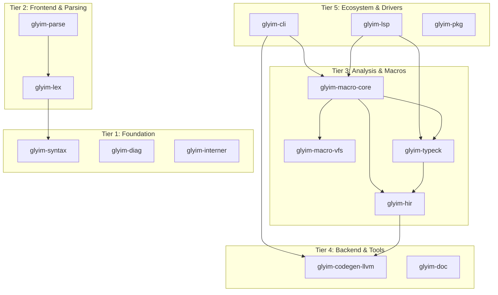
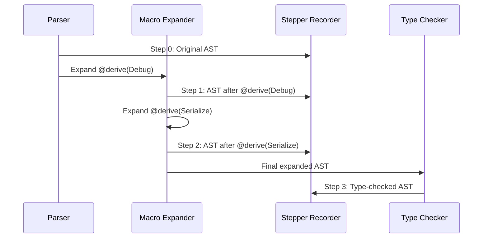

# Glyim v0.6.0 Architecture & Design Specification

## 1. Context & Scope

### What v0.1.0–v0.5.0 Delivered

| Version | Theme | Key Macro Deliverables |
|---------|-------|----------------------|
| **v0.1.0** | Architectural Runway | `MacroContext` trait, `ContentStore` trait, hygiene framework, CAS. |
| **v0.2.0** | Feels Like a Real Language | (No macro changes) |
| **v0.3.0** | Language Core | Typed macro execution (`Expr<T>`), `MacroContext` implementation, `@rust()` FFI. |
| **v0.4.0** | Developer Experience | Macro expansion preview in LSP, semantic tokens for generated code. |
| **v0.5.0** | Ecosystem & Production | Remote macro caching (REAPI), macro stack traces in DWARF, package manager with macro dependencies. |

### The Problem: v0.5.0 Macros Are Powerful But Painful

After v0.5.0, the macro system works end-to-end and caches remotely. But writing, debugging, and composing macros is an exercise in frustration:

- **Writing macros is painful:** You must manually construct AST nodes. There are no quoting or splicing mechanisms. A simple `@derive(Debug)` takes 50 lines of AST matching and building.
- **Macro errors are opaque:** When a macro fails, you get `"macro expansion failed"` with no indication of *what* went wrong inside the macro or *where* in the caller's code the problem originated.
- **Macros can't compose:** Applying `@derive(Serialize)` and `@derive(Debug)` to the same struct works, but two custom derives generating overlapping methods causes cryptic compiler errors with no clear ownership.
- **No incremental expansion:** Changing one macro invocation re-expands *every* macro in the file.
- **No macro debugging:** You can't step through expansion. You can't see intermediate states.
- **Limited macro APIs:** Macros can query trait implementations and struct fields, but can't look at enum variants, function signatures, or module contents.
- **No built-in derives:** Every project reimplements `Debug`, `Clone`, `Serialize` from scratch.
- **No attribute arguments:** `@serde` works but `@serde(rename_all = "camelCase")` doesn't.

### The Solution: v0.6.0 — "Macros That Don't Suck"

**Tagline:** *"Write macros like you write code. Debug macros like you debug code."*

This specification makes Glyim's macro system the best-in-class: ergonomic to write (quote/splice), safe to compose (protocol), easy to debug (stepper), and rich in capability (extended API).

### Scope of v0.6.0

**Included:**
- Quote/Splice syntax (`quote! { ... }` and `${expr}`)
- Macro Debugger (Stepper) via CLI and LSP
- Rich Macro Errors with multi-span provenance
- Built-in Derive Macros (`Debug`, `Clone`, `Eq`, `Hash`, `Serialize`, `Deserialize`, `Default`)
- Macro Composability Protocol (namespaces, requirements, conflict resolution)
- Extended `MacroContext` API (variants, methods, modules, caller info, sandboxed FS)
- Incremental Macro Expansion (per-invocation caching with dependency tracking)
- Attribute Arguments (structured key-value parsing)

**Excluded:**
- DSL builder protocol (v0.7.0)
- Property wrapper protocol (v0.7.0)
- Zig-style full comptime evaluation (v0.7.0)
- Macro hot-reload in IDE (v0.7.0)
- Garbage collection / destructors (v0.7.0)
- Async/await (v0.7.0)
- WASM target (v0.7.0)

---

## 2. Goals and Non-Goals (ASRs)

### Goals

| ID | Statement |
|----|-----------|
| **ASR-031** | Users can write macros using `quote! { ... }` syntax with `${expr}` splicing, reducing AST construction code by ≥80% compared to manual construction. |
| **ASR-032** | Users can step through macro expansion interactively via `glyim macro-step` and the LSP, seeing the AST before and after each expansion. |
| **ASR-033** | Macro errors carry multi-span provenance: they point to both the macro invocation site and the specific internal location that caused the error. |
| **ASR-034** | The standard library ships built-in derive macros for `Debug`, `Clone`, `Eq`, `Hash`, `Serialize`, `Deserialize`, and `Default`. |
| **ASR-035** | Multiple derive macros applied to the same type compose without conflicting impl blocks, governed by a composability protocol. |
| **ASR-036** | The `MacroContext` API provides reflection for enum variants, function signatures, module contents, caller location, and sandboxed file access. |
| **ASR-037** | Changing one macro invocation only re-expands that invocation and its dependents, not the entire file or project. |
| **ASR-038** | Macros accept structured attribute arguments (`@serde(rename_all = "camelCase", skip_none = true)`), parsed and type-checked by the compiler. |

### Non-Goals

| What | Why |
|------|-----|
| **DSL builder protocol** | Requires language design work beyond macros. v0.7.0. |
| **Property wrapper protocol** | Requires language design work beyond macros. v0.7.0. |
| **Full comptime evaluation** | Requires a separate interpreter. v0.7.0. |
| **Macro hot-reload** | Requires deep LSP integration. v0.7.0. |
| **GC / destructors** | Not macro-related. v0.7.0. |
| **Async/await** | Not macro-related. v0.7.0. |

---

## 3. The Design

### 3.1 C2 View: Container Architecture (Updated for v0.6.0)

No new crates are added in v0.6.0. Instead, existing crates are extended:



**Modified crates:**

| Crate | Nature of Change |
|-------|-----------------|
| `glyim-macro-core` | **Major** — Add `quote!` engine, `MacroError` with spans, `AttributeArgs` parser, extended `MacroContext` trait, composability protocol, incremental expansion cache |
| `glyim-parse` | **Modified** — Parse attribute arguments (`key = value`, `key`, nested), `quote!` syntax inside macro bodies |
| `glyim-hir` | **Modified** — Add `HirMacroInvocationId`, attribute argument nodes, incremental expansion metadata |
| `glyim-typeck` | **Modified** — Implement extended `MacroContext` methods (variants, methods, modules), dependency tracking for incremental expansion |
| `glyim-cli` | **Modified** — Add `glyim macro-step` command, wire incremental expansion |
| `glyim-lsp` | **Modified** — Add macro stepper code lens, hygiene visualization |
| `glyim-diag` | **Modified** — Support multi-span errors with macro expansion traces |
| `glyim-syntax` | **Modified** — Add `SyntaxKind::Quote`, `SyntaxKind::Splice`, attribute argument syntax kinds |
| `glyim-std` | **Modified** — Add built-in derive macros |

### 3.2 Quote/Splice Syntax

#### 3.2.1 The Problem with Manual AST Construction

Before v0.6.0, writing a `Debug` derive requires manually constructing HIR nodes:

```glyim
// v0.5.0: painful (50+ lines)
fn expand_debug(ctx: &MacroContext, input: &Expr) -> MacroOutput {
    let struct_def = ctx.get_struct(input)?;
    let fields = ctx.get_fields(struct_def)?;
    let mut stmts = vec![];
    stmts.push(Expr::call("write!", vec![
        Expr::ident("f"),
        Expr::string(format!("{} {{ ", struct_def.name)),
    ]));
    for (i, field) in fields.iter().enumerate() {
        if i > 0 {
            stmts.push(Expr::call("write!", vec![
                Expr::ident("f"),
                Expr::string(", "),
            ]));
        }
        stmts.push(Expr::call("write!", vec![
            Expr::ident("f"),
            Expr::string(format!("{}: {{}}", field.name)),
            Expr::field_access(Expr::ident("self"), field.name),
        ]));
    }
    stmts.push(Expr::call("write!", vec![
        Expr::ident("f"),
        Expr::string(" }"),
    ]));
    // ... return impl block ...
}
```

#### 3.2.2 Quote/Splice Design

v0.6.0 introduces `quote! { ... }` and `${expr}`:

```glyim
// v0.6.0: ergonomic (10 lines)
fn expand_debug(ctx: &MacroContext, input: &Expr) -> MacroOutput {
    let struct_def = ctx.get_struct(input)?;
    let fields = ctx.get_fields(struct_def)?;
    
    let field_fmts: Vec<Expr> = fields.map(|f| {
        quote! { write!(f, "${f.name}: {}", self.${f.name})?; }
    });
    
    quote! {
        impl Debug for ${struct_def.name} {
            fn fmt(&self, f: &mut Formatter) -> Result {
                write!(f, "${struct_def.name} {{ ")?;
                ${join(field_fmts, quote! { write!(f, ", ")?; })}
                write!(f, " }}")
            }
        }
    }
}
```

**Syntax rules:**

| Construct | Meaning | Example |
|-----------|---------|---------|
| `quote! { ... }` | Create an `Expr` from the enclosed Glyim code | `quote! { 1 + 2 }` |
| `${expr}` | Splice a computed `Expr` into a quote | `quote! { ${lhs} + ${rhs} }` |
| `${name}` | Splice a `Symbol` or `String` as an identifier | `quote! { fn ${method_name}() { ... } }` |
| `${join(exprs, sep)}` | Splice a `Vec<Expr>` with a separator | `${join(fields, quote! { , })}` |
| `${str(expr)}` | Splice an expression as a string literal | `quote! { "${str(name)}: {}" }` |

#### 3.2.3 Implementation Strategy

`quote!` is a **compiler-built-in macro** that transforms its body at parse time:

1. Parse the body as Glyim syntax (allowing `${...}` splice expressions)
2. For each splice, replace it with a unique placeholder
3. Generate a function that constructs the HIR, substituting splices at placeholder positions

The generated code calls `glyim-macro-core::hir_builder` functions:

```rust
// What the compiler generates for: quote! { ${lhs} + ${rhs} }
fn expand_quote(lhs: Expr, rhs: Expr) -> Expr {
    HirBuilder::binary(
        HirBinOp::Add,
        HirBuilder::splice(lhs),  // Injects the computed HIR node
        HirBuilder::splice(rhs),
    )
}
```

### 3.3 Macro Debugger (Stepper)

#### 3.3.1 Architecture

The macro stepper records the AST at each expansion step:



#### 3.3.2 CLI Interface

```bash
$ glyim macro-step src/main.xyz

Step 1: Original source
─────────────────────
  @derive(Debug)
  struct User { name: String, age: i64 }

Step 2: After expanding @derive(Debug)
──────────────────────────────────────
  struct User { name: String, age: i64 }
  
  impl Debug for User {
      fn fmt(&self, f: &mut Formatter) -> Result {
          write!(f, "User {{ ")?;
          write!(f, "name: {}", self.name)?;
          write!(f, ", ")?;
          write!(f, "age: {}", self.age)?;
          write!(f, " }}")
      }
  }

✓ Macro expansion complete. 1 macro expanded in 0.3ms.
```

#### 3.3.3 Interactive Mode

```bash
$ glyim macro-step --interactive src/main.xyz

Step 1/3: Original source
  @derive(Debug, Serialize)
  struct User { name: String, age: i64 }

[n]ext / [p]rev / [e]xpand / [d]iff / [q]uit > e

Expanding @derive(Debug)...

Step 2/3: After expanding @derive(Debug)
  struct User { ... }
  impl Debug for User { ... }

[n]ext / [p]rev / [e]xpand / [d]iff / [q]uit > d

Diff (added lines in green, removed in red):
+ impl Debug for User {
+     fn fmt(&self, f: &mut Formatter) -> Result { ... }
+ }

[n]ext / [p]rev / [e]xpand / [d]iff / [q]uit > e

Expanding @derive(Serialize)...

Step 3/3: After expanding @derive(Serialize)
  struct User { ... }
  impl Debug for User { ... }
  impl Serialize for User { ... }

✓ All macros expanded. 2 impls generated. No conflicts.
```

#### 3.3.4 LSP Integration

The LSP exposes a **"Macro Step" code lens** above each macro invocation:

```glyim
@derive(Debug, Serialize)  // 🔍 Step through macro expansion
struct User { name: String, age: i64 }
```

Clicking the lens opens a split-pane view showing the original and expanded code, with forward/backward navigation.

### 3.4 Rich Macro Errors with Spans

#### 3.4.1 Error Provenance Chain

When a macro reports an error, the compiler automatically attaches:

1. **Primary span:** The specific location inside the macro or the input that caused the error
2. **Invocation span:** Where the macro was invoked
3. **Expansion trace:** The chain of macro invocations (for nested macros)

**Example output:**

```
error: field `password` is not serializable
  --> src/main.xyz:4:5 (field definition)
   |
 4 |     password: SecureString,
   |     ^^^^^^^^ field `password` has type `SecureString`
   |
   = note: required by `@derive(Serialize)` on struct `User`
  --> src/main.xyz:2:1 (macro invocation)
   |
 2 | @derive(Serialize)
   | ^^^^^^^^^^^^^^^^^^ derive invoked here
   |
   = note: expansion trace:
           @derive(Serialize) → derive-serialize::expand()
  --> <derive-serialize macro> line 42 (internal)
   |
   = error: type `SecureString` does not implement `Serialize`
   |
help: implement `Serialize` for `SecureString`, or annotate with `@serde(skip)`
```

#### 3.4.2 MacroContext Error API

```rust
pub trait MacroContext {
    // ... existing methods ...

    /// Report an error at a specific span.
    /// The compiler automatically attaches the invocation span.
    fn error(&self, span: Span, message: &str) -> MacroError;
    
    /// Report a warning at a specific span.
    fn warning(&self, span: Span, message: &str);
    
    /// Report an error with multiple related spans.
    fn error_with_spans(
        &self,
        primary_span: Span,
        primary_message: &str,
        related: Vec<(Span, String)>,
    ) -> MacroError;
    
    /// Attach a help message to the previous error.
    fn help(&self, message: &str);
}
```

### 3.5 Built-in Derive Macros

#### 3.5.1 Standard Derives

The standard library ships these derive macros:

| Macro | Generates | Notes |
|-------|-----------|-------|
| `@derive(Debug)` | `impl Debug for T { fn fmt(&self, f: &mut Formatter) -> Result }` | Pretty-prints struct/enum |
| `@derive(Clone)` | `impl Clone for T { fn clone(&self) -> T }` | Deep copy (requires `Clone` on all fields) |
| `@derive(Eq)` | `impl Eq for T { fn eq(&self, other: &T) -> bool }` | Structural equality |
| `@derive(Hash)` | `impl Hash for T { fn hash(&self) -> u64 }` | SipHash 1-3 |
| `@derive(Serialize)` | `impl Serialize for T { fn serialize(&self) -> String }` | JSON output |
| `@derive(Deserialize)` | `impl Deserialize for T { fn from_str(s: &str) -> Result<T> }` | JSON input |
| `@derive(Default)` | `impl Default for T { fn default() -> T }` | Default values |

#### 3.5.2 Implementation Strategy

Built-in derives are **regular Glyim macros** distributed in `glyim-std/derive/`, not compiler intrinsics. This:

- Proves the macro system is powerful enough for standard tasks
- Allows users to read and modify the source
- Forces the API to be general-purpose

**Example: `Debug` derive (simplified)**

```glyim
// glyim-std/derive/debug.glyim

macro Debug(target: Expr<Type>) {
    let struct_def = ctx.get_struct(target)?;
    let fields = ctx.get_fields(struct_def)?;
    
    let field_fmts: Vec<Expr> = fields.map(|f| {
        quote! { write!(f, "${f.name}: {}", self.${f.name})?; }
    });
    
    quote! {
        impl Debug for ${struct_def.name} {
            fn fmt(&self, f: &mut Formatter) -> Result {
                write!(f, "${struct_def.name} {{ ")?;
                ${join(field_fmts, quote! { write!(f, ", ")?; })}
                write!(f, " }}")
            }
        }
    }
}
```

#### 3.5.3 Enum Derives

For enums, the derive generates a `match` over variants:

```glyim
// Input:
@derive(Debug)
enum Color { Red, Green, Blue }

// Generated:
impl Debug for Color {
    fn fmt(&self, f: &mut Formatter) -> Result {
        match self {
            Color::Red => write!(f, "Color::Red"),
            Color::Green => write!(f, "Color::Green"),
            Color::Blue => write!(f, "Color::Blue"),
        }
    }
}
```

### 3.6 Macro Composability Protocol

#### 3.6.1 The Problem: Conflicting Impls

```glyim
@derive(Validate)
@derive(Sanitize)
struct User { name: String, email: String }
```

If both `Validate` and `Sanitize` generate a `validate()` method, the compiler reports a conflict with no clear resolution.

#### 3.6.2 Protocol Design

1. **Namespacing by trait:** Each derive macro generates `impl TraitName for TypeName`. Since trait names are unique, impls don't conflict.
2. **Requirements:** Macros declare which traits they require:

```glyim
macro Serialize requires { Debug } {
    // @derive(Serialize) requires Debug to be implemented first
    // The compiler checks this requirement before expanding
}
```

3. **Conflict detection:** If two macros generate methods with the same name in the *same* trait impl, the compiler reports:

```
error: conflicting method `validate` in impl `Validate for User`
  --> src/main.xyz:3:1
   |
 3 | @derive(Validate, Sanitize)
   | ^^^^^^^^^^^^^^^^^^^^^^^^^^^ both macros generate `validate()`
   |
help: provide an explicit impl:
       impl Validate for User {
           fn validate(&self) -> bool { ... }
       }
```

4. **Ordering:** Macros are expanded in declaration order. `@derive(A, B, C)` expands A first, then B, then C. Each macro sees the output of the previous ones.

### 3.7 Extended MacroContext API

#### 3.7.1 New Reflection Methods

```rust
pub trait MacroContext {
    // === Existing (v0.1.0) ===
    fn trait_is_implemented(&self, type_id: Symbol, trait_id: Symbol) -> bool;
    fn get_fields(&self, struct_id: Symbol) -> Vec<FieldInfo>;
    fn get_type_params(&self, type_id: Symbol) -> Vec<Symbol>;
    
    // === New in v0.6.0 ===
    
    // Type information
    fn get_type(&self, expr: &Expr) -> TypeInfo;
    fn get_variants(&self, enum_id: Symbol) -> Vec<VariantInfo>;
    fn get_methods(&self, type_id: Symbol) -> Vec<MethodInfo>;
    fn get_implementations(&self, type_id: Symbol) -> Vec<ImplInfo>;
    fn is_copy(&self, type_id: Symbol) -> bool;
    fn is_send(&self, type_id: Symbol) -> bool;
    fn size_of(&self, type_id: Symbol) -> usize;
    fn align_of(&self, type_id: Symbol) -> usize;
    
    // Function information
    fn get_function(&self, fn_id: Symbol) -> FunctionInfo;
    fn get_function_params(&self, fn_id: Symbol) -> Vec<ParamInfo>;
    fn get_function_return_type(&self, fn_id: Symbol) -> TypeInfo;
    
    // Module information
    fn get_module(&self, module_id: Symbol) -> ModuleInfo;
    fn get_module_items(&self, module_id: Symbol) -> Vec<ItemInfo>;
    
    // Caller information
    fn caller_location(&self) -> SourceLocation;  // file, line, column
    fn caller_module(&self) -> Symbol;
    
    // File system (sandboxed, marks macro as impure)
    fn read_file(&self, path: &str) -> Result<String, FsError>;
    fn file_exists(&self, path: &str) -> bool;
    fn list_dir(&self, path: &str) -> Result<Vec<String>, FsError>;
    
    // Environment
    fn env(&self, key: &str) -> Option<String>;
    fn cfg(&self, key: &str) -> bool;
}
```

#### 3.7.2 Stability Guarantees

The `MacroContext` API is **versioned separately** from the compiler:

- Major version changes indicate breaking API changes
- Minor version changes indicate additive changes
- Macros declare their required API version: `macro Debug api(1.0) { ... }`
- The compiler rejects macros that require a newer API version than it provides

This ensures macros don't break when the compiler is upgraded (the key lesson from Scala 3).

#### 3.7.3 Dependency Tracking for Incremental Expansion

Every call to `MacroContext` methods is tracked by the compiler:

```rust
struct MacroExpansionDependencies {
    types_accessed: HashSet<Symbol>,
    traits_accessed: HashSet<Symbol>,
    fields_accessed: HashSet<(Symbol, Symbol)>,  // (type, field)
    files_read: HashSet<PathBuf>,
    env_vars_read: HashSet<String>,
}
```

If any of these change between compilations, the macro is re-expanded. Otherwise, the cached result is used.

### 3.8 Incremental Macro Expansion

#### 3.8.1 Per-Invocation Caching

Instead of caching at the file level, v0.6.0 caches at the invocation level:

```
cache_key(invocation) = SHA256(
    macro_bytecode_hash +
    input_ast_hash +
    macro_context_dependencies_hash +  // NEW: hash of accessed types/fields/files
    compiler_version +
    macro_api_version
)
```

#### 3.8.2 Invalidation Algorithm

When a source file changes:

1. Parse the new file and identify macro invocations
2. For each invocation, compute its cache key
3. If the cache key matches, reuse the cached output
4. If not, re-expand the invocation
5. After expansion, check if the new output differs from the old output
6. If it differs, invalidate all invocations that depended on the old output

#### 3.8.3 Performance Guarantee

For a file with 10 macro invocations where only 1 changes, incremental expansion should be **≥5× faster** than full expansion.

### 3.9 Attribute Arguments

#### 3.9.1 Syntax

```glyim
@serde(rename_all = "camelCase", skip_none = true)
struct User {
    name: String,
    @serde(skip)
    password: String,
    @serde(rename = "userAge")
    age: i64,
}
```

#### 3.9.2 Parsing

Attribute arguments are parsed as structured key-value pairs:

```rust
pub struct AttributeArgs {
    args: Vec<AttributeArg>,
}

pub enum AttributeArg {
    KeyValue { key: Symbol, value: AttributeValue, span: Span },
    Flag { key: Symbol, value: bool, span: Span },
    Positional { value: AttributeValue, span: Span },
}

pub enum AttributeValue {
    String(String),
    Int(i64),
    Bool(bool),
    Path(Vec<Symbol>),
    Nested(AttributeArgs),
}
```

#### 3.9.3 Macro API

Macros receive parsed arguments:

```rust
fn expand_serde(
    ctx: &MacroContext,
    input: &Expr,
    args: &AttributeArgs,
) -> MacroOutput {
    let rename_all = args.get_string("rename_all").unwrap_or("original");
    let skip_none = args.get_bool("skip_none").unwrap_or(false);
    // ...
}
```

Field-level attributes are accessible via `MacroContext`:

```rust
let fields = ctx.get_fields(struct_def)?;
for field in fields {
    let serde_attr = field.attributes.get("serde")?;
    let skip = serde_attr.get_bool("skip").unwrap_or(false);
    let rename = serde_attr.get_string("rename");
    // ...
}
```

---

## 4. Alternatives Considered

### 4.1 Quote/Splice: Rust `quote!` vs Scala `'{ }` vs String Interpolation

- **Alternative A (Rust `quote!` style):** `quote! { #expr }` with `#` for splicing. Proven in Rust ecosystem.
- **Alternative B (Scala 3 style):** `'{ expr }` for quoting, `${ expr }` for splicing. More consistent with string interpolation.
- **Alternative C (String interpolation):** `"$expr + $expr"` — no structural guarantees.
- **Decision (Chosen: B — Scala 3 style with `${}`).** The `${ }` syntax is familiar from string interpolation and template languages. It's visually distinct from `#` (which is used for attributes in many languages). The `quote! { }` wrapper makes it clear that code is being constructed.
- *Traceability: ASR-031.*

### 4.2 Macro Reflection: Compiler Internals vs Stable API

- **Alternative A (Rust `syn` style):** Give macros access to the full AST representation. Maximum power, but breaks when the compiler changes.
- **Alternative B (Scala 3 `Quotes` style):** Provide a stable reflection API with semantic concepts (type, field, variant). Less power, but macros survive compiler upgrades.
- **Decision (Chosen: B — Stable Semantic API).** The #1 lesson from Scala 3 is that coupling macros to compiler internals creates a maintenance nightmare. The `MacroContext` trait must be versioned and stable.
- *Traceability: ASR-036.*

### 4.3 Built-in Derives: Compiler Intrinsics vs Stdlib Macros

- **Alternative A (Compiler intrinsics):** Built-in derives are special-cased in the compiler. Fast, but not extensible.
- **Alternative B (Stdlib macros):** Built-in derives are regular Glyim macros in the standard library. Slower, but proves the macro system works and allows user modification.
- **Decision (Chosen: B — Stdlib Macros).** Dogfooding the macro system is essential. If the macro API isn't powerful enough to implement `Debug`, it's not powerful enough for user macros. Performance can be optimized later.
- *Traceability: ASR-034.*

### 4.4 Macro Composability: Traits vs Explicit Namespaces

- **Alternative A (Trait-based):** Each derive generates `impl TraitName for TypeName`. Trait names are naturally unique, so impls don't conflict.
- **Alternative B (Explicit namespaces):** Each derive generates code in a named namespace, with explicit merge rules.
- **Decision (Chosen: A — Trait-based).** Trait-based namespacing is simpler and matches Glyim's existing type system. Users already understand that two traits can have methods with the same name without conflict.
- *Traceability: ASR-035.*

### 4.5 Attribute Arguments: Token Streams vs Structured Parsing

- **Alternative A (Rust style):** Attribute arguments are `TokenStream`s. Macros parse them manually.
- **Alternative B (Glyim style):** Attribute arguments are parsed by the compiler into `AttributeArgs`. Macros access typed values.
- **Decision (Chosen: B — Structured Parsing).** Structured parsing eliminates an entire class of bugs (malformed attributes) and provides better error messages. It also enables IDE autocompletion for attribute arguments.
- *Traceability: ASR-038.*

---

## 5. Cross-Cutting Concerns

### 5.1 Security: Macro File System Access

The `read_file`, `file_exists`, and `list_dir` methods on `MacroContext` are sandboxed:

- Paths are resolved relative to the package root (not the macro's location)
- Parent directory traversal (`..`) is blocked
- Absolute paths are blocked unless explicitly allowed in `glyim.toml`
- All file accesses are tracked for cache invalidation (v0.5.0's purity model)

### 5.2 Performance: Quote Expansion Speed

`quote!` macro expansion happens at compile time. The generated HIR construction code must be fast:

- The `HirBuilder` API uses a bump allocator for HIR nodes
- Splicing is O(1) — it just inserts a pre-computed HIR subtree
- `join()` is O(n) where n is the number of expressions

Target: `quote!` expansion should take <1ms for typical derive macros.

### 5.3 Backward Compatibility

- `MacroContext` API additions are **additive** — existing macros continue to work
- `quote!` syntax is new; existing manual AST construction still works
- Attribute argument syntax is new; bare attributes (`@serde`) still work

### 5.4 Testing Strategy

| Category | Count Target | Location | What It Proves |
|----------|-------------|----------|---------------|
| **Quote/Splice tests** | ~50 | `crates/glyim-macro-core/tests/` | Quote expansion correctness |
| **Derive macro tests** | ~80 | `std/derive/tests/` | Each built-in derive works correctly |
| **Rich error tests** | ~30 | `tests/ui/macro-errors/` | Error messages are correct and have proper spans |
| **Composability tests** | ~20 | `crates/glyim-macro-core/tests/` | Multiple derives compose without conflict |
| **Incremental expansion tests** | ~15 | `crates/glyim-cli/tests/` | Only changed invocations are re-expanded |
| **Attribute argument tests** | ~25 | `crates/glyim-parse/tests/` | Parsing and type-checking of arguments |
| **Stepper tests** | ~10 | `crates/glyim-cli/tests/` | Step-by-step expansion is correct |
| **Extended API tests** | ~40 | `crates/glyim-typeck/tests/` | Reflection API returns correct data |
| **Total** | **~270** | | |

---

## 6. Architecture Decision Records

### ADR-025: Quote/Splice Syntax with `${}` Splicing

- **Context:** Writing macros with manual AST construction is tedious and error-prone. Rust's `quote!` crate proved that quoting dramatically improves ergonomics.
- **Decision:** Adopt `quote! { ... }` with `${expr}` splicing (Scala 3 / Julia style) instead of `#expr` (Rust style).
- **Consequences:** + More intuitive syntax (matches string interpolation). + Clearer visual distinction between code and splices. – Requires parser changes to support `${...}` inside `quote!` blocks.

### ADR-026: Stable Semantic Reflection API

- **Context:** Scala 3 macros couple tightly to compiler internals, breaking when the compiler changes. Rust's `syn` provides a separate AST but it can drift from the compiler's representation.
- **Decision:** The `MacroContext` API exposes semantic concepts (types, fields, variants), not compiler internals. The API is versioned separately from the compiler.
- **Consequences:** + Macros survive compiler upgrades. + Simpler API surface. – Some advanced use cases (e.g., inspecting compiler-generated code) are not supported. – API versioning adds complexity.

### ADR-027: Stdlib-Implemented Derives over Compiler Intrinsics

- **Context:** Built-in derives can be compiler intrinsics (fast, special-cased) or stdlib macros (slower, general-purpose).
- **Decision:** Built-in derives are regular Glyim macros in the standard library, implemented using `quote!` and `MacroContext`.
- **Consequences:** + Proves the macro system is powerful enough. + Users can read and modify derives. + Forces the API to be general-purpose. – Slower than intrinsics. – More code to maintain.

### ADR-028: Per-Invocation Incremental Expansion

- **Context:** v0.5.0 caches at the file level. Changing one invocation re-expands all macros in the file.
- **Decision:** v0.6.0 caches at the invocation level, tracking which `MacroContext` dependencies each invocation accessed.
- **Consequences:** + Much faster incremental builds. + Only affected invocations are re-expanded. – Dependency tracking adds overhead. – Conservative invalidation may re-expand more than necessary.

### ADR-029: Structured Attribute Arguments

- **Context:** Rust derive macros receive attribute arguments as `TokenStream`s, which they must parse manually. This is error-prone and produces bad error messages.
- **Decision:** Glyim parses attribute arguments into structured `AttributeArgs` with typed values (string, int, bool, path, nested).
- **Consequences:** + Better error messages for malformed attributes. + IDE autocompletion support. + Macros don't need to write parsers. – Less flexible than raw token streams. – New attribute argument forms require parser changes.

---

## 7. Traceability Matrix

| ASR | Design Section | ADR | Crate(s) Changed | Key Interface |
|-----|---------------|-----|-----------------|---------------|
| ASR-031 (quote/splice) | §3.2 | ADR-025 | `glyim-macro-core`, `glyim-parse`, `glyim-syntax` | `quote! { ... }`, `${expr}` |
| ASR-032 (macro stepper) | §3.3 | — | `glyim-cli`, `glyim-lsp`, `glyim-macro-core` | `glyim macro-step`, code lens |
| ASR-033 (rich errors) | §3.4 | — | `glyim-macro-core`, `glyim-diag` | `MacroContext::error()`, `MacroError` |
| ASR-034 (built-in derives) | §3.5 | ADR-027 | `glyim-std` | `@derive(Debug, Clone, ...)` |
| ASR-035 (composability) | §3.6 | — | `glyim-macro-core`, `glyim-typeck` | `requires { }`, conflict detection |
| ASR-036 (extended API) | §3.7 | ADR-026 | `glyim-macro-core`, `glyim-typeck` | `get_variants()`, `caller_location()`, `read_file()` |
| ASR-037 (incremental) | §3.8 | ADR-028 | `glyim-macro-core`, `glyim-cli` | Per-invocation cache, dependency tracking |
| ASR-038 (attribute args) | §3.9 | ADR-029 | `glyim-parse`, `glyim-macro-core` | `AttributeArgs`, `@serde(key = value)` |

---

## 8. Behavioral Specification (BDD)

### 8.1 Quote/Splice

```gherkin
Feature: Quote and Splice Syntax

  Scenario: Simple quote expression
    Given a macro that returns `quote! { 1 + 2 }`
    When the macro is expanded
    Then the output is the HIR for `1 + 2`

  Scenario: Splice a computed expression
    Given a macro with a parameter `x` bound to the HIR for `42`
    When the macro returns `quote! { ${x} + 1 }`
    Then the output is the HIR for `42 + 1`

  Scenario: Splice a symbol as an identifier
    Given a macro that computes `name = Symbol::from("my_func")`
    When the macro returns `quote! { fn ${name}() -> i64 { 0 } }`
    Then the output is the HIR for `fn my_func() -> i64 { 0 }`

  Scenario: Join a list of expressions
    Given a macro with `items = [Expr::IntLit(1), Expr::IntLit(2), Expr::IntLit(3)]`
    When the macro returns `quote! { [${join(items, quote! { , })}] }`
    Then the output is the HIR for `[1, 2, 3]`
```

### 8.2 Macro Debugger

```gherkin
Feature: Macro Stepper

  Scenario: Step through single derive
    Given the source:
      """
      @derive(Debug)
      struct Point { x: i64, y: i64 }
      """
    When "glyim macro-step" is run
    Then the output shows "Step 1: Original source"
    And the output shows "Step 2: After expanding @derive(Debug)"
    And the output shows "impl Debug for Point"

  Scenario: Step through multiple derives
    Given the source:
      """
      @derive(Debug, Clone)
      struct Point { x: i64, y: i64 }
      """
    When "glyim macro-step" is run
    Then the output shows expansion of @derive(Debug)
    And the output shows expansion of @derive(Clone)

  Scenario: Diff between steps
    Given a macro expansion that adds an impl block
    When "glyim macro-step --interactive" is run and "d" is pressed
    Then the output shows the added impl block with green highlighting
```

### 8.3 Rich Macro Errors

```gherkin
Feature: Rich Macro Errors

  Scenario: Error points to field definition
    Given the source:
      """
      @derive(Serialize)
      struct User { name: String, password: SecureString }
      """
    And `SecureString` does not implement `Serialize`
    When "glyim check" is run
    Then the error mentions "field `password` has type `SecureString`"
    And the error points to the line with `password: SecureString`
    And the error mentions "required by @derive(Serialize)"
    And the error points to the `@derive(Serialize)` line

  Scenario: Nested macro error trace
    Given macro A invokes macro B internally
    And macro B reports an error
    When "glyim check" is run
    Then the error shows an expansion trace: "A → B"
```

### 8.4 Built-in Derive Macros

```gherkin
Feature: Built-in Derive Macros

  Scenario: Derive Debug for struct
    Given the source:
      """
      @derive(Debug)
      struct Point { x: i64, y: i64 }
      fn main() {
        let p = Point { x: 1, y: 2 }
        println(p)
      }
      """
    When compiled and run
    Then stdout contains "Point { x: 1, y: 2 }"

  Scenario: Derive Debug for enum
    Given the source:
      """
      @derive(Debug)
      enum Color { Red, Green, Blue }
      fn main() { println(Color::Red) }
      """
    When compiled and run
    Then stdout contains "Color::Red"

  Scenario: Derive Clone
    Given the source:
      """
      @derive(Clone)
      struct Point { x: i64, y: i64 }
      fn main() {
        let p1 = Point { x: 1, y: 2 }
        let p2 = p1.clone()
        assert(p2.x == 1)
      }
      """
    When compiled and run
    Then the exit code is 0

  Scenario: Derive Eq
    Given the source:
      """
      @derive(Eq)
      struct Point { x: i64, y: i64 }
      fn main() {
        let p1 = Point { x: 1, y: 2 }
        let p2 = Point { x: 1, y: 2 }
        assert(p1 == p2)
      }
      """
    When compiled and run
    Then the exit code is 0
```

### 8.5 Macro Composability

```gherkin
Feature: Macro Composability

  Scenario: Multiple derives compose
    Given the source:
      """
      @derive(Debug, Clone, Eq)
      struct Point { x: i64, y: i64 }
      """
    When "glyim check" is run
    Then no errors are reported
    And three impl blocks are generated

  Scenario: Conflicting methods are detected
    Given two custom derives that both generate a `validate()` method in the same trait
    When "glyim check" is run
    Then an error is reported: "conflicting method `validate`"
    And a help message suggests providing an explicit impl

  Scenario: Requirements are checked
    Given macro `Serialize` requires `Debug`
    And a struct with `@derive(Serialize)` but no `@derive(Debug)`
    When "glyim check" is run
    Then an error is reported: "macro `Serialize` requires `Debug` to be implemented for `User`"
```

### 8.6 Extended MacroContext

```gherkin
Feature: Extended MacroContext API

  Scenario: Get enum variants
    Given a macro that calls `ctx.get_variants(enum_id)`
    When the macro is applied to `enum Color { Red, Green, Blue }`
    Then the macro receives variants ["Red", "Green", "Blue"]

  Scenario: Get caller location
    Given a macro that calls `ctx.caller_location()`
    When the macro is invoked at line 5, column 1 of "main.xyz"
    Then `caller_location()` returns `SourceLocation { file: "main.xyz", line: 5, column: 1 }`

  Scenario: Read file (impure macro)
    Given a macro that calls `ctx.read_file("config.json")`
    When the macro is expanded
    Then the macro is marked as impure
    And the file's content hash is included in the cache key
    And if "config.json" changes, the macro is re-expanded
```

### 8.7 Incremental Macro Expansion

```gherkin
Feature: Incremental Macro Expansion

  Scenario: Only changed invocation is re-expanded
    Given a file with two macro invocations: `@derive(Debug)` on struct A and `@derive(Clone)` on struct B
    When struct A is modified but struct B is unchanged
    Then only `@derive(Debug)` on struct A is re-expanded
    And `@derive(Clone)` on struct B uses the cached result

  Scenario: Dependency invalidation
    Given a macro that queries `ctx.get_fields(User)`
    When a field is added to `User`
    Then the macro is re-expanded (its dependencies changed)
    When a comment is added to `User`
    Then the macro is NOT re-expanded (its dependencies didn't change)
```

### 8.8 Attribute Arguments

```gherkin
Feature: Attribute Arguments

  Scenario: Key-value attribute arguments
    Given the source:
      """
      @serde(rename_all = "camelCase")
      struct User { name: String }
      """
    When the `@serde` macro is expanded
    Then `args.get_string("rename_all")` returns `"camelCase"`

  Scenario: Boolean flag attribute arguments
    Given the source:
      """
      @serde(skip_none)
      struct User { name: Option<String> }
      """
    When the `@serde` macro is expanded
    Then `args.get_bool("skip_none")` returns `true`

  Scenario: Field-level attribute arguments
    Given the source:
      """
      @serde(rename_all = "camelCase")
      struct User {
        @serde(rename = "userName")
        name: String,
        age: i64,
      }
      """
    When the `@serde` macro is expanded
    Then the `name` field has `rename = "userName"`
    And the `age` field has no `rename` attribute

  Scenario: Malformed attribute arguments
    Given the source `@serde(rename_all = )`
    When "glyim check" is run
    Then an error is reported: "expected value after '=' in attribute argument"
```

---

## 9. Test Strategy

### 9.1 Verification Methods Mapping

| Requirement Group | Primary Method | Secondary Method | Rationale |
|:---|:---|:---|:---|
| **Quote/Splice** | Test (unit + snapshot) | Inspection (HIR diff) | Generated HIR must exactly match expected HIR |
| **Macro Stepper** | Demonstration (CLI output) | Inspection (step snapshots) | Output must be human-readable and correct |
| **Rich Errors** | UI Test (`.xyz.stderr` snapshots) | Inspection (error format) | Error messages are a tested contract |
| **Built-in Derives** | Test (integration + stdlib tests) | Analysis (generated code quality) | Derives must work for all supported types |
| **Composability** | Test (conflict detection) | Analysis (impl block uniqueness) | Must detect and report all conflicts |
| **Extended API** | Test (unit per method) | Inspection (API versioning) | Reflection must return correct data |
| **Incremental** | Test (timing + cache hit/miss) | Analysis (dependency tracking) | Must be faster than full expansion |
| **Attribute Args** | Test (parsing + type-checking) | Inspection (AST structure) | Parser must handle all argument forms |

---

## 10. Execution Roadmap

### 10.1 Execution Order (Recommended)

**Phase 1: Quote/Splice Foundation**
1. Extend `glyim-syntax` with `quote!` and `${}` token kinds
2. Extend `glyim-parse` to parse `quote!` blocks
3. Implement `HirBuilder` API in `glyim-macro-core`
4. Implement `quote!` expansion to `HirBuilder` calls
5. Implement `join()` and `str()` splice helpers
6. Write comprehensive quote/splice tests

**Phase 2: Rich Errors and Extended API**
7. Extend `MacroContext` with error reporting methods
8. Extend `glyim-diag` to support multi-span errors with expansion traces
9. Implement extended `MacroContext` methods in `glyim-typeck`
10. Implement `caller_location()` and `read_file()` (sandboxed FS)
11. Add dependency tracking for `MacroContext` calls

**Phase 3: Attribute Arguments**
12. Extend `glyim-syntax` with attribute argument token kinds
13. Extend `glyim-parse` to parse attribute arguments (key=value, flags, nested)
14. Implement `AttributeArgs` API in `glyim-macro-core`
15. Wire attribute arguments to macro invocations

**Phase 4: Built-in Derive Macros**
16. Implement `@derive(Debug)` in `glyim-std/derive/`
17. Implement `@derive(Clone)` in `glyim-std/derive/`
18. Implement `@derive(Eq)` in `glyim-std/derive/`
19. Implement `@derive(Hash)` in `glyim-std/derive/`
20. Implement `@derive(Serialize)` and `@derive(Deserialize)` in `glyim-std/derive/`
21. Implement `@derive(Default)` in `glyim-std/derive/`

**Phase 5: Composability Protocol**
22. Implement `requires { }` syntax in macro definitions
23. Implement requirement checking before expansion
24. Implement conflict detection for overlapping methods
25. Write composability tests (multiple derives, conflicting derives)

**Phase 6: Incremental Expansion**
26. Implement per-invocation cache in `glyim-macro-core`
27. Implement dependency tracking (which `MacroContext` calls were made)
28. Implement cache key computation with dependencies
29. Implement invalidation algorithm
30. Wire incremental expansion into `glyim-cli`

**Phase 7: Macro Debugger**
31. Implement expansion step recording in `glyim-macro-core`
32. Implement `glyim macro-step` CLI command
33. Implement `--interactive` mode (next/prev/expand/diff/quit)
34. Implement diff view between steps
35. Add macro stepper code lens in `glyim-lsp`

### 10.2 Estimated Scope

| Phase | New Test Count | Effort (Relative) |
|-------|---------------|-------------------|
| Phase 1: Quote/Splice | ~50 | Large |
| Phase 2: Rich Errors & API | ~70 | Large |
| Phase 3: Attribute Arguments | ~25 | Medium |
| Phase 4: Built-in Derives | ~80 | Large |
| Phase 5: Composability | ~20 | Medium |
| Phase 6: Incremental | ~15 | Medium |
| Phase 7: Macro Debugger | ~10 | Medium |
| **Total new** | **~270** | |

Combined with v0.1.0–v0.5.0's ~730 tests: **~1000 tests total** for v0.6.0.

---

## 11. The 60-Second Test (Acceptance Criteria)

v0.6.0 is complete when a user can do all of this in under 60 seconds:

```bash
# 1. Write a macro with quote/splice
$ cat > src/macros.glyim << 'EOF'
macro my_assert(condition: Expr<Bool>, message: Expr<String>) {
    quote! {
        if !${condition} {
            panic(${message})
        }
    }
}
EOF

# 2. Use the macro
$ cat > src/main.glyim << 'EOF'
use macros::my_assert

fn main() {
    let x = 5
    my_assert(x > 0, "x must be positive")
    println(x)
}
EOF

# 3. See the expansion
$ glyim macro-step src/main.glyim

Step 1: Original source
  my_assert(x > 0, "x must be positive")

Step 2: After expanding my_assert
  if !(x > 0) { panic("x must be positive") }

✓ 1 macro expanded in 0.1ms

# 4. Get a rich error from a macro
$ cat > src/main.glyim << 'EOF'
@derive(Serialize)
struct User {
    name: String,
    password: SecureString,
}
EOF

$ glyim check
error: field `password` has type `SecureString` which does not implement `Serialize`
  --> src/main.glyim:4:5 (field definition)
   |
 4 |     password: SecureString,
   |     ^^^^^^^^ not serializable
   |
   = note: required by `@derive(Serialize)` on struct `User`
  --> src/main.glyim:2:1 (macro invocation)
   |
 2 | @derive(Serialize)
   | ^^^^^^^^^^^^^^^^^^ derive invoked here

# 5. Compose multiple derives with attribute arguments
$ cat > src/main.glyim << 'EOF'
@derive(Debug, Serialize, Deserialize)
@serde(rename_all = "camelCase")
struct ApiResponse {
    @serde(rename = "statusCode")
    status: i64,
    message: String,
}
EOF

$ glyim check
✓ All derives composed successfully. No conflicts.

# 6. Debug interactively
$ glyim macro-step --interactive src/main.glyim

Step 1/4: Original source
  @derive(Debug, Serialize, Deserialize)
  struct ApiResponse { ... }

[e]xpand > e

Step 2/4: After expanding @derive(Debug)
  struct ApiResponse { ... }
  impl Debug for ApiResponse { ... }

[e]xpand > d

Diff:
+ impl Debug for ApiResponse {
+     fn fmt(&self, f: &mut Formatter) -> Result { ... }
+ }

[e]xpand > e

Step 3/4: After expanding @derive(Serialize)
  ...impl Serialize for ApiResponse { ... }

✓ All macros expanded. 3 impls generated. No conflicts.
```

---

## 12. Next Steps

1. **Break this spec into sub-project plans** (one per Phase in §10.2)
2. **Phase 1 plan first** — quote/splice is the foundation for everything else
3. **Write ADRs** for each decision in §6 as separate Markdown files under `docs/adr/`
4. **API versioning design** — specify how `MacroContext` versioning works in practice
5. **Sandbox design** — specify the exact rules for `read_file()` sandboxing
6. **Derive macro sprint** — implement `Debug` first, then use it as the template for other derives
