# Glyim v0.7.0 Architecture & Design Specification

## 1. Context & Scope

### What v0.1.0–v0.6.0 Delivered

| Version | Theme | Key IDE / Tooling Deliverables |
|---------|-------|--------------------------------|
| **v0.1.0** | Architectural Runway | Rowan CST, Span tracking, strict DAG. |
| **v0.2.0** | Feels Like a Real Language | `ariadne` diagnostics, UI test framework. |
| **v0.3.0** | Language Core | Type checker, basic REPL. |
| **v0.4.0** | Developer Experience | Basic LSP skeleton (semantic tokens, hover), macro expansion preview, inlay hints. |
| **v0.5.0** | Ecosystem & Production | DWARF debug info, `glyim test` runner, `glyim doc`, remote CAS. |
| **v0.6.0** | Macros That Don't Suck | Macro stepper, rich macro errors, incremental macro expansion, quote/splice. |

### The Problem: The Compiler is Powerful; The IDE is a Skeleton

After v0.6.0, Glyim's compiler is remarkably capable. It has best-in-class macro tooling, incremental caching, and a full type checker. But the LSP from v0.4.0 is a bare-minimum skeleton. It provides syntax highlighting and basic hover, but lacks the features that make a language *feel* professional in an editor:

- **No go-to-definition through macros:** Clicking a macro-generated identifier yields "not found."
- **No auto-completion:** Users type everything from memory.
- **No find-all-references or rename:** Refactoring is manual and error-prone.
- **No debugging from the IDE:** Users must start `gdb` manually; the DWARF info from v0.5.0 is unused by the editor.
- **No test integration:** No "click to run" above `#[test]` functions.
- **No code actions:** Missing imports and trivial errors require manual fixes.
- **No incremental analysis:** The LSP re-analyzes the whole project on every keystroke.

### The Solution: v0.7.0 — "The IDE That Makes You Smile"

**Tagline:** *"Every feature you expect. Some you don't. All of them fast."*

This specification transforms the Glyim IDE experience from a skeleton into a world-class environment, competitive with rust-analyzer, by introducing an incremental computation database, full navigation, DAP debugging, and intelligent code actions.

### Scope of v0.7.0

**Included:**
- Salsa-style incremental computation database (`glyim-ide-db`)
- Go-to-Definition (including through macro expansions)
- Auto-Completion with type signatures and import insertion
- Find All References (workspace-wide, including macro-generated code)
- Rename Symbol (workspace-wide)
- Code Lenses for running and debugging `#[test]` functions
- DAP Integration (`glyim-dap`) with macro-aware stepping
- Code Actions / Quick Fixes (add import, add derive, fill struct fields)
- Inlay Hints (type annotations, parameter names)
- Hover Documentation (type signatures, doc comments, macro expansion preview)

**Excluded:**
- AI-assisted completions (v0.8.0+)
- Live share collaboration (v0.8.0+)
- Performance profiling view (v0.8.0+)
- Call/Type hierarchy (v0.7.1)
- AST/HIR/LLVM IR inspector panel (v0.7.1)

---

## 2. Goals and Non-Goals (ASRs)

### Goals

| ID | Statement |
|----|-----------|
| **ASR-039** | The LSP responds to completion requests in < 50ms and full project incremental analysis in < 500ms, powered by a Salsa-style incremental database. |
| **ASR-040** | Go-to-Definition navigates through macro expansions, mapping generated identifiers back to the macro invocation site or the macro definition. |
| **ASR-041** | Auto-Completion provides typed suggestions for struct fields, trait methods, and path imports, with type signatures displayed. |
| **ASR-042** | Find All References locates all usages of a symbol across the workspace, including inside macro-generated code. |
| **ASR-043** | Rename Symbol propagates changes across all files in the workspace atomically. |
| **ASR-044** | Code Lenses appear above `#[test]` functions, allowing one-click execution or debugging. |
| **ASR-045** | DAP Integration allows setting breakpoints, stepping through code, and inspecting variables in the editor, with macro-aware call stacks. |
| **ASR-046** | Code Actions provide quick fixes for common diagnostics (add missing import, add derive, fill missing struct fields). |
| **ASR-047** | Inlay Hints display inferred types on `let` bindings and parameter names at call sites. |
| **ASR-048** | Hover Documentation renders type signatures, doc comments, and macro expansion previews. |

### Non-Goals

| What | Why |
|------|-----|
| **AI-assisted completions** | Requires LLM integration; research project. v0.8.0+. |
| **Live share collaboration** | Requires custom protocol. v0.8.0+. |
| **Performance profiling** | Requires runtime instrumentation. v0.8.0+. |
| **Call/Type hierarchy** | Nice-to-have; can be added on top of the reference index. v0.7.1. |
| **AST/HIR/LLVM IR inspector** | Fun but not blocking. v0.7.1. |

---

## 3. The Design

### 3.1 C2 View: Container Architecture (Updated for v0.7.0)

Two new crates are introduced:

```mermaid
graph TD
    subgraph "Tier 5: Ecosystem & Drivers"
        CLI["glyim-cli"]
        LSP["glyim-lsp"]
        DAP["glyim-dap"]
    end

    subgraph "Tier 4: Backend & Tools"
        IDEDB["glyim-ide-db"]
        LLVM["glyim-codegen-llvm"]
        Doc["glyim-doc"]
    end

    subgraph "Tier 3: Analysis & Macros"
        MacroVFS["glyim-macro-vfs"]
        MacroCore["glyim-macro-core"]
        HIR["glyim-hir"]
        Typeck["glyim-typeck"]
    end

    subgraph "Tier 2: Frontend & Parsing"
        Parse["glyim-parse"]
        Lex["glyim-lex"]
    end

    subgraph "Tier 1: Foundation"
        Syntax["glyim-syntax"]
        Diag["glyim-diag"]
        Interner["glyim-interner"]
    end

    LSP --> IDEDB
    DAP --> IDEDB
    IDEDB --> Typeck
    IDEDB --> HIR
    IDEDB --> Parse
    Typeck --> HIR
    HIR --> LLVM
    Parse --> Lex
    Lex --> Syntax
```



**New crates:**

| Crate | Tier | Depends On | Purpose |
|-------|------|-----------|---------|
| `glyim-ide-db` | 4 | `glyim-typeck`, `glyim-hir`, `glyim-parse`, `glyim-syntax` | Incremental computation database, indices, reference graph |
| `glyim-dap` | 5 | `glyim-ide-db`, `glyim-diag` | Debug Adapter Protocol server bridging DAP to DWARF |

### 3.2 Salsa-style Incremental Database (`glyim-ide-db`)

#### 3.2.1 The Problem with Non-Incremental LSPs

Without incremental computation, the LSP re-analyzes the entire project on every keystroke. For a 10,000-line project, this means 2–5 second delays.

#### 3.2.2 Design

We implement a simplified Salsa-style query framework. Every LSP operation is a *query* against the database. Queries are cached. When a file changes, only dependent queries are invalidated.

```rust
// In glyim-ide-db

/// The central database holding all analysis state.
pub struct IdeDatabase {
    storage: Storage,
}

#[derive(Default)]
struct Storage {
    // Inputs
    source_text: HashMap<FileId, Arc<String>>,
    file_paths: HashMap<FileId, PathBuf>,

    // Derived (cached)
    parse_results: HashMap<FileId, Cached<Arc<ParseOutput>>>,
    hir_results: HashMap<FileId, Cached<Arc<Hir>>>,
    typeck_results: HashMap<FileId, Cached<Arc<TypeckResults>>>,
    macro_expansions: HashMap<FileId, Cached<Arc<ExpandedAst>>>,

    // Indices
    symbol_index: Cached<SymbolIndex>,
    reference_index: Cached<ReferenceIndex>,
    expansion_map: Cached<ExpansionMap>,
}

impl IdeDatabase {
    // --- Input Setters ---

    pub fn update_file(&mut self, file_id: FileId, text: String) {
        self.storage.source_text.insert(file_id, Arc::new(text));
        // Invalidate derived queries for this file
        self.storage.parse_results.remove(&file_id);
        self.storage.hir_results.remove(&file_id);
        self.storage.typeck_results.remove(&file_id);
        self.storage.macro_expansions.remove(&file_id);
        // Invalidate global indices
        self.storage.symbol_index.invalidate();
        self.storage.reference_index.invalidate();
        self.storage.expansion_map.invalidate();
    }

    // --- Query Getters (compute on demand) ---

    pub fn source_text(&self, file_id: FileId) -> Arc<String> {
        self.storage.source_text[&file_id].clone()
    }

    pub fn parse(&self, file_id: FileId) -> Arc<ParseOutput> {
        if let Some(cached) = self.storage.parse_results.get(&file_id) {
            return cached.value();
        }
        let text = self.source_text(file_id);
        let result = Arc::new(glyim_parse::parse(&text));
        self.storage.parse_results.insert(file_id, Cached::new(result.clone()));
        result
    }

    pub fn hir(&self, file_id: FileId) -> Arc<Hir> {
        if let Some(cached) = self.storage.hir_results.get(&file_id) {
            return cached.value();
        }
        let parse_out = self.parse(file_id);
        let result = Arc::new(glyim_hir::lower(&parse_out.ast));
        self.storage.hir_results.insert(file_id, Cached::new(result.clone()));
        result
    }

    pub fn typeck(&self, file_id: FileId) -> Arc<TypeckResults> {
        if let Some(cached) = self.storage.typeck_results.get(&file_id) {
            return cached.value();
        }
        let hir = self.hir(file_id);
        let result = Arc::new(glyim_typeck::typeck(&hir));
        self.storage.typeck_results.insert(file_id, Cached::new(result.clone()));
        result
    }

    pub fn symbol_index(&self) -> &SymbolIndex { /* compute if invalidated */ }
    pub fn reference_index(&self) -> &ReferenceIndex { /* compute if invalidated */ }
    pub fn expansion_map(&self) -> &ExpansionMap { /* compute if invalidated */ }
}
```

#### 3.2.3 Performance Targets

| Operation | Target Latency | Strategy |
|-----------|---------------|----------|
| Completion | < 50ms | Incremental; use stale results if fresh ones aren't ready |
| Go-to-def | < 100ms | Index-based, pre-computed |
| Hover | < 100ms | Cached type information |
| References | < 200ms | Pre-computed reference index |
| Rename | < 500ms | Find references, then apply edits |
| Full project analysis | < 5s (initial), < 500ms (incremental) | Parallel file analysis |

### 3.3 Go-to-Definition (Including Through Macros)

#### 3.3.1 Normal Navigation

For normal identifiers, the LSP uses the `SymbolIndex`:

```rust
pub struct SymbolIndex {
    /// Maps (name, FileId) -> LocalSymbol
    locals: HashMap<(Symbol, FileId), Vec<LocalSymbol>>,
    /// Maps name -> GlobalSymbol (across workspace)
    globals: HashMap<Symbol, Vec<GlobalSymbol>>,
}

pub struct LocalSymbol { pub span: Span, pub kind: SymbolKind }
pub struct GlobalSymbol { pub file_id: FileId, pub span: Span, pub kind: SymbolKind }
```

#### 3.3.2 Macro-Aware Navigation

When a user clicks on a macro-generated identifier, the `ExpansionMap` maps it back to the macro invocation:

```rust
pub struct ExpansionMap {
    /// Maps generated source ranges back to the macro invocation
    generated_to_invocation: HashMap<(FileId, Span), MacroInvocationId>,
    /// Maps macro invocations to their generated code ranges
    invocation_to_generated: HashMap<MacroInvocationId, Vec<(FileId, Span)>>,
}
```

**Go-to-def flow for macro-generated code:**

1. User clicks on `user.name` (generated by `@derive(Debug)`)
2. LSP looks up the span in `ExpansionMap::generated_to_invocation`
3. Finds `MacroInvocationId` pointing to `@derive(Debug)` at line 3, column 1
4. LSP returns two locations:
   - "Go to macro invocation" → line 3, column 1
   - "Go to macro definition" → `glyim-std/derive/debug.glyim:1`

### 3.4 Auto-Completion with Types

#### 3.4.1 Completion Context

```rust
pub enum CompletionContext {
    /// `user.█`
    FieldAccess { receiver_type: TypeId },
    /// `Vec::█`
    PathAccess { path: Vec<Symbol> },
    /// `let x: █`
    TypePosition,
    /// `@derive(█)`
    AttributeArgument,
    /// `fn █`
    ItemPosition,
    /// Expression position
    ExprPosition,
}
```

#### 3.4.2 Field Access Completion

```glyim
let user = User { name: "Alice", age: 30 }
user.█
```

The LSP queries the `IdeDatabase`:

1. Infer type of `user` → `User`
2. Query `TypeckResults` for fields of `User` → `name: String`, `age: i64`
3. Query `TypeckResults` for available traits on `User` → `Debug`, `Clone`, `Serialize`
4. Return completions:

```
user.name    String    (from struct User)
user.age     i64       (from struct User)
user.clone() -> User   (from @derive(Clone))
user.fmt()   -> String (from @derive(Debug))
```

#### 3.4.3 Import Insertion

If a completion item requires an import:

```glyim
let v = Vec::█  // Selects "Vec::new()"
```

The LSP generates a `TextEdit` to add `use glyim-std::vec::Vec;` at the top of the file, and a `TextEdit` to insert `Vec::new()` at the cursor.

### 3.5 Find All References

#### 3.5.1 Reference Index

```rust
pub struct ReferenceIndex {
    /// Symbol → all locations where it's referenced
    references: HashMap<Symbol, Vec<ReferenceLocation>>,
}

pub struct ReferenceLocation {
    pub file_id: FileId,
    pub span: Span,
    pub kind: ReferenceKind,
}

pub enum ReferenceKind {
    Definition,
    Read,
    Write,
    Call,
    MacroGenerated,  // Reference inside macro-generated code
}
```

#### 3.5.2 Handling Macro-Generated References

References inside macro-generated code are tagged as `MacroGenerated`. When the user clicks "Find All References" on `User`:

1. LSP queries `ReferenceIndex` for `User`
2. Returns:
   - `src/main.xyz:3:8` (Definition)
   - `src/main.xyz:10:12` (Read)
   - `<@derive(Debug) expansion>:0:0` (MacroGenerated)
3. The editor shows the macro-generated reference with an annotation: "(inside `@derive(Debug)` expansion)"

### 3.6 Rename Symbol

#### 3.6.1 Workspace Edit

Rename is implemented on top of Find All References:

1. Find all references to the symbol across the workspace
2. Generate `TextEdit`s for each reference
3. Return a `WorkspaceEdit` with all changes

```rust
pub struct RenameService<'a> {
    db: &'a IdeDatabase,
}

impl<'a> RenameService<'a> {
    pub fn rename(&self, file_id: FileId, span: Span, new_name: &str) -> Option<WorkspaceEdit> {
        let symbol = self.db.resolve_symbol(file_id, span)?;
        let refs = self.db.reference_index().references_for(symbol);
        
        let mut changes: HashMap<FileId, Vec<TextEdit>> = HashMap::new();
        for r in refs {
            changes.entry(r.file_id).or_default().push(TextEdit {
                range: r.span,
                new_text: new_name.to_string(),
            });
        }
        
        Some(WorkspaceEdit { changes })
    }
}
```

#### 3.6.2 Hygiene-Aware Rename

If a macro-generated reference is renamed, the rename is applied at the **macro invocation site**, not in the generated code. The macro is then re-expanded with the new input.

### 3.7 Code Lenses for Tests

#### 3.7.1 Design

```glyim
#[test]                          ▶ Run  🐛 Debug
fn test_addition() {
    assert(add(1, 2) == 3)
}
```

#### 3.7.2 Implementation

```rust
pub fn test_code_lenses(file_id: FileId, db: &IdeDatabase) -> Vec<CodeLens> {
    let hir = db.hir(file_id);
    let mut lenses = vec![];
    for func in &hir.fns {
        if func.has_attribute("test") {
            lenses.push(CodeLens {
                range: func.name_span,
                command: Command {
                    title: "▶ Run".into(),
                    command: "glyim.runTest".into(),
                    arguments: vec![func.name.clone()],
                },
            });
            lenses.push(CodeLens {
                range: func.name_span,
                command: Command {
                    title: "🐛 Debug".into(),
                    command: "glyim.debugTest".into(),
                    arguments: vec![func.name.clone()],
                },
            });
        }
    }
    lenses
}
```

**Execution:** The VS Code extension listens for `glyim.runTest` and `glyim.debugTest` commands, and invokes `glyim test -p <pkg> --test <name>` or starts the `glyim-dap` adapter.

### 3.8 DAP Integration (`glyim-dap`)

#### 3.8.1 Architecture

```
┌──────────┐      DAP       ┌──────────────┐     lldb/gdb     ┌──────────┐
│  VS Code │ ◄──────────────► │  glyim-dap   │ ◄──────────────► │  Process  │
│  Editor  │                 │  Adapter     │                  │  (debuggee)│
└──────────┘                 └──────────────┘                  └──────────┘
                                     │
                                     ▼
                              ┌──────────────┐
                              │  IdeDatabase │
                              │  ExpansionMap│
                              └──────────────┘
```

#### 3.8.2 Macro-Aware Debugging

When a breakpoint is hit in macro-generated code:

1. The DAP adapter receives the native stack frame from `lldb`/`gdb`
2. It maps the DWARF location to a `.glyim` source location
3. If the location is inside macro-generated code, it looks up `ExpansionMap::generated_to_invocation`
4. It translates the source location to the macro invocation site
5. The editor shows the macro invocation site (not the generated code)
6. The user can choose to "step into macro expansion" to see the generated code

```rust
pub struct DapSession {
    db: IdeDatabase,
    debugger: Debugger, // Wraps lldb or gdb
}

impl DapSession {
    fn on_breakpoint_hit(&mut self, stack_frame: StackFrame) -> StackFrame {
        let file_path = stack_frame.source_path;
        let line = stack_frame.line;
        
        if let Some(invocation_id) = self.db.expansion_map().lookup_generated(file_path, line) {
            let invocation = self.db.expansion_map().get_invocation(invocation_id);
            StackFrame {
                source_path: invocation.file_path,
                line: invocation.line,
                is_macro_generated: true,
                original_path: Some(file_path),
                original_line: Some(line),
            }
        } else {
            stack_frame
        }
    }
}
```

### 3.9 Code Actions / Quick Fixes

#### 3.9.1 Supported Code Actions

| Diagnostic | Code Action |
|-----------|-------------|
| "cannot find type `Vec` in scope" | "Add import: `use glyim-std::vec::Vec`" |
| "struct `User` is missing derive `Debug`" | "Add `@derive(Debug)`" |
| "missing field `age` in struct literal" | "Fill missing fields" |
| "unused variable `x`" | "Prefix with `_`: `_x`" |

#### 3.9.2 Implementation

```rust
pub fn code_actions(diagnostic: &Diagnostic, db: &IdeDatabase) -> Vec<CodeAction> {
    match diagnostic.code {
        "E0001" => add_missing_import(diagnostic, db),
        "E0002" => add_derive(diagnostic, db),
        "E0003" => fill_struct_fields(diagnostic, db),
        "W0001" => prefix_unused_variable(diagnostic, db),
        _ => vec![],
    }
}

fn add_missing_import(diagnostic: &Diagnostic, db: &IdeDatabase) -> Vec<CodeAction> {
    let missing_type = diagnostic.data.as_missing_type()?;
    let import_path = db.find_import_path(missing_type)?;
    vec![CodeAction {
        title: format!("Add import: `use {}`", import_path),
        edit: Some(WorkspaceEdit {
            changes: hashmap! {
                diagnostic.file_id => vec![
                    TextEdit {
                        range: db.insert_position(diagnostic.file_id),
                        new_text: format!("use {}\n", import_path),
                    }
                ]
            }
        }),
        ..Default::default()
    }]
}
```

### 3.10 Inlay Hints

#### 3.10.1 Types of Inlay Hints

| Type | Example | When Shown |
|------|---------|-----------|
| Type annotation | `let x/*: i64*/ = 42` | When type is inferred but not written |
| Parameter name | `add(/*a:*/1, /*b:*/2)` | At call sites for positional parameters |
| Closing label | `} // fn main` | After long function bodies (>15 lines) |

#### 3.10.2 Implementation

```rust
pub fn inlay_hints(file_id: FileId, db: &IdeDatabase) -> Vec<InlayHint> {
    let typeck = db.typeck(file_id);
    let mut hints = vec![];
    for binding in &typeck.bindings {
        if binding.type_annotation_missing {
            hints.push(InlayHint {
                position: binding.name_span.end,
                label: format!(": {}", binding.ty),
                kind: InlayHintKind::Type,
            });
        }
    }
    for call in &typeck.calls {
        for (i, arg) in call.args.iter().enumerate() {
            if let Some(param_name) = call.param_names.get(i) {
                hints.push(InlayHint {
                    position: arg.span.start,
                    label: format!("{}:", param_name),
                    kind: InlayHintKind::Parameter,
                });
            }
        }
    }
    hints
}
```

### 3.11 Hover Documentation

#### 3.11.1 Markdown Rendering

Hovering over `User` shows:

```markdown
## struct User

```glyim
struct User {
    name: String,
    age: i64,
}
```

**Implements:** Debug, Clone, Eq, Serialize, Deserialize

**Defined in:** src/main.xyz:3:1

---

A user with a name and age.
```

Hovering over a macro invocation shows:

```markdown
## @derive(Debug, Serialize)

**Expands to:**
- `impl Debug for User { ... }` (8 lines)
- `impl Serialize for User { ... }` (12 lines)

[🔍 Step through expansion]
```

---

## 4. Alternatives Considered

### 4.1 Salsa vs Custom Incremental Engine

- **Alternative A (Full Salsa crate):** Use the `salsa` crate directly. Battle-tested, but heavy dependency and complex to learn.
- **Alternative B (Custom simplified engine):** Implement a simplified Salsa-style system within `glyim-ide-db`. Less general, but tailored to our needs.
- **Decision (Chosen: B — Custom Simplified Engine).** The Salsa crate is designed for general incremental computation. Our needs are specific: file-level invalidation cascading through parse → hir → typeck → indices. A custom engine is simpler, easier to debug, and avoids a large dependency.
- *Traceability: ASR-039.*

### 4.2 DAP: Custom Adapter vs Existing Extensions

- **Alternative A (CodeLLDB extension):** Use the existing CodeLLDB extension, mapping Glyim DWARF to its expectations. No custom DAP adapter needed.
- **Alternative B (Custom `glyim-dap` adapter):** Build a custom DAP adapter that understands Glyim's macro expansion map.
- **Decision (Chosen: B — Custom Adapter).** CodeLLDB cannot translate macro-generated stack frames back to macro call sites. Our custom adapter uses `ExpansionMap` to provide macro-aware debugging, which is Glyim's key differentiator.
- *Traceability: ASR-045.*

### 4.3 Tree-sitter vs Rowan for IDE Parsing

- **Alternative A (Tree-sitter):** Use Tree-sitter for syntax highlighting and quick parsing. Fast, incremental, and widely supported.
- **Alternative B (Rowan):** Use the existing Rowan parser for everything.
- **Decision (Chosen: A — Tree-sitter for Syntax, Rowan for Semantics).** Tree-sitter provides blazing-fast incremental parsing for syntax highlighting and simple structure. Rowan provides the full-fidelity CST needed for refactoring and code actions. We use Tree-sitter for the editor's syntax layer and Rowan for the compiler's semantic layer.
- *Traceability: ASR-039.*

---

## 5. Cross-Cutting Concerns

### 5.1 Memory Usage

The `IdeDatabase` holds the entire project in memory. For a 100,000-line project, this is approximately:
- Source text: 5 MB
- ASTs: 50 MB
- HIR: 20 MB
- Type information: 10 MB
- Indices: 10 MB
- **Total: ~100 MB**

This is acceptable. rust-analyzer uses similar amounts.

### 5.2 Concurrency

The LSP must remain responsive while the `IdeDatabase` is updating:

- **Read queries** (completion, hover, go-to-def) run on the main thread, reading from cached data.
- **Write updates** (file changes) run on a background thread, producing new cached data.
- When the background update completes, it swaps the cache atomically.

### 5.3 Latency

If a query takes longer than the target latency (e.g., completion > 50ms), the LSP returns stale results and schedules a refresh. This ensures the editor never blocks.

---

## 6. Architecture Decision Records

### ADR-030: Simplified Salsa-style Incremental Database

- **Context:** rust-analyzer uses the Salsa framework for incremental computation. It's powerful but complex.
- **Decision:** Implement a simplified incremental database in `glyim-ide-db` with file-level granularity.
- **Consequences:** + Simpler to implement and debug. + Tailored to Glyim's needs. – Less general than Salsa. – May need refinement for very large projects.

### ADR-031: Macro-Aware Source Mapping via ExpansionMap

- **Context:** Go-to-def and debugging must work through macro expansions.
- **Decision:** Store an `ExpansionMap` that maps generated source ranges back to macro invocations. This map is built during macro expansion and persisted in the `IdeDatabase`.
- **Consequences:** + Navigation through macros "just works." + Macro-aware debugging. – Map size grows with macro complexity. – Map must be rebuilt on macro changes.

### ADR-032: Custom DAP Adapter for Macro Translation

- **Context:** Debugging macro-generated code requires translating stack frames.
- **Decision:** Build a custom `glyim-dap` adapter that uses `ExpansionMap` to translate macro-generated stack frames to macro call sites.
- **Consequences:** + World-class macro debugging experience. + Differentiates Glyim from Rust. – More code to maintain. – Requires implementing DAP protocol.

### ADR-033: Tree-sitter for Syntax, Rowan for Semantics

- **Context:** Rowan is great for full-fidelity parsing but slow for syntax highlighting on every keystroke.
- **Decision:** Use Tree-sitter for syntax highlighting and simple structure (folding, matching brackets). Use Rowan for semantic operations (code actions, refactoring).
- **Consequences:** + Fast syntax highlighting. + Accurate semantic operations. – Two parser implementations to maintain. – Tree-sitter grammar must be written and maintained.

---

## 7. Traceability Matrix

| ASR | Design Section | ADR | Crate(s) Changed | Key Interface |
|-----|---------------|-----|-----------------|---------------|
| ASR-039 (incremental DB) | §3.2 | ADR-030 | `glyim-ide-db` (new) | `IdeDatabase`, query methods |
| ASR-040 (go-to-def) | §3.3 | ADR-031 | `glyim-ide-db`, `glyim-lsp` | `ExpansionMap`, `SymbolIndex` |
| ASR-041 (completion) | §3.4 | — | `glyim-ide-db`, `glyim-lsp` | `CompletionContext` |
| ASR-042 (references) | §3.5 | — | `glyim-ide-db`, `glyim-lsp` | `ReferenceIndex` |
| ASR-043 (rename) | §3.6 | — | `glyim-ide-db`, `glyim-lsp` | `RenameService` |
| ASR-044 (test lenses) | §3.7 | — | `glyim-lsp` | `test_code_lenses()` |
| ASR-045 (DAP) | §3.8 | ADR-032 | `glyim-dap` (new) | `DapSession` |
| ASR-046 (code actions) | §3.9 | — | `glyim-ide-db`, `glyim-lsp` | `code_actions()` |
| ASR-047 (inlay hints) | §3.10 | — | `glyim-ide-db`, `glyim-lsp` | `inlay_hints()` |
| ASR-048 (hover) | §3.11 | — | `glyim-ide-db`, `glyim-lsp`, `glyim-doc` | Markdown rendering |

---

## 8. Behavioral Specification (BDD)

### 8.1 Incremental Database

```gherkin
Feature: Incremental Computation

  Scenario: File change invalidates dependent queries
    Given a project with 3 files: A, B, C
    And file A imports file B
    And file B imports file C
    When file C is modified
    Then queries for file C are invalidated
    And queries for file B are invalidated (depends on C)
    And queries for file A are invalidated (depends on B)
    And the incremental update completes in < 500ms

  Scenario: Unrelated file change does not invalidate all queries
    Given a project with files: A, B
    And file A does NOT import file B
    When file B is modified
    Then queries for file A are NOT invalidated
```

### 8.2 Go-to-Definition

```gherkin
Feature: Go-to-Definition

  Scenario: Go to struct definition
    Given the source:
      """
      struct User { name: String }
      fn main() { let u = User { name: "Alice" } }
      """
    When go-to-definition is requested on "User" in "User { name: ..."
    Then the editor navigates to "struct User" on line 1

  Scenario: Go to macro invocation
    Given the source:
      """
      @derive(Debug)
      struct User { name: String }
      fn main() { println(user) }
      """
    And `println(user)` calls `user.fmt()` generated by `@derive(Debug)`
    When go-to-definition is requested on "fmt" in "user.fmt()"
    Then the editor shows two options:
      | Option                    | Target                       |
      | Go to macro invocation   | @derive(Debug) on line 1    |
      | Go to macro definition   | derive/debug.glyim line 1   |
```

### 8.3 Auto-Completion

```gherkin
Feature: Auto-Completion

  Scenario: Struct field completion
    Given the source:
      """
      struct User { name: String, age: i64 }
      fn main() { let u = User { name: "A", age: 0 }; u.█ }
      """
    When completion is requested after "u."
    Then the completion list includes:
      | Item       | Type   | Source      |
      | name       | String | struct User |
      | age        | i64    | struct User |
      | clone()    | -> User | @derive(Clone) |

  Scenario: Import insertion on completion
    Given the source:
      """
      fn main() { let v = Vec::█ }
      """
    When "Vec::new()" is selected from completions
    Then `use glyim-std::vec::Vec;` is added to the top of the file
```

### 8.4 Find All References

```gherkin
Feature: Find All References

  Scenario: Find references across workspace
    Given file A defines `struct User`
    And file B creates `let u = User { ... }`
    And file C uses `User` in a function signature
    When find-all-references is requested on `User` in file A
    Then 3 locations are returned: definition in A, usage in B, usage in C

  Scenario: Find macro-generated references
    Given `@derive(Debug)` generates `impl Debug for User`
    When find-all-references is requested on `User`
    Then the reference inside `impl Debug for User` is returned
    And it is tagged as "MacroGenerated"
```

### 8.5 Rename Symbol

```gherkin
Feature: Rename Symbol

  Scenario: Rename across files
    Given `struct User` in file A
    And `let u = User { ... }` in file B
    When "User" is renamed to "Person"
    Then file A is updated to `struct Person`
    And file B is updated to `let u = Person { ... }`

  Scenario: Rename macro-generated reference
    Given `@derive(Debug)` on `struct User`
    When "User" is renamed to "Person"
    Then the macro invocation is updated to `@derive(Debug)` on `struct Person`
    And the macro is re-expanded
```

### 8.6 Code Lenses for Tests

```gherkin
Feature: Code Lenses for Tests

  Scenario: Run test via code lens
    Given the source:
      """
      #[test]
      fn test_add() { assert(1 + 1 == 2) }
      """
    When the "▶ Run" code lens is clicked
    Then `glyim test --test test_add` is executed
    And the test result is shown inline

  Scenario: Debug test via code lens
    When the "🐛 Debug" code lens is clicked
    Then the DAP adapter is started
    And a breakpoint is set at the beginning of `test_add`
```

### 8.7 DAP Integration

```gherkin
Feature: DAP Integration

  Scenario: Set breakpoint in editor
    Given a Glyim project
    When a breakpoint is set on line 5 of main.xyz
    And the program is started with the debugger
    Then the program pauses at line 5
    And variable values are shown in the variables pane

  Scenario: Macro-aware stack trace
    Given a crash inside macro-generated code
    When the debugger pauses at the crash
    Then the stack trace shows the macro invocation site
    And the user can expand the frame to see the generated code
```

### 8.8 Code Actions

```gherkin
Feature: Code Actions

  Scenario: Add missing import
    Given the source:
      """
      fn main() { let v = Vec::new() }
      """
    And `Vec` is not imported
    When a diagnostic "cannot find type `Vec`" is shown
    Then a code action "Add import: `use glyim-std::vec::Vec`" is available
    When the code action is applied
    Then `use glyim-std::vec::Vec;` is added to the top of the file

  Scenario: Add missing derive
    Given the source:
      """
      struct User { name: String }
      fn main() { println(user) }
      """
    And `User` does not implement `Debug`
    When a diagnostic "struct `User` is missing derive `Debug`" is shown
    Then a code action "Add `@derive(Debug)`" is available
```

### 8.9 Inlay Hints

```gherkin
Feature: Inlay Hints

  Scenario: Type annotation hint
    Given the source:
      """
      fn main() { let x = 42 }
      """
    When inlay hints are enabled
    Then `: i64` is shown after `x` in `let x = 42`

  Scenario: Parameter name hint
    Given the source:
      """
      fn add(a: i64, b: i64) -> i64 { a + b }
      fn main() { add(1, 2) }
      """
    When inlay hints are enabled
    Then `a:` is shown before `1` and `b:` is shown before `2` in `add(1, 2)`
```

---

## 9. Test Strategy

### 9.1 Test Categories for v0.7.0

| Category | Count Target | Location | What It Proves |
|----------|-------------|----------|----------------|
| **IdeDatabase unit tests** | ~50 | `crates/glyim-ide-db/tests/` | Query invalidation, caching |
| **Navigation tests** | ~30 | `crates/glyim-lsp/tests/` | Go-to-def, references, rename |
| **Completion tests** | ~40 | `crates/glyim-lsp/tests/` | Completion items, import insertion |
| **Code action tests** | ~20 | `crates/glyim-lsp/tests/` | Quick fix correctness |
| **Inlay hint tests** | ~15 | `crates/glyim-lsp/tests/` | Hint placement and text |
| **DAP integration tests** | ~20 | `crates/glyim-dap/tests/` | Breakpoints, stepping, macro frames |
| **Latency benchmarks** | ~10 | `crates/glyim-ide-db/benches/` | Performance targets |
| **Tree-sitter grammar tests** | ~30 | `tree-sitter-glyim/test/` | Syntax highlighting correctness |
| **Total** | **~215** | | |

---

## 10. Execution Roadmap

### 10.1 Execution Order (Recommended)

**Phase 1: Incremental Database**
1. Implement `IdeDatabase` with file-level granularity
2. Implement `Cached<T>` wrapper for derived queries
3. Implement `SymbolIndex` and `ReferenceIndex`
4. Implement `ExpansionMap` (integrating v0.6.0's macro expansion metadata)
5. Write unit tests for invalidation and caching

**Phase 2: Tree-sitter Grammar**
6. Write `tree-sitter-glyim` grammar
7. Integrate with VS Code extension for syntax highlighting
8. Write grammar tests

**Phase 3: Navigation**
9. Implement go-to-definition using `SymbolIndex`
10. Implement go-to-definition through macros using `ExpansionMap`
11. Implement find-all-references using `ReferenceIndex`
12. Implement rename using `ReferenceIndex`

**Phase 4: Completion**
13. Implement field/method completion
14. Implement path/import completion
15. Implement attribute argument completion
16. Implement import insertion on completion

**Phase 5: Code Lenses and Actions**
17. Implement test code lenses (run/debug)
18. Implement "Add missing import" code action
19. Implement "Add derive" code action
20. Implement "Fill struct fields" code action

**Phase 6: Inlay Hints and Hover**
21. Implement type annotation inlay hints
22. Implement parameter name inlay hints
23. Implement hover documentation rendering
24. Implement macro expansion hover preview

**Phase 7: DAP Integration**
25. Implement `glyim-dap` adapter scaffolding
26. Implement breakpoint translation (Glyim ↔ DWARF)
27. Implement macro-aware stack frame translation
28. Implement variable inspection
29. Write DAP integration tests

### 10.2 Estimated Scope

| Phase | New Test Count | Effort (Relative) |
|-------|---------------|-------------------|
| Phase 1: Incremental DB | ~50 | Large |
| Phase 2: Tree-sitter | ~30 | Medium |
| Phase 3: Navigation | ~30 | Large |
| Phase 4: Completion | ~40 | Large |
| Phase 5: Code Lenses/Actions | ~20 | Medium |
| Phase 6: Inlay/Hover | ~15 | Medium |
| Phase 7: DAP | ~20 | Large |
| **Total new** | **~205** | |

Combined with v0.1.0–v0.6.0's ~1000 tests: **~1205 tests total** for v0.7.0.

---

## 11. The 60-Second Test (Acceptance Criteria)

v0.7.0 is complete when a user can do all of this in VS Code:

```bash
# 1. Open a project
$ code myproject/

# 2. Go-to-definition through a macro
# (Ctrl+Click on "user.name" in generated Debug code)
# → Jumps to the @derive(Debug) invocation, with option to jump to derive source

# 3. Auto-completion with types
# (Type "user." and see all fields and methods with type signatures)

# 4. Find all references
# (Right-click "User" → "Find All References")
# → Shows all locations where User is used, including macro-generated code

# 5. Rename symbol
# (Right-click "User" → "Rename Symbol" → type "Person")
# → All references updated across all files

# 6. Run a test with a code lens
# (Click "▶ Run" above #[test] fn test_addition())
# → Test runs, output shown in terminal, pass/fail shown inline

# 7. Debug a test
# (Click "🐛 Debug" above #[test] fn test_addition())
# → Debugger starts, breakpoint set, can step through code

# 8. Inlay hints
# (See type annotations on all let bindings)
# (See parameter names at all call sites)

# 9. Quick fix for missing import
# (Hover over "Vec" → "Add import: use glyim-std::vec::Vec")
# → Click to auto-add the import

# 10. Hover over a macro invocation
# (See expanded code, macro source, and "Step through expansion" link)
```

---

## 12. Next Steps

1. **Break this spec into sub-project plans** (one per Phase in §10.2)
2. **Phase 1 plan first** — `IdeDatabase` is the foundation for everything else
3. **Write ADRs** for each decision in §6 as separate Markdown files under `docs/adr/`
4. **Tree-sitter grammar sprint** — requires dedicated effort, separate from compiler work
5. **VS Code extension update** — integrate new LSP features, code lens commands, and DAP configuration
